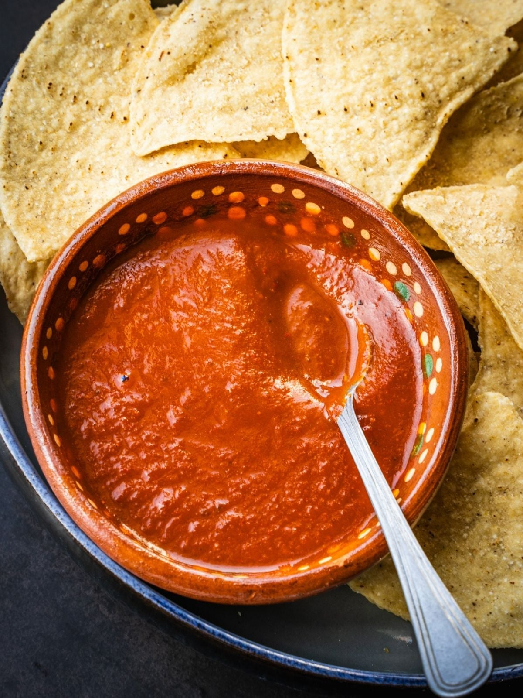

# Salsa Roja

*Mexico's red table salsa: ripe tomatoes charred briefly, blitzed with garlic, fresh chillies, onion, cumin, lime juice and fresh coriander into a fresh chunky red salsa. The Mexican everyday table condiment that goes on practically every Mexican dish, made fresh in 5 minutes.*

**Serves:** Makes about 400 ml

**Prep Time:** 15 minutes

**Cook Time:** 10 minutes (briefly charring the vegetables)

## Overview
Salsa roja Mexicana is the foundational Mexican red salsa and one of the most pervasive condiments in Mexican cooking: ripe tomatoes charred briefly under a grill (or roasted in a hot dry pan) along with garlic, fresh chillies and a piece of onion till the skins blister and blacken slightly; then blended (or chopped fine by hand) with chopped fresh onion, ground cumin, dried Mexican oregano, fresh lime juice, fresh coriander and salt into a fresh chunky red salsa. The salsa is meant to be made fresh and eaten within a few days; the freshness is the point. It accompanies practically every Mexican dish - tacos, tostadas, eggs, beans, rice, grilled meats, fish, sandwiches. Three details define proper salsa roja. First, charring is canonical. The charring of the tomatoes (and chillies and garlic) gives the proper smoky depth; raw-blended salsa is more like pico de gallo. Second, fresh chillies. Serrano peppers are the canonical Mexican choice; jalapeños are milder. Third, eat fresh. The salsa is meant for the day; refrigerated up to 4 days but fresh is best.

## Ingredients

- 8 ripe tomatoes (about 800 g)
- 2-4 fresh serrano peppers (or jalapeños; deseeded for milder)
- 6 garlic cloves (whole, unpeeled)
- 1 small white onion (halved; half for charring, half finely chopped for blending)
- Juice of 2 limes
- 1 small bunch fresh coriander (chopped)
- 1 tablespoon ground cumin
- 1 tablespoon dried Mexican oregano
- 1 ½ teaspoons fine sea salt
- 1 teaspoon ground black pepper
- 2 tablespoons olive oil

## Method

### Stage 1 - Char the vegetables
1. Preheat the grill (broiler) to high; or heat a heavy dry pan over high heat.
2. Place the tomatoes, chillies, garlic (skin on) and half-onion under the grill (or in the dry pan).
3. Cook 8-10 minutes, turning regularly, till the skins are blistered and blackened in patches.
4. Let cool slightly.
5. Peel the garlic; discard the chilli stems.

### Stage 2 - Blend
1. Transfer the charred vegetables to a blender (or food processor).
2. Add the finely chopped raw onion, lime juice, chopped coriander, cumin, oregano, salt, pepper and olive oil.
3. Blitz to a chunky salsa (not a smooth purée; keep some texture).

### Stage 3 - Rest
1. Transfer to a serving bowl.
2. Let stand 15 minutes for the flavours to marry.

### Stage 4 - Serve
1. Stir before serving.

## Notes
- **Charring is essential:** smoky depth.
- **Chunky texture:** don't fully purée.
- **Fresh chillies:** serrano canonical.
- **Lime juice and coriander at the end:** brightness.
- **Eat within a few days.**

## Variations
**Smokier (salsa molcajeteada):** crush in a molcajete (Mexican stone mortar) instead of blending; gives a coarser more rustic texture.
**Spicier:** double the chillies; add 2 chiles de árbol (dried small red chillies, briefly toasted).
**With chipotle:** add 1-2 chipotles in adobo; gives a smoky depth.
**Fresh-blended salsa cruda:** skip the charring; just blend raw vegetables; closer to pico de gallo.

## Serving
With everything Mexican: tacos, tostadas, scrambled eggs, beans, rice, chips for dipping. As a table condiment.

## Storage
- Keeps refrigerated 4 days; the flavour deepens after 24 hours.
- Don't freeze; the texture suffers.
- Make in small batches.
