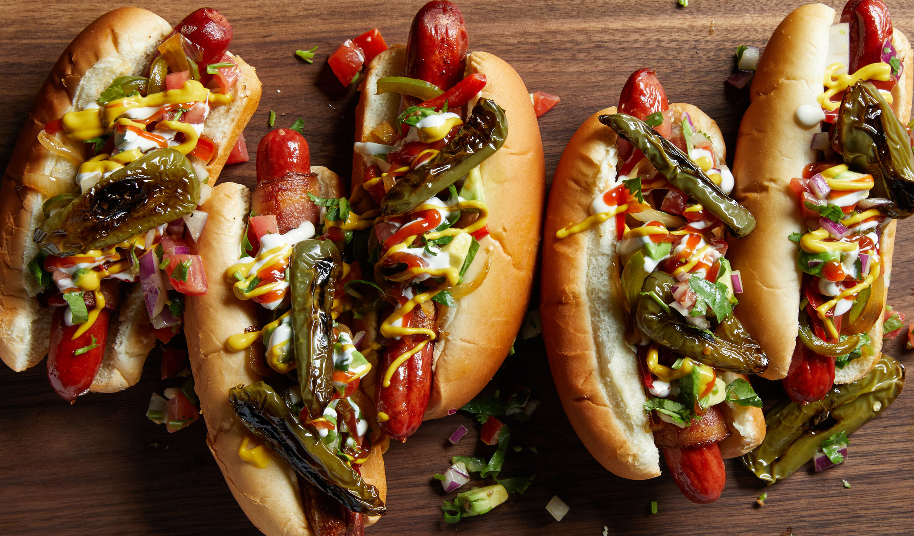

# Tijuana Hot Dog

*Tijuana's bacon-wrapped street dog: a hot dog wrapped tight in streaky bacon, grilled till the bacon crisps, then tucked into a soft white bun and topped with grilled bell peppers and onions, a chopped tomato-and-onion pico, sliced jalapeños, mayonnaise, ketchup, and a drizzle of mustard. The Tijuana-Mexico border-town street food that birthed the Sonoran hot dog.*

**Serves:** 4

**Prep Time:** 15 minutes

**Cook Time:** 15 minutes

## Overview
The Tijuana hot dog (also called Tijuana-style dog or "el perro tijuanense") is the Mexican-border-town street food that birthed an entire family of bacon-wrapped Mexican hot dog styles (most famously the Sonoran hot dog of Sonora and Arizona, which is a direct evolution of the Tijuana version): a standard hot dog (canonically a small all-beef or pork-and-beef frankfurter) wrapped tightly in a strip of streaky bacon and grilled hard on a flat-top till the bacon crisps and renders its fat into the dog. Laid into a soft white bun (smaller and softer than American hot dog buns, with the dog poking out both ends), then topped with grilled-on-the-flat-top strips of bell pepper and white onion, a chopped fresh pico (tomato + white onion + cilantro + lime + salt), thinly sliced jalapeños (or pickled jalapeño rings), a heavy drizzle of crema or mayonnaise, a stripe of ketchup, and a stripe of yellow mustard. Sold from street carts in downtown Tijuana, particularly around the Zona Norte, the Mercado Hidalgo, and Avenida Revolución, late at night or early morning to bar-goers and workers. Three details: bacon-wrapped, grilled bell peppers and onions (cooked on the same flat-top), three sauces (mayo + ketchup + mustard).

## Ingredients

### Dogs and bacon
- 8 small hot dogs (pork-and-beef frankfurters)
- 8 strips thin streaky bacon (1 per dog)
- Wooden toothpicks
- 1 tablespoon vegetable oil

### Grilled peppers and onions
- 2 green bell peppers (sliced thin)
- 2 red bell peppers (sliced thin)
- 2 medium white onions (sliced thin)
- 2 tablespoons vegetable oil
- 1 teaspoon fine sea salt
- ½ teaspoon ground black pepper

### Fresh pico
- 2 medium tomatoes (chopped)
- 1 small white onion (very finely chopped)
- 1 small bunch fresh coriander (chopped)
- Juice of 1 lime
- 1 teaspoon fine sea salt

### Toppings
- 2 fresh jalapeños (sliced thin) OR 80 g pickled jalapeño rings
- 4 tablespoons mayonnaise (or Mexican crema)
- 4 tablespoons ketchup
- 4 tablespoons yellow mustard

### Buns
- 8 small soft white hot dog buns (or telera rolls split lengthwise)

### To serve
- Cold Mexican beer (Tecate or Pacifico) with lime and salt
- Salsa roja on the side for extra heat
- Pickled vegetables (zanahorias en escabeche)

## Method

### Stage 1 - Wrap dogs in bacon
1. Wrap each hot dog tightly with a strip of streaky bacon in a spiral.
2. Secure both ends with a toothpick.

### Stage 2 - Make fresh pico
1. Mix chopped tomatoes, onion, coriander, lime juice and salt.
2. Rest 10 minutes to meld.

### Stage 3 - Grill peppers and onions
1. Heat 2 tablespoons of oil on a wide flat-top or cast-iron pan over medium-high heat.
2. Add bell peppers and onions; season with salt and pepper.
3. Cook 8-10 minutes, stirring occasionally, till softened and lightly charred at the edges.
4. Push to one side of the pan to keep warm.

### Stage 4 - Cook bacon-wrapped dogs
1. On the same flat-top or pan, lay the bacon-wrapped dogs.
2. Cook 6-8 minutes, turning, till the bacon is deep golden and crispy and the dog is heated through.
3. Remove the toothpicks.

### Stage 5 - Warm the buns
1. Briefly toast the bun cut sides on the flat-top (15 seconds) or in a separate pan.

### Stage 6 - Build (Tijuana street-cart order)
1. Place a bacon-wrapped dog in each bun.
2. A heap of grilled peppers and onions over the dog.
3. A generous spoon of fresh pico on top.
4. A scatter of jalapeño rounds.
5. A zigzag of mayo down the length.
6. A zigzag of ketchup over the mayo.
7. A zigzag of mustard over the ketchup.

### Stage 7 - Serve immediately
1. With cold Mexican beer.
2. Salsa roja on the side for those who want more heat.

## Notes
- **Bacon-wrapped, grilled hard:** the bacon must be crisp; not flabby.
- **Peppers + onions cooked on the flat-top:** they take on the bacon fat - that's the canonical street-cart flavour.
- **Three sauces (mayo + ketchup + mustard):** the canonical street trio.
- **Small soft bun:** Tijuana buns are smaller than American; choose accordingly.

## Variations
**Sonoran style:** add pinto beans, mayonnaise drizzle in a thicker stripe; gives the Sonora-Arizona variant.
**With avocado:** chunky chopped avocado in the build.
**With chiles toreados:** add whole pan-blistered serrano chillies on top for the proper Tijuana heat.
**With queso fresco:** crumble queso fresco over the pico.
**Vegetarian:** swap the bacon-wrapped dog for a halloumi-wrapped portobello cap.

## Serving
At a Tijuana street cart at 2 am. At a backyard barbecue. At a Mexican family party. With cold beer and salsa.

## Storage
- Best immediately.
- Bacon-wrapped uncooked dogs refrigerate 1 day.
- Grilled peppers and onions refrigerate 3 days.
- Pico refrigerates 1 day (loses lift after that).
- Don't store assembled.
