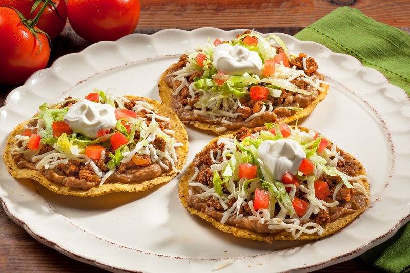

# Tostadas

*Mexico's crisp tortilla plate: fried-flat tortillas layered with refried beans, shredded chicken, lettuce, tomato, crema and cotija.*

**Serves:** 4 (8 tostadas)

**Prep Time:** 20 minutes

**Cook Time:** 15 minutes

## Overview
Corn tortillas are crisped: either deep-fried in 1 cm of oil at 180°C for 60 seconds per side, OR brushed with oil and baked at 200°C for 8-10 minutes (lower-fat option). Either way, the result is a flat crisp shell. Toppings build in layers: a base smear of refried beans, then a generous spoon of warm chicken tinga (or any seasoned protein), then cold fresh toppings, shredded lettuce, diced tomato, sliced red onion, sliced avocado, crumbled cotija. Crema drizzles over. Pickled jalapeño tops. Eat by hand (two-hand grip required).*

## Ingredients

### Tostada shells
- 8 corn tortillas (15 cm - bought, not made)
- 2 tablespoons vegetable oil (for baking) OR 300 ml oil (for frying)
- A pinch of salt

### Chicken tinga (a quick seasoned-chicken topping)
- 400 g cooked shredded chicken (poached or rotisserie)
- 2 tablespoons vegetable oil
- 1 onion (small, sliced thin)
- 3 garlic cloves (sliced)
- 2 chipotles in adobo (chopped - plus 1 tablespoon of the adobo sauce)
- 1 (400 g) tin chopped tomatoes
- 1 teaspoon dried oregano
- 1 teaspoon ground cumin
- ½ teaspoon salt
- ½ teaspoon black pepper

### To assemble (per tostada)
- 1 tablespoon warm refried beans (see [refried-beans.md](../side-dishes/refried-beans.md))
- 2 tablespoons chicken tinga
- A small handful shredded iceberg lettuce (about 20 g)
- 2 tablespoons diced tomato
- 1 tablespoon sliced red onion
- 2 slices avocado
- 1 tablespoon crumbled cotija cheese (or queso fresco, or feta)
- 1 tablespoon Mexican crema (or thinned sour cream)
- 2-3 slices pickled jalapeño
- A few coriander leaves
- A wedge of lime

## Method

### Stage 1 - Make tostada shells
1. **Fried version (the classic, crispiest)**: Heat 1 cm of oil in a wide pan to 180°C. Slide a tortilla into the oil; fry 30-60 seconds per side until golden and crisp; lift onto kitchen paper. Sprinkle with a pinch of salt. Repeat for all 8.
1. **Baked version (lighter)**: Heat oven to 200°C (180°C fan). Brush each tortilla on both sides with oil. Arrange on a baking tray in a single layer. Bake 8-10 minutes, flipping halfway, until golden, crisp, and slightly curled at the edges.

### Stage 2 - Chicken tinga
1. Heat oil in a wide pan over medium heat.
1. Add sliced onion; cook 5 minutes until soft.
1. Add garlic; cook 1 minute.
1. Add chipotles, adobo sauce, chopped tomatoes, oregano, cumin, salt and pepper.
1. Simmer 8 minutes, mashing the tomatoes with a wooden spoon, until reduced to a thick sauce.
1. Stir in the shredded chicken; cook 3 minutes to warm through and coat.
1. Taste; adjust salt.

### Stage 3 - Prep the cold toppings
1. Shred the lettuce.
1. Dice the tomato; slice the onion thinly; slice avocado.
1. Crumble the cheese.
1. Thin the crema with a splash of milk if too thick.

### Stage 4 - Assemble (just before serving - assembled tostadas go soggy)
1. Lay tostada shells on a board or platter.
1. Spread 1 tablespoon of warm refried beans on each.
1. Top with 2 tablespoons of chicken tinga.
1. Pile on shredded lettuce.
1. Add diced tomato, sliced onion, avocado slices.
1. Sprinkle crumbled cheese.
1. Drizzle crema in a zigzag.
1. Top with pickled jalapeño slices and a few coriander leaves.

### Stage 5 - Serve
1. Plate 2 tostadas per person; offer lime wedges on the side.
1. Eat with hands, holding the tostada flat between thumb and fingers (the corners crack if you flex it - bite carefully).

## Notes
- **Crisp the shells well:** Soggy shells are sad. Whether frying or baking, push for deep golden colour - the shells need to be crisp enough to hold the toppings without collapsing.
- **Assemble at the last moment:** Pre-assembled tostadas go soggy within 10 minutes. Lay out all the toppings; assemble at the table or just before serving.
- **Toppings are flexible:** Tinga is just one option. Pulled pork carnitas, refried beans alone (vegetarian), ceviche-marinated white fish, or grilled prawns all work. Tostada de tinga is the most common Mexican home version.

## Storage
- Tostada shells, plain (no toppings): keep airtight at room temperature 1 week. Re-crisp at 200°C 3 minutes if they soften.
- Chicken tinga: refrigerate 4 days; reheats well; freezes 2 months.
- Don't assemble ahead.
