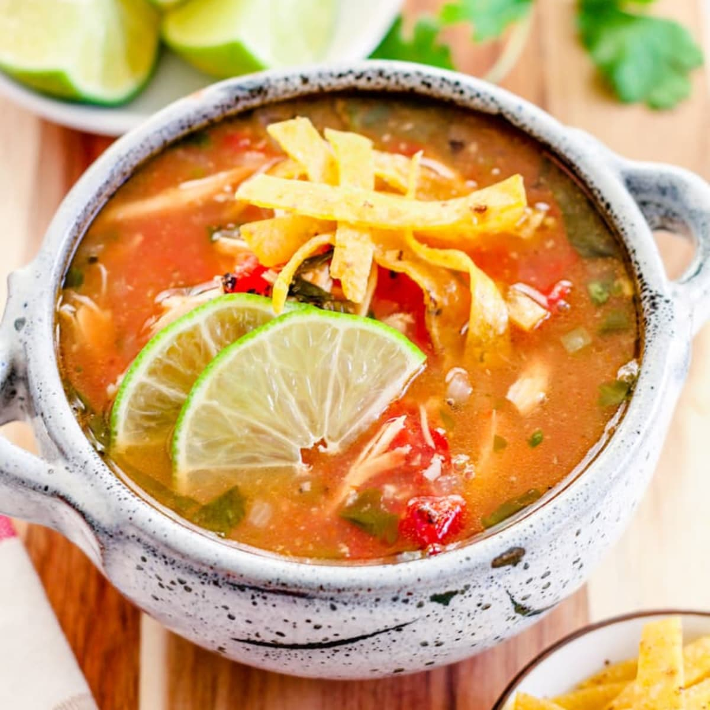

# Sopa de Lima

*Yucatán's bright lime chicken soup: a clear chicken broth scented with sour Yucatecan lime, achiote and oregano, with shredded chicken, fried tortilla strips, sliced lime, chopped chilli and fresh coriander. The Mayan-Mexican Yucatecan classic, served at the centre of every Mérida and Cancún table.*

**Serves:** 4-6

**Prep Time:** 20 minutes

**Cook Time:** 1 hour

## Overview
Sopa de lima is the iconic chicken-lime soup of Mexico's Yucatán peninsula, particularly associated with the cities of Mérida and the wider Mayan-Mexican coastal region: a clear-but-deeply-flavoured chicken broth seasoned with achiote (annatto for the proper orange-yellow Yucatecan colour), Mexican oregano, garlic, onion, tomato, and the canonical Yucatecan lime - specifically the "lima agria" (sour lime; technically not a regular lime but a sour orange-lime hybrid; outside Mexico, substitute with regular limes + a splash of orange juice for the proper character). Shredded poached chicken is added to the broth; toasted-and-fried corn tortilla strips are added at the table to provide crunch; finished with thin slices of fresh lime, finely chopped fresh habanero or jalapeño, fresh coriander and avocado. Three details define proper sopa de lima. First, Yucatecan lima agria. The sour orange-lime gives the proper Yucatecan flavour; outside Mexico, the substitute is regular lime juice + a small splash of orange juice + lime zest. Second, achiote for colour. Yucatán cooking uses achiote (annatto) extensively; gives the proper orange-yellow colour to the broth. Third, the tortilla strip topping. The fried corn tortilla strips (totopos) added at the table provide essential crunch; without them, the soup is incomplete.

## Ingredients

### Broth
- 1.2 kg whole chicken (cut into 8 pieces; or use 8 bone-in thighs and drumsticks)
- 2 litres water
- 1 large white onion (halved)
- 8 garlic cloves
- 6 ripe tomatoes (halved); or 1 tin (400 g) chopped tomatoes
- 1 tablespoon achiote paste (or 2 teaspoons annatto powder)
- 2 tablespoons dried Mexican oregano
- 2 tablespoons ground cumin
- 1 tablespoon ground coriander seed
- 4 bay leaves
- 1 cinnamon stick
- 2 teaspoons fine sea salt
- 1 teaspoon ground black pepper

### Lime addition (the canonical Yucatecan touch)
- Juice of 4 Yucatecan limas agrias (sour limes); OR juice of 4 regular limes + juice of 1 sour orange + zest of 2 limes

### Tortilla strips (totopos)
- 6 corn tortillas (cut into 5 mm × 5 cm strips)
- 6 tablespoons vegetable oil (for frying)
- 1 teaspoon fine sea salt

### To finish
- 1 small fresh habanero or jalapeño chilli (very finely chopped; deseeded for milder)
- 1 small bunch fresh coriander (chopped)
- 4 thin slices of fresh lime (per person; for the bowls)
- 1 ripe avocado (sliced)
- 1 small red onion (thinly sliced, optional)
- Extra lime wedges

### To serve
- Plain white rice (or yellow rice with sazón); optional
- Warm corn tortillas
- Refried beans (optional)
- Hot sauce

## Method

### Stage 1 - Make the broth
1. Place the chicken pieces in a large pot.
2. Cover with the 2 litres of water.
3. Add the halved onion, garlic, halved tomatoes, achiote, oregano, cumin, ground coriander seed, bay leaves, cinnamon stick, salt and pepper.
4. Bring to a boil; reduce to a simmer.
5. Skim any foam that rises.
6. Cover with the lid slightly ajar; simmer 35-45 minutes till the chicken is tender and the broth is fragrant.

### Stage 2 - Shred the chicken
1. Lift the chicken pieces out with a slotted spoon; cool slightly.
2. Remove the skin and bones; shred the meat with two forks.
3. Strain the broth through a fine sieve into a clean pot.
4. Skim off any excess fat.

### Stage 3 - Fry the tortilla strips
1. Heat the vegetable oil in a wide pan over medium-high heat.
2. Add the tortilla strips in batches; fry 1-2 minutes till deep golden and crispy.
3. Lift out; drain on kitchen paper; sprinkle with salt.

### Stage 4 - Finish the soup
1. Bring the strained broth back to a simmer.
2. Add the shredded chicken back to the broth; warm 5 minutes.
3. Just before serving, stir in the lime juice (and orange juice + zest if using substitutes).
4. Taste; adjust salt and lime.

### Stage 5 - Serve
1. Ladle the hot soup into deep bowls.
2. Add 2-3 lime slices per bowl (floating on top).
3. Add slices of avocado.
4. Scatter chopped coriander.
5. Add a pinch of finely chopped habanero/jalapeño.
6. Pile a generous handful of fried tortilla strips on top.
7. Add red onion if using.
8. Serve immediately while the tortilla strips are still crispy.
9. Provide warm corn tortillas, hot sauce and extra lime wedges on the side.

## Notes
- **Sour lime (lima agria) is canonical:** outside Mexico, substitute with regular lime + sour orange.
- **Achiote for the proper colour:** gives the Yucatecan orange-yellow.
- **Add tortilla strips at the table:** they go soggy in the broth; keep crispy.
- **Stir in lime juice at the end:** preserves the brightness.
- **The Mayan-Yucatecan flavour profile:** distinct from central Mexican cooking; gentler, more aromatic, less spice-forward.

## Variations
**Sopa de pollo Yucateca:** less lime, more black pepper; called "sopa de pollo" instead of "sopa de lima" but otherwise similar.
**With pibil chicken:** swap regular chicken for pibil-style (achiote-marinated) chicken; gives extra colour and flavour.
**Vegetarian sopa de lima:** swap chicken for cubed firm tofu or chickpeas; use vegetable stock; same procedure.
**Spicier:** double the habanero; add 2 chiles de árbol to the broth; properly Yucatecan fierce.

## Serving
In deep bowls with all the canonical garnishes. Drink: cold Mexican beer (Pacifico, Sol), Yucatecan agua de chaya (chaya leaf drink), or fresh agua de horchata. As a light Yucatán-Mexican lunch.

## Storage
- Best eaten the day made.
- The broth keeps refrigerated 3 days; reheat and add fresh garnishes.
- Don't freeze with tortilla strips; add fresh.
- The base broth freezes 3 months.
