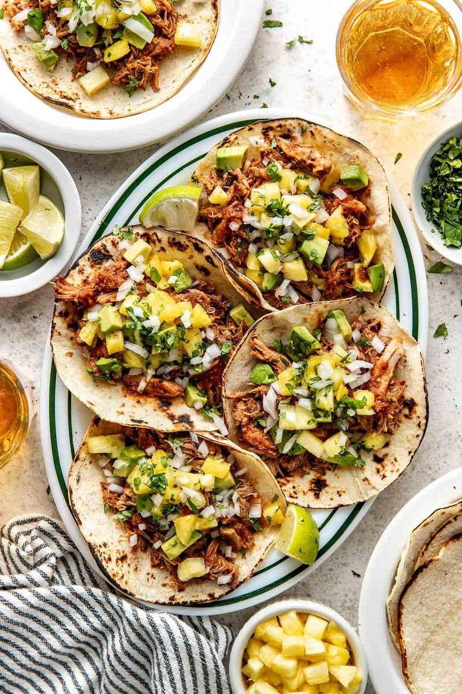

# Tacos al Pastor

*Mexico City's gift to the world: thinly sliced pork marinated in dried-chilli paste, achiote and pineapple, traditionally cooked on a vertical trompo and topped with raw onion, coriander and charred pineapple.*

**Serves:** 6 (about 24 tacos)

**Prep Time:** 25 minutes (plus 4 hours marinade)

**Cook Time:** 15 minutes

## Overview
Mexico City's gift to the world and the taco that defines a Mexico City night: thinly sliced pork marinated in a paste of dried chillies, achiote, vinegar and pineapple, traditionally roasted on a vertical trompo (the spit Lebanese immigrants brought; the Mexicans added the chilli and pineapple) and shaved off in slivers onto warm corn tortillas. The home version sears the marinated pork in a screaming-hot pan and chars the pineapple separately. Pineapple is structural here, not decorative: the bromelain enzyme tenderises the meat and gives the characteristic sweet-savoury edge that orange juice can't match. Pork shoulder slices thin (5 mm; partially freeze for thirty minutes for clean cuts), then marinates four hours or overnight in a smooth deep-red paste of toasted-and-soaked guajillo and ancho chillies blended with garlic, vinegar, pineapple juice, achiote, cumin and oregano. Seared hard till the edges char, chopped fine, piled on warm corn tortillas with charred pineapple chunks, finely chopped white onion, coriander and a squeeze of lime.

## Ingredients

### Marinade
- 4 dried guajillo chillies (stems and seeds removed)
- 2 dried ancho chillies (stems and seeds removed)
- 4 garlic cloves
- 100 ml white wine vinegar
- 100 ml fresh pineapple juice
- 2 tablespoons achiote paste (or 1 teaspoon paprika + 1 teaspoon turmeric as substitute)
- 1 teaspoon ground cumin
- 1 teaspoon dried oregano (Mexican if possible)
- 2 teaspoons salt
- 1 teaspoon caster sugar

### Pork
- 1 kg pork shoulder (very thinly sliced, 5 mm thick)

### To serve
- 24 corn tortillas (small)
- ½ small fresh pineapple (cut into 1 cm chunks)
- 1 white onion (small, very finely chopped)
- A bunch of fresh coriander (chopped)
- 4 limes (cut into wedges)

## Method

### Stage 1 - Marinade
1. Toast the dried chillies in a dry pan over medium heat for 30 seconds a side until fragrant (don't burn).
1. Soak the chillies in just-boiled water for 15 minutes to soften.
1. Drain and blend with the garlic, vinegar, pineapple juice, achiote, cumin, oregano, salt and sugar to a smooth paste.

### Stage 2 - Marinate
1. Toss the sliced pork with the marinade in a bowl. Cover and refrigerate at least 4 hours, ideally overnight.

### Stage 3 - Sear the pork
1. Heat a heavy frying pan or griddle over high heat.
1. Working in batches (don't crowd), sear the pork for 2-3 minutes a side until charred at the edges and cooked through.
1. As each batch is done, transfer to a board and chop into smaller pieces.

### Stage 4 - Char the pineapple
1. In the same pan, char the pineapple chunks for 1-2 minutes a side.

### Stage 5 - Warm the tortillas
1. Warm the tortillas one at a time on a dry hot griddle for 20 seconds a side, or wrap in foil and heat in a 180°C oven for 10 minutes.
1. Stack and wrap in a clean tea towel to keep warm.

### Stage 6 - Build the tacos
1. Pile chopped pork on each tortilla.
1. Top with charred pineapple, chopped onion, coriander.
1. Serve with lime wedges.

## Notes
- **Pineapple is structural:** The bromelain enzyme tenderises the meat and gives the characteristic sweet-savoury edge. Don't substitute orange juice.
- **Slice pork thin:** Easier if the shoulder is partially frozen for 30 minutes before slicing; cuts cleanly with a sharp knife.
- **Fresh chillies, not powdered:** Dried whole chillies (guajillo, ancho) give the layered chilli flavour that powder can't match.

## Storage
- Marinated raw pork keeps 2 days refrigerated; cooked keeps 3 days.
- Tortillas eat best fresh. Reheat individually.
