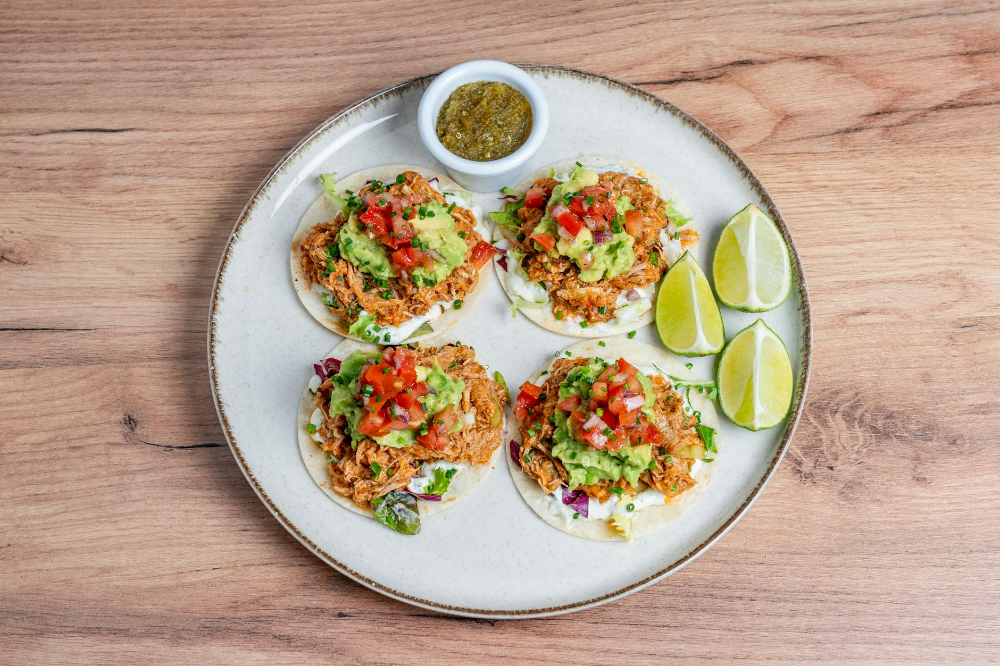

# Tinga de Pollo

*Shredded chicken in a smoky tomato-chipotle sauce. A Puebla classic that's the workhorse filling for tostadas, tacos and tortas; on the table in under an hour.*

**Serves:** 4-6

**Prep Time:** 10 minutes

**Cook Time:** 40 minutes

## Overview
Chicken thighs are poached with onion, garlic and bay until just cooked, then shredded with two forks. A sauce is built separately: sliced onion is caramelised, then chipotles in adobo and tinned tomatoes are blended in and simmered down with the poaching liquor. The shredded chicken is folded back through the sauce so every shred picks up the smoke and acidity. Spoon onto warm tostadas with avocado, crema and crumbled queso fresco.

## Ingredients

### Chicken
- 800 g chicken thighs (skinless, boneless)
- 1 onion (halved)
- 4 garlic cloves
- 2 bay leaves
- 1 teaspoon salt
- Water to cover

### Sauce
- 2 tablespoons olive oil
- 2 onions (thinly sliced)
- 4 garlic cloves (finely chopped)
- 2-3 chipotle chillies in adobo (chopped, plus 1 tablespoon of the adobo)
- 400 g tin chopped tomatoes
- 1 teaspoon dried Mexican oregano
- ½ teaspoon ground cumin
- 1 teaspoon salt (to adjust)

### To serve
- 12 corn tostadas (or warm corn tortillas for tacos)
- 1 avocado (sliced)
- 100 g queso fresco (or feta, crumbled)
- Mexican crema (or soured cream)
- Coriander leaves
- Lime wedges

## Method

### Stage 1 - Poach the chicken
1. Place the chicken thighs in a saucepan with the halved onion, garlic, bay and salt.
1. Cover with water and bring to a gentle simmer.
1. Poach for 18-20 minutes until the chicken is cooked through.
1. Lift the chicken out and reserve 250 ml of the poaching liquor.
1. Once cool enough to handle, shred with two forks into fine strands.

### Stage 2 - Caramelise the onions
1. Heat the olive oil in a wide pan over medium heat.
1. Add the sliced onions and a pinch of salt.
1. Cook for 12-15 minutes, stirring occasionally, until soft and lightly browned.
1. Add the chopped garlic and cook for 1 minute.

### Stage 3 - Build the sauce
1. Blend the chipotles, adobo, tinned tomatoes, oregano and cumin until smooth.
1. Pour into the pan with the onions.
1. Bring to a simmer and cook for 8-10 minutes, stirring, until the sauce darkens and thickens.
1. Add 200 ml of the reserved poaching liquor and simmer for another 5 minutes.

### Stage 4 - Combine
1. Fold the shredded chicken into the sauce, coating every strand.
1. Cook for 5 minutes for the chicken to absorb the flavour.
1. Taste and adjust salt (chipotle adobo is salty, so the dish often needs less than expected).

### Stage 5 - Serve
1. Spoon the tinga onto warm tostadas or into folded tortillas.
1. Top with sliced avocado, crumbled queso fresco, a drizzle of crema, coriander leaves and a squeeze of lime.

## Notes
- **Chipotles in adobo:** Sold in small tins; smoky, deep-red, moderately hot. Use the chillies and a spoonful of the adobo sauce; the rest keeps in the fridge for weeks.
- **Heat level:** 2 chipotles is medium; 3 is properly hot. The adobo is where most of the smoke lives, so don't skip it.
- **Thighs not breasts:** Breasts dry out and shred into chalky strands; thighs stay juicy.

## Storage
- Refrigerate up to 4 days. The sauce thickens as it cools; loosen with a splash of stock when reheating.
- Freezes well for 2 months.
