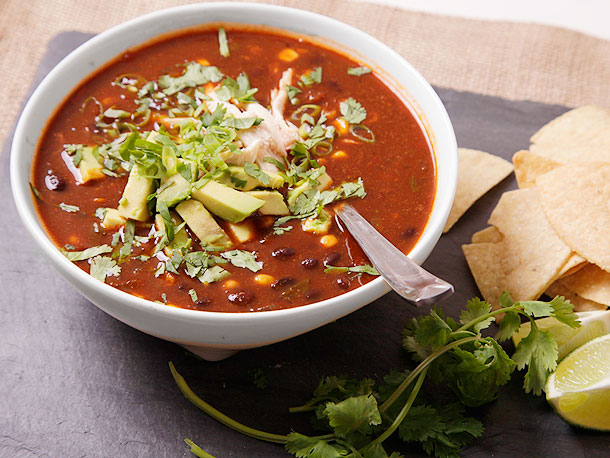

# Tortilla Soup

*This is a classic Mexican soup, simple yet at the same time sophisticated. You can use the recipe below for a light fragrant soup, or add left-over bits of chicken for a hearty comforting variant.*

**Serves:** 4

**Prep Time:** 20 minutes

**Cook Time:** 30 minutes

## Overview
A Mexican soup that's simple yet sophisticated: a smoky tomato broth ladled over crisp-fried tortilla strips and a chilli toasted to bright red strips, topped at the table with diced avocado, mozzarella cubes, fresh coriander, parsley and a squeeze of lime. You can serve it as a light fragrant soup or add leftover shredded chicken for a heartier supper. You dry-toast halved onion and garlic in a heavy pan for five or six minutes, blend with peeled-seeded tomatoes and smoked paprika to a puree, then reduce in a saucepan till thick. Pour in chicken stock and simmer 25 minutes, season. Meanwhile toast a large dried chilli briefly in a dry pan (no longer than 30 seconds; longer and it turns bitter), cut into strips. Cut corn tortillas in half then into 2 cm strips, fry in batches in shimmering oil till brown and crispy, drain on paper. Divide tortilla and chilli strips between bowls, ladle the hot broth over, set out small ramekins of cubed buffalo mozzarella, diced avocado, chopped parsley, chopped coriander and lime wedges so each diner builds their own bowl.

## Ingredients

### Base
- 5 tablespoons olive oil

### Aromatics
- 1 onion (peeled and cut into 6 pieces)
- 3 garlic cloves

### Vegetables
- 4 -6 fresh tomatoes (skinned and seeded)

### Seasonings
- 1 - 2 very large dried chillies (seeds removed)
- 1 teaspoon smoked paprika

### Liquid/Broth
- 1.2 litres chicken stock

### Other
- 6 corn tortillas
- 200 grams buffalo mozzarella (diced into ½ cm pieces)
- 1 ripe avocado (large, stoned, peeled, and diced)
- 1 lime (large, cut into wedges)
- 1 bunch fresh flat leaf parsley (finely chopped)
- 1 bunch fresh coriander (finely chopped)

## Method

### Stage 1 - Prepare ingredients
1. Peel the onion, and cut into 6 pieces.
2. Dice the mozzarella into ½ cm pieces.
3. Remove the stone from the avocado, and peel.
4. Chop the avocado into ½ cm pieces and place in a ramekin.
5. Cut the lime into wedges and place in a ramekin.
6. Finely chop the parsley and place in a ramekin.
7. Finely chop the coriander and place in a ramekin.

### Stage 2 - Make broth
1. Put the onion and garlic in a large, heavy frying pan and dry toast (stirring frequently) for 5 - 6 minutes over a medium heat.
2. Add the onions, paprika and garlic to a food processor, along with the tomatoes and purée.
3. Add the purée to a saucepan over a medium heat and reduce until thick.
4. Add the stock and simmer for about 25 minutes.
5. Season to taste.

### Stage 3 - Fry tortillas
1. Add the chilli to a dry frying pan and toast for about 30 seconds, taking care not to burn the chilli.
2. Cut the chilli into strips.
3. Cut the tortillas in half.
4. Cut each half into 2 cm strips.
5. Heat the oil in a saucepan until shimmering.
6. Add half the tortilla strips and fry, stirring constantly until the pieces are brown and crispy.
7. Remove the tortilla, and allow to dry on kitchen towel.
8. Repeat with the remaining tortilla.

### Stage 4 - Assemble and serve
1. Divide the tortilla and chilli strips between 4 bowls.
2. Add the tomato broth to each bowl.
3. Arrange the ramekins on a table along with the soup bowls.
4. Add cheese and avocado to the soup, with a squeeze of lime juice and garnish with parsley and coriander.

## Notes
- **Tortillas:** Fry in batches for crispiness; drain well.
- **Chillies:** Toast briefly to release flavor without burning.
- **Toppings:** Serve separately for customization.
- **Smoked paprika:** Adds authentic smokiness.

## Serving
Serve hot with toppings on the side for guests to customize.

## Storage
- Refrigerate broth up to 3 days; tortillas separate.
- Freezes well for up to 1 month (without toppings).
- Best assembled fresh.
