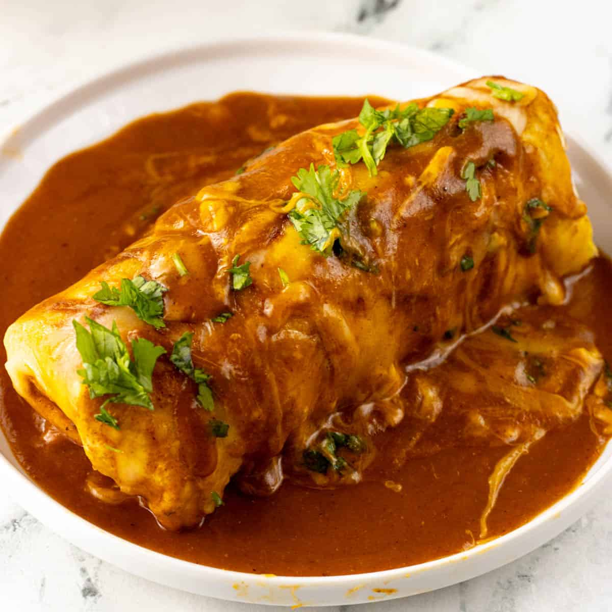

# Wet Burrito

*The Midwestern smothered burrito: a large flour-tortilla burrito filled with beans, meat and cheese, smothered in red or green enchilada sauce and baked under more cheese until bubbling.*

**Serves:** 4 burritos

**Prep Time:** 30 minutes

**Cook Time:** 1 hour 30 minutes

## Overview
The Wet Burrito (also called the Smothered Burrito) is the Midwestern and Texan answer to the question of what happens if you bake a burrito under enchilada sauce. The dish was popularised in Michigan in the 1960s and Texas around the same time, where Mexican-American restaurants started ladling red salsa or green enchilada sauce over a stuffed burrito and baking it under cheese until the top went bubbling and dark. The result is closer to enchilada than to a Mission burrito: knife-and-fork food rather than hand-held. The combination is comforting and indulgent, the kind of plate that turns up at every Tex-Mex diner across the American Midwest.

## Ingredients

### Filling
- 500 g ground beef or pork
- 1 onion, finely chopped
- 2 garlic cloves, crushed
- 1 tsp ground cumin
- 1 tsp Mexican oregano
- 1 tsp salt
- 2 tbsp tomato paste
- 200 g cooked refried beans
- 1 tbsp oil

### Enchilada Sauce
- 4 dried guajillo chiles (Mexican dried red chilli, mild and sweet-tangy), toasted and rehydrated
- 2 dried ancho chiles, toasted and rehydrated
- 1 tin (400 g) chopped tomatoes
- 1 small onion
- 2 garlic cloves
- 1 tsp cumin
- 1 tsp oregano
- 400 ml chicken stock
- Salt to taste

### To Assemble
- 4 large flour tortillas (30 cm)
- 300 g Monterey Jack or cheddar cheese, grated
- Shredded iceberg lettuce (optional)
- Sliced tomato (optional)
- Sour cream
- Sliced jalapeños

## Method

### Stage 1 - Build the enchilada sauce
1. Toast the dried chiles in a dry pan for 30 seconds per side; rehydrate in hot water for 20 minutes.
2. Blend the rehydrated chiles, tomatoes, onion, garlic, cumin and oregano with a ladle of the soaking water to a smooth paste.
3. Pour the paste into a saucepan; cook for 5 minutes; add the stock; simmer 10 minutes until thickened. Salt to taste.

### Stage 2 - Cook the filling
1. Heat oil in a pan; soften the onion for 5 minutes.
2. Add the garlic, cumin, oregano; cook 1 minute.
3. Add the ground meat; brown hard, breaking it up; cook 8-10 minutes.
4. Stir in the tomato paste; cook 2 minutes.
5. Fold in the refried beans; salt to taste.

### Stage 3 - Assemble and bake
1. Preheat the oven to 200°C.
2. Warm a tortilla on a dry pan; spoon the meat-bean filling across the lower third, top with a handful of grated cheese.
3. Fold the bottom up, sides in, roll forward; place seam-side down in a greased baking dish.
4. Repeat for all four burritos.
5. Pour the enchilada sauce generously over the top so each burrito is completely covered.
6. Scatter the remaining grated cheese over the sauce.
7. Bake for 20-25 minutes until the cheese bubbles and darkens at the edges.

### Stage 4 - Serve
1. Lift each burrito onto a wide plate with a spatula; spoon extra sauce around.
2. Top with shredded lettuce, sliced tomato, sour cream and jalapeños at the table.

## Notes
- **Knife and fork:** Wet burritos can't be eaten by hand; the sauce and melted cheese make them messy. Serve on plates.
- **Enchilada sauce variations:** Green (salsa verde with tomatillos) or red (chile-based, as above) both work. Some recipes use both, half and half on each burrito.
- **Don't over-sauce the burrito before baking:** The sauce can soak through and make the tortilla collapse; pour over the rolled burrito in the dish, not before rolling.

## Variations
**Green wet burrito:** Use salsa verde (tomatillo-based) instead of red enchilada sauce.
**Vegetarian:** Skip the meat, double the beans, add roasted vegetables.
**Cheese-heavy:** Add an extra layer of cheese inside the burrito as well as on top.

## Serving
Serve in deep plates with the sauce pooling around the burrito. Shredded lettuce, sliced tomato, sour cream and jalapeños on top; chips and salsa on the side.

## Storage
- The filling and enchilada sauce keep 4 days refrigerated; freeze separately 2 months
- Assembled and baked wet burritos keep 2 days refrigerated; reheat covered at 180°C for 15 minutes
- The tortilla softens further on day two; this is fine for a wet burrito
