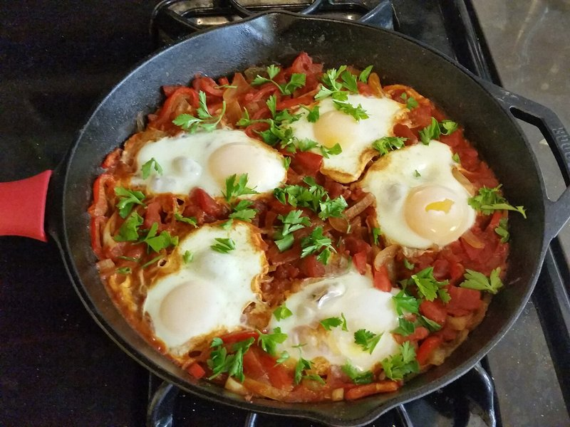

# Shakshuka

*North African and Levantine breakfast: eggs poached in a spiced tomato-and-pepper sauce, served straight from the pan with bread to mop. Originally from Tunisia or Libya; widespread across Israel, Palestine, Egypt and the broader region.*

**Serves:** 4

**Prep Time:** 10 minutes

**Cook Time:** 25 minutes

## Overview
The North African and Levantine one-pan breakfast that's spread across the whole region: eggs poached in a spiced tomato-and-pepper sauce, brought to the table in the cooking pan with bread to mop. Originally Tunisian or Libyan, now eaten everywhere from Tel Aviv to Cairo to Beirut. You build a slow sofrito first, softening sliced onion and red pepper in olive oil for 10 minutes till they start to caramelise, then bloom garlic, chilli, cumin, sweet paprika, smoked paprika (both, not one; just smoked is one-note, just sweet lacks depth) and caraway seeds for a minute. Stir in tomato purée and a minute later add two tins of chopped tomatoes with a pinch of sugar, season generously, simmer 12 to 15 minutes till the sauce thickens (a wet sauce makes wet eggs; reduce it properly first). Make six wells in the sauce with the back of a spoon, crack an egg into each, lid down on low for five to seven minutes till the whites set but the yolks stay runny. Don't stir once the eggs are in; the steam under the lid is what poaches them through. Scatter crumbled feta and chopped parsley or coriander, bring the pan to the table with crusty bread for dipping.

## Ingredients

- 3 tablespoons olive oil
- 1 onion (sliced)
- 1 red pepper (sliced)
- 4 garlic cloves (sliced)
- 1 red chilli (small, chopped, optional)
- 2 teaspoons ground cumin
- 1 teaspoon sweet paprika
- 1 teaspoon smoked paprika
- 1 teaspoon caraway seeds (optional)
- 2 tablespoons tomato purée
- 800 g tinned chopped tomatoes (2 tins)
- 1 teaspoon caster sugar
- salt
- pepper
- 6 eggs (large)
- 100 g feta cheese (crumbled, optional)
- A small handful of flat-leaf parsley (or coriander, chopped)
- Crusty bread, to serve

## Method

### Stage 1 - Sofrito
1. Heat the oil in a wide heavy frying pan (about 28 cm) over medium heat.
1. Cook the onion and red pepper for 10 minutes until soft and starting to caramelise.
1. Add the garlic, chilli, cumin, both paprikas and caraway; cook 1 minute.

### Stage 2 - Sauce
1. Stir in the tomato purée; cook 1 minute.
1. Add the chopped tomatoes and sugar. Season generously.
1. Simmer for 12-15 minutes until thickened.

### Stage 3 - Eggs
1. Make 6 wells in the sauce with the back of a spoon.
1. Crack an egg into each well.
1. Cover the pan; reduce heat to low.
1. Cook 5-7 minutes, until the whites are just set but the yolks are still runny.

### Stage 4 - Serve
1. Scatter the feta and herbs over.
1. Bring the pan to the table; serve with crusty bread for dipping.

## Notes
- **Reduce the sauce well:** Wet sauce makes wet eggs. Get it thick first.
- **Cover, don't stir:** Once the eggs are in, the lid steams them through. Stirring breaks the yolks.
- **Smoked + sweet paprika:** Both. Just smoked is one-note; just sweet lacks depth.

## Storage
- Sauce keeps 3 days refrigerated; cook fresh eggs into it on demand.
- Whole shakshuka with eggs doesn't reheat well.
