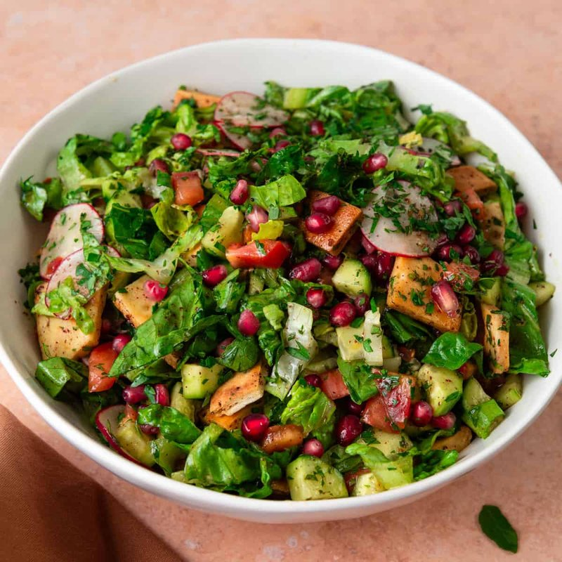

# Fattoush

*Levantine bread salad: chopped cucumber, tomato, radish, herbs and shards of toasted pita, all dressed with lemon, olive oil and sumac. The everyday salad that uses up stale bread; sumac gives it the characteristic tang.*

**Serves:** 4

**Prep Time:** 15 minutes

**Cook Time:** 5 minutes

## Overview
The Levantine bread salad that uses up day-old pita, the kind of dish that turns up at every mezze table from Damascus to Detroit: chopped cucumber, tomato, radish, romaine, fresh mint and parsley tossed with shards of crisp toasted pita in a lemon-and-sumac dressing. Sumac is the colour and the tang and what makes fattoush fattoush; skip it and you have a salad, not the dish. You tear day-old pita into 3 cm pieces, toss with olive oil and a pinch of salt, bake at 200°C for five to seven minutes till deep golden and crisp. Cool completely; warm pita softens the salad. Whisk the dressing: olive oil, lemon juice, pomegranate molasses (the tart-sweet syrup that's central to the dressing; find at any Middle Eastern grocer or substitute with balsamic and a teaspoon of honey), crushed garlic, sumac, dried mint, salt and pepper. Combine the tomatoes, cucumber, radishes, spring onions, lettuce, fresh mint and parsley in a wide bowl, pour the dressing over, toss gently. Add the toasted pita last and toss once more, plate immediately, scatter extra sumac across the top. Eat the moment it's tossed; pita in dressing for more than a few minutes turns soggy.

## Ingredients

### Salad
- 2 pita breads (large, 1-2 days old, torn into 3 cm pieces)
- 3 tablespoons olive oil
- 4 ripe tomatoes (cut into wedges)
- 1 cucumber (cut into chunks)
- 6 radishes (sliced)
- 4 spring onions (sliced)
- 1 romaine lettuce (small, chopped)
- A small bunch of fresh mint (leaves picked, torn)
- A small bunch of flat-leaf parsley (chopped)

### Dressing
- 4 tablespoons extra virgin olive oil
- 1 lemon (juice)
- 1 tablespoon pomegranate molasses
- 1 garlic clove (crushed)
- 2 teaspoons sumac (plus extra to scatter)
- 1 teaspoon dried mint
- ½ teaspoon salt
- ¼ teaspoon black pepper

## Method

### Stage 1 - Toast the pita
1. Heat the oven to 200°C (180°C fan).
1. Toss the torn pita with 3 tablespoons of olive oil and a pinch of salt.
1. Spread on a baking tray; bake 5-7 minutes until deep golden and crisp.
1. Cool completely (warm pita softens the salad).

### Stage 2 - Dressing
1. Whisk all dressing ingredients in a small jar.

### Stage 3 - Salad
1. In a large bowl, combine the tomatoes, cucumber, radishes, spring onions, lettuce, mint and parsley.
1. Pour the dressing over; toss gently.

### Stage 4 - Serve
1. Add the toasted pita; toss once more.
1. Plate immediately.
1. Scatter extra sumac over the top.

## Notes
- **Add the bread last:** Pita in dressing for more than a few minutes turns soggy. Toss and eat.
- **Pomegranate molasses:** Tart-sweet syrup; central to the dressing. Find at any Middle Eastern grocer; substitute with 1 tablespoon balsamic + 1 teaspoon honey if needed.
- **Sumac is the colour and tang:** Dark red, lemony. Don't skip; it's what makes fattoush fattoush.

## Storage
- Doesn't keep. Eat the moment it's tossed.
