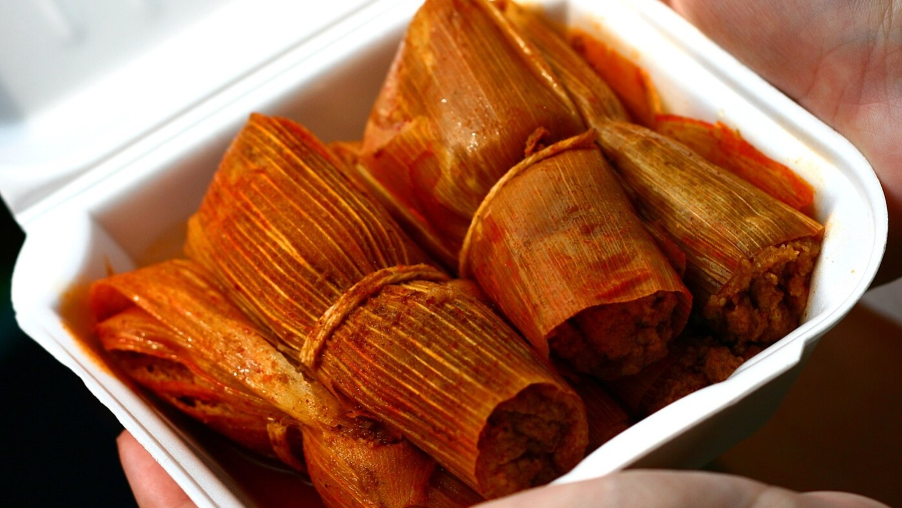

# Delta Hot Tamales

*The Mississippi Delta's distinctive hot tamale: a small, spicy, simmered (not steamed) tamale of beef and cornmeal, wrapped in corn husk and tied with string, sold from roadside stands and cafes from Greenville to Cleveland.*

**Makes:** 24 tamales

**Prep Time:** 1 hour (plus 30 minutes for husks to soak)

**Cook Time:** 1 hour 30 minutes

## Overview
The Mississippi Delta hot tamale is its own thing, distinct from any Mexican tradition. The story most often told is that Delta tamales arrived via Mexican migrant workers in the cotton fields of the early 1900s, who introduced the basic technique to local Black cooks; the cooks then adapted it, using yellow cornmeal (cheaper and more available than masa harina), beef rather than pork, lots of cayenne, and a simmering method (not steaming) that gives the tamales their distinctive deep red-orange exterior. They are smaller than Mexican tamales (finger-length rather than palm-length), tied at both ends with string, and almost always served in pairs in their husks with extra liquor from the simmering pot ladled over the top.

The Mississippi Delta now has its own Hot Tamale Trail, mapped by the Southern Foodways Alliance, with dozens of restaurants and stands across the region. Each has its own recipe; the version below is built on the common Delta template.

## Ingredients

### Husks and string
- 24 dried corn husks
- Kitchen string (cut into 24 short lengths)

### Filling
- 600 g ground beef chuck (15-20% fat)
- 1 small onion (very finely chopped)
- 2 garlic cloves (minced)
- 1 tbsp chilli powder
- 1 tbsp paprika
- 1 tsp ground cumin
- 1 tsp ground oregano
- 1 tsp salt
- ½-1 tsp cayenne (to taste; Mississippi tamales are properly hot)
- ½ tsp black pepper

### Dough
- 300 g fine yellow cornmeal (not coarse polenta)
- 100 g plain flour
- 1 tsp salt
- 1 tsp chilli powder
- 1 tsp paprika
- ½ tsp cayenne
- 150 ml beef stock or hot water
- 75 ml vegetable oil or lard

### Simmering liquid
- 1.5 litres beef stock or water
- 2 tbsp chilli powder
- 1 tbsp paprika
- 1 tbsp salt
- 1 tsp cayenne
- 1 small onion (halved)

## Method

### Stage 1 - Soak the husks
1. Pour boiling water over the corn husks in a heatproof bowl. Weigh them down with a plate (they float). Soak 30 minutes, until soft and pliable.

### Stage 2 - Make the filling
1. Combine the beef, chopped onion, garlic and all the filling spices in a bowl. Mix thoroughly with your hands.
1. Heat a wide pan over medium heat. Add the meat mixture and break it up with a wooden spoon. Cook 8-10 minutes, until the beef is browned and the juices have reduced.
1. Tip onto a plate and cool slightly while you make the dough.

### Stage 3 - Make the dough
1. Combine the cornmeal, flour, salt, chilli powder, paprika and cayenne in a bowl.
1. Stir in the beef stock and oil. The dough should be soft and slightly tacky, easy to mould but not sticking to hands.
1. Mix in the cooked beef mixture so the dough is uniformly meat-flecked.

### Stage 4 - Wrap the tamales
1. Drain the husks and pat dry.
1. Take a husk, lay it on the work surface with the pointed end facing away. Place 2 tablespoons of the dough mixture in the centre.
1. Roll the husk to form a tight cylinder around the filling, about 8-10 cm long and 3 cm thick. Tie each end with a short length of kitchen string.
1. Repeat with the rest. You should have 24 small tied tamales.

### Stage 5 - Simmer
1. Bring the simmering liquid to a boil in a large heavy pot.
1. Lay the tamales in the pot, packing them tightly. Add more water or stock if needed to cover them.
1. Reduce heat to a low simmer. Cover with a tight lid.
1. Simmer 1 hour to 1 hour 15 minutes. Test one tamale by lifting it out, untying the string and unrolling: the dough should be firm and hold its shape, the meat aromatic, the colour deep brick-red.
1. Keep the tamales in the simmering liquid until ready to serve.

### Stage 6 - Serve
1. Lift the tamales out with a slotted spoon into shallow bowls, 2-3 per person.
1. Ladle some of the cooking liquid over the top (this is the "tamale liquor", essential to the Delta experience).
1. Serve with saltine crackers on the side and a bottle of hot sauce on the table.

## Notes
- **Yellow cornmeal, not masa harina.** Mississippi tamales use grits cornmeal, which gives the firmer, denser texture and slightly grittier mouthfeel that distinguishes them from a Mexican tamale.
- **Simmer, do not steam.** This is the structural difference. Steaming gives a fluffy, white tamale; simmering gives a denser, redder, more saucy one. The cooking liquid is part of the dish.
- **The dough is fairly stiff.** It should hold its shape when squeezed. A wet dough leaks into the simmering liquid; a too-dry dough cracks.
- **Eaten in the husk.** The tamale is served in its corn husk, untied but unfolded only at the top. The husk holds the simmering liquor against the dough as you eat.
- **Saltines on the side.** Not a garnish; a Delta tradition. Used to scoop up extra liquor from the bowl.

## Variations
- **Pork tamales:** swap the beef for ground pork; reduce cooking time to 1 hour.
- **Vegetarian tamales:** use a filling of black beans, sweetcorn and roasted poblano in place of the beef. Less traditional but works.
- **Hot tamale pie:** if rolling 24 tamales feels excessive, layer the dough and meat in a casserole dish and bake at 180°C for 45 minutes; serve in squares. A common Delta home shortcut.

## Serving
- Two or three tamales per person as a meal, with the saltines and the liquor. A cold sweet tea or a Coke on the side. Mississippi hot tamale stands often serve them in styrofoam cups so the liquor pools at the bottom; this is the correct service.

## Storage
- Refrigerates 3 days in their liquor. Reheat by simmering gently for 10 minutes.
- Freezes 3 months wrapped tightly in foil. Defrost overnight in the fridge; reheat by simmering.
- The cooking liquid keeps a week in the fridge and can be used to simmer a second batch of tamales (or stirred into chilli).
