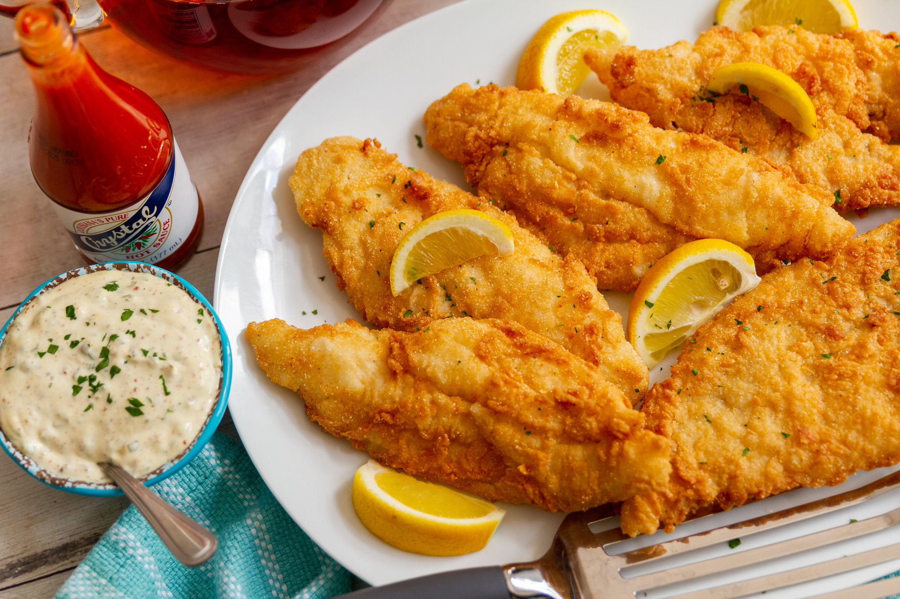

# Fried Catfish

*The Mississippi staple: farm-raised catfish fillets in a buttermilk soak and cornmeal-and-flour crust, fried gold in a heavy skillet. Eaten with hush puppies, slaw and a wedge of lemon.*

**Serves:** 4

**Prep Time:** 15 minutes (plus 30 minutes for the soak)

**Cook Time:** 12 minutes

## Overview
Catfish has been a Mississippi staple as long as the state has had a name. The Mississippi Delta now produces most of America's farm-raised catfish, and the fish is the heart of countless small fish-houses across the state where you can order a fried catfish plate with hush puppies, coleslaw and a wedge of lemon, sit on a screened porch, and eat lunch for less than ten dollars.

The technique is straightforward: catfish fillets are soaked in buttermilk (which tenderises and removes any muddy river note), dredged in a half-cornmeal-half-flour mix seasoned with cayenne, paprika and salt, and fried in a deep skillet of hot oil until the crust is deep gold and the fish flakes cleanly. The buttermilk soak is non-negotiable; it makes the difference between catfish that tastes clean and catfish that tastes of the bottom of a pond.

Eaten with the right accompaniments, fried catfish is one of the best Southern dishes there is. Hush puppies and tartare sauce alongside; a beer or a sweet iced tea to drink.

## Ingredients

### Catfish
- 4 catfish fillets (about 175 g each, skinless)
- 300 ml buttermilk
- 1 tsp Louisiana hot sauce (Crystal or Tabasco)

### Dredge
- 150 g fine yellow cornmeal
- 100 g plain flour
- 2 tsp salt
- 1 tsp paprika
- 1 tsp garlic powder
- 1 tsp onion powder
- ½ tsp cayenne (more for heat)
- ½ tsp ground black pepper
- ½ tsp dried oregano

### Frying
- Neutral oil for deep frying (about 1 litre)
- Lemon wedges, to serve
- Tartare sauce (homemade or shop-bought), to serve

## Method

### Stage 1 - Soak the fillets
1. Whisk the buttermilk and hot sauce together in a wide shallow dish.
1. Add the catfish fillets, turning to coat both sides. Cover and refrigerate at least 30 minutes, up to 4 hours. The longer the soak, the more tender and milder the fish.

### Stage 2 - Make the dredge
1. Combine the cornmeal, flour, salt, paprika, garlic powder, onion powder, cayenne, black pepper and oregano in a wide shallow bowl. Mix thoroughly with a fork.

### Stage 3 - Heat the oil
1. Pour oil into a deep heavy skillet or Dutch oven to a depth of 4 cm. Heat to 180°C (350°F).
1. A pinch of dredge dropped into the oil should sizzle and rise immediately without browning instantly.

### Stage 4 - Dredge and fry
1. Lift a fillet out of the buttermilk, letting excess drip back into the dish. Press into the seasoned cornmeal mix on both sides, pushing the coating on firmly. The fillet should be uniformly thickly coated; any bare spots will brown faster and give an uneven crust.
1. Lower the fillet carefully into the hot oil. Repeat with a second fillet (do not crowd; fry no more than 2 fillets at a time in a typical skillet).
1. Fry 3-4 minutes per side, depending on fillet thickness, turning once. The crust should be deep gold and the fish should flake when prodded with a fork.
1. Lift onto kitchen paper. Sprinkle immediately with a fine pinch of salt.
1. Repeat with the remaining 2 fillets, allowing the oil to return to 180°C between batches.

## Stage 5 - Serve
1. Plate each fillet with a wedge of lemon and a generous spoonful of tartare sauce.
1. Serve immediately while the crust is still crisp.

## Notes
- **Cornmeal in the dredge is the Mississippi marker.** Plain flour alone gives a flat coating; cornmeal gives the crackle. The 60:40 cornmeal-to-flour ratio is the right balance.
- **The buttermilk soak does two jobs.** It tenderises the flesh and removes any earthy "river" flavour from the catfish. 30 minutes is enough; 2 hours is better; longer than 4 starts to break the fish down.
- **The oil must be properly hot.** Under 170°C and the fish absorbs oil and stays soft. Over 190°C and the crust burns before the fish cooks. 180°C is the target.
- **Don't crowd the skillet.** Two fillets at a time keeps the oil temperature steady. Crowding drops the temp and gives you greasy, pale catfish.
- **Farmed catfish is preferred for this dish.** American farm-raised catfish has been cleaned of the muddy notes that wild-caught catfish can carry; the flavour is more reliable.

## Variations
- **Blackened catfish:** dip the fillets in butter, press into the spice rub from [Blackened Redfish](../louisiana/blackened-redfish.md), and char in a screaming-hot skillet for 2 minutes per side. A totally different dish.
- **Po'boy:** flake the fried catfish into a French baguette with shredded lettuce, sliced tomato, pickle and remoulade for a catfish po'boy.
- **Whole fish:** if you can source small whole catfish, score them across the side, soak and dredge whole, and fry for 5-6 minutes per side. The bones add flavour but require more care to eat.

## Serving
A classic Mississippi catfish plate: two fried fillets, three hush puppies, a heap of coleslaw, a wedge of lemon and a small ramekin of tartare sauce. Sweet iced tea on the side; cornbread is optional.

## Storage
- Fried catfish softens within an hour. Eat fresh.
- Day-old fried catfish can be revived in a 200°C oven for 5 minutes, or briefly in an air fryer. Do not microwave; it goes soggy.
- The buttermilk soak does not store; discard after use.
