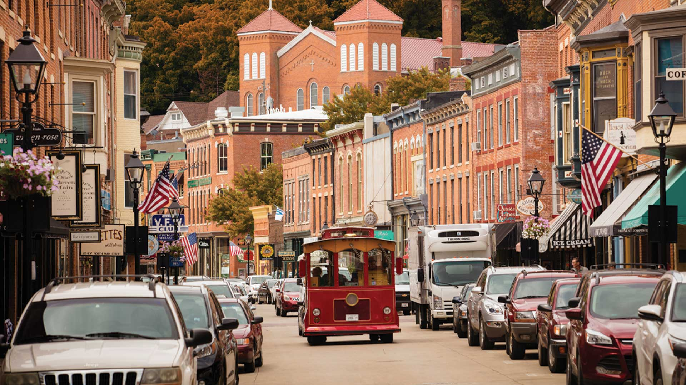

# Mississippi Cuisine

Delta and hill-country cooking from the state that gave America the blues. Hot tamales from Greenville cafés (the Mississippi Delta hot tamale trail), fried catfish from every river-town fish house, slugburgers in the Tupelo diners, sweet potato pone, smoked pork shoulder, and Mississippi mud pie for the dessert course. Cornmeal, river fish and pork carry the table; cayenne and black pepper do the heavy lifting on seasoning.
