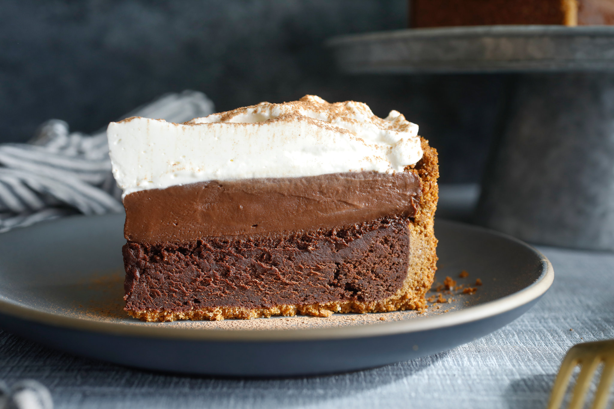

# Mississippi Mud Pie

*The Mississippi river-mud dessert: chocolate cookie base, dense flourless chocolate cake layer, soft chocolate pudding, and a thick swoosh of whipped cream on top. As dark and rich as the riverbank that named it.*

**Serves:** 10-12

**Prep Time:** 30 minutes

**Cook Time:** 30 minutes (plus 4 hours chilling)

## Overview
Mississippi mud pie is named for the dark, dense mud of the Mississippi riverbank, and the dessert is named to match: layered chocolate, deeply rich, slightly cracked on top, with the dark colour and dense texture the name promises. The recipe was popularised in the 1970s as a Southern dinner-party showpiece; every Mississippi grandmother now has a version, and most disagree about which layers are essential.

This version follows the most common Mississippi template: chocolate cookie crust, baked flourless chocolate cake layer (the "mud"), soft chocolate pudding layer (sometimes called the "swamp"), and whipped cream on top. Some recipes add a marshmallow or pecan layer; the version below leaves them out to keep the focus on chocolate. The pie sits in the fridge for at least 4 hours after assembly to firm up; overnight is better.

## Ingredients

### Crust
- 200 g chocolate digestive or chocolate cookie biscuits
- 75 g unsalted butter (melted)
- Pinch of salt

### Cake layer
- 175 g dark chocolate (70% cocoa, chopped)
- 100 g unsalted butter
- 150 g granulated sugar
- 3 eggs
- 1 tsp vanilla extract
- 50 g cocoa powder
- ¼ tsp fine salt

### Pudding layer
- 60 g cocoa powder
- 50 g cornflour
- 100 g granulated sugar
- ¼ tsp fine salt
- 400 ml whole milk
- 200 ml double cream
- 100 g dark chocolate (chopped)
- 1 tsp vanilla extract
- 30 g unsalted butter

### Topping
- 300 ml double cream (chilled)
- 1 tbsp icing sugar
- 1 tsp vanilla extract
- Dark chocolate (for shaving)

## Method

### Stage 1 - Make the crust
1. Preheat the oven to 175°C (350°F).
1. Pulse the biscuits in a food processor until they form fine crumbs (or crush in a sealed bag with a rolling pin).
1. Mix the crumbs with the melted butter and salt until uniformly damp.
1. Press the mixture firmly into the base and slightly up the sides of a 23 cm springform tin. Use the bottom of a glass to compact the layer.
1. Bake 10 minutes. Cool on a rack while you make the cake layer.

### Stage 2 - Make the cake layer
1. Melt the dark chocolate and butter together in a bowl over a pan of simmering water (or in the microwave, in 20-second bursts).
1. Off the heat, stir in the sugar.
1. Whisk in the eggs one at a time.
1. Stir in the vanilla.
1. Sift in the cocoa powder and salt. Fold gently until just combined.
1. Pour into the baked crust and smooth the top.
1. Bake at 175°C for 20-25 minutes, until the top is set and just slightly cracked. The middle should still wobble faintly when nudged.
1. Cool completely in the tin (1 hour at room temperature).

### Stage 3 - Make the pudding layer
1. Whisk the cocoa, cornflour, sugar and salt together in a heavy saucepan.
1. Gradually whisk in the milk and cream until smooth.
1. Set on medium heat. Bring slowly to a gentle simmer, whisking constantly. The mixture will thicken noticeably as it approaches a boil.
1. Simmer 1 minute (still whisking) until thick and glossy.
1. Off the heat, stir in the chopped dark chocolate, vanilla and butter until the chocolate melts and the mixture is smooth.
1. Pour over the cooled cake layer in the tin. Smooth the surface. Cover loosely with cling film (touching the surface to prevent a skin).
1. Refrigerate at least 4 hours, ideally overnight.

### Stage 4 - Topping and serve
1. Whip the chilled double cream with the icing sugar and vanilla until soft peaks form.
1. Release the springform tin. Pile the whipped cream onto the chilled pie, swooshing it into peaks with the back of a spoon.
1. Shave dark chocolate generously over the top with a vegetable peeler.
1. Cut with a hot wet knife into 10-12 slices.

## Notes
- **The three layers serve different roles.** The crust is the structure; the cake layer is the body; the pudding layer is the texture. Skipping the pudding layer gives a flourless chocolate cake; skipping the cake layer gives a chocolate cream pie. Both are good but neither is a mud pie.
- **Cool the cake completely before adding the pudding.** Hot pudding on warm cake gives a soupy result; cooled pudding on cooled cake holds clean layers.
- **Press the cling film onto the pudding surface.** Without it, a slightly papery skin forms on top of the pudding. With it, the pudding stays glossy.
- **Hot wet knife for cutting.** Run the knife under hot water and dry it between every slice. The pudding layer will smear otherwise.

## Variations
- **With marshmallow layer:** add a layer of melted marshmallow (mini marshmallows melted with 2 tbsp milk) between the cake and the pudding. Common in Memphis-style recipes.
- **With pecan or coffee:** stir 100 g chopped toasted pecans into the cake layer, or 2 tsp espresso powder into the pudding layer for a coffee-chocolate version.
- **Ice cream pie:** replace the pudding layer with 750 ml softened chocolate ice cream, smoothed over the cooled cake and refrozen. Lighter, more dessert-cart in style.

## Serving
- A small slice goes a long way; this is one of the richest desserts in the Southern repertoire. Serve with a strong black coffee or a small glass of bourbon. Whipped cream is essential; a scoop of vanilla ice cream is acceptable.

## Storage
- Keeps 5 days refrigerated, covered. The texture stays good for the first 3 days; after that the pudding layer starts to weep slightly.
- Freezes 1 month: freeze without the whipped cream, defrost overnight in the fridge, top with fresh whipped cream just before serving.
