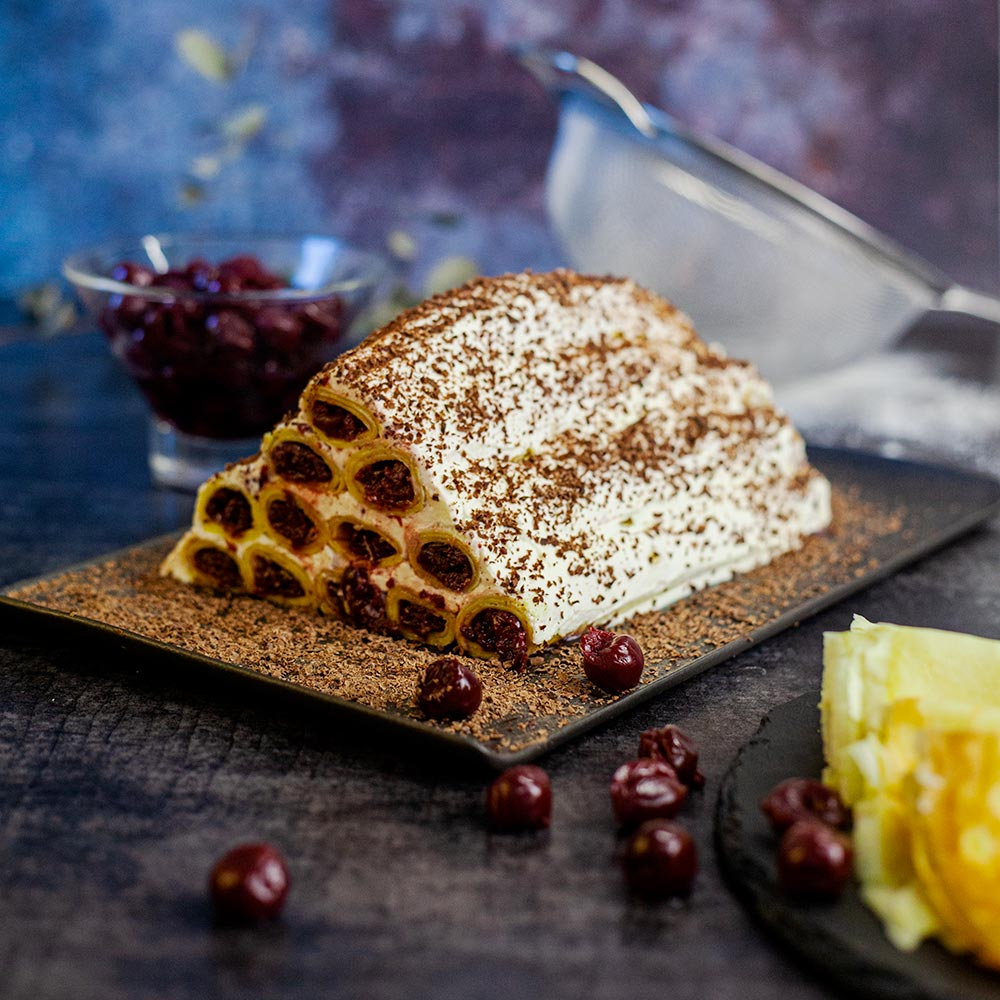

# Cușma lui Guguță

*The Moldovan layer cake: thin chocolate pancakes stuffed with sweet sour cherries and rolled together under a thick blanket of whipped sour cream and dark chocolate, shaped to look like the tall sheepskin hat of the children's-book hero.*

**Serves:** 12

**Prep Time:** 1 hour

**Cook Time:** 40 minutes (plus 4 hours chilling)

## Overview
Cușma lui Guguță is the celebration cake of Soviet-era Moldovan childhood, named after the boy-hero of Spiridon Vangheli's beloved 1960s children's stories who wore a tall sheepskin hat (a cușmă) so big it dragged in the snow. The cake takes the silhouette of the hat: thin chocolate pancakes (clătite) are filled with macerated sour cherries (vișine), rolled into cylinders, and arranged on a plate to build a tall stepped cone. The whole thing is covered in a thick blanket of whipped sour cream and dark chocolate ganache and chilled until the layers set into a sliceable dome. Cut at the table, the slice shows the spiral of cherry and pancake against the soft cream. The taste is sour cherry, cocoa, and tang. The classic name-day cake.

## Ingredients

### For the pancakes
- 300 g plain flour
- 30 g cocoa powder
- 50 g caster sugar
- 1/2 tsp salt
- 4 eggs
- 600 ml full-fat milk
- 100 ml sunflower oil
- 1 tsp vanilla extract
- Extra oil for the pan

### For the cherry filling
- 600 g pitted sour cherries (vișine), fresh or frozen
- 100 g caster sugar
- 2 tbsp cornflour

### For the sour cream coating
- 600 g full-fat sour cream (smântână), 30% fat
- 150 g icing sugar
- 1 tsp vanilla extract

### For the chocolate finish
- 150 g dark chocolate (70% cocoa), chopped
- 100 ml double cream

## Method

### Stage 1 - Mix the pancake batter
1. Whisk the flour, cocoa, sugar, and salt in a large bowl.
2. In a jug, beat the eggs, milk, oil, and vanilla.
3. Pour the wet into the dry; whisk to a smooth thin batter.
4. Rest 20 minutes.

### Stage 2 - Cook the pancakes
1. Heat a 22 cm non-stick pan over medium heat; brush with a little oil.
2. Pour a small ladle of batter; tilt to coat the pan thinly.
3. Cook 1 minute until set; flip; cook 30 seconds.
4. Stack on a plate.
5. Repeat to make 16 to 20 thin pancakes.

### Stage 3 - Cook the cherries
1. Tip the cherries and sugar into a wide pan.
2. Cook over medium heat 8 minutes until the juices run.
3. Mix the cornflour with 2 tbsp cold water; stir into the cherries.
4. Cook 2 minutes until the syrup thickens to a glossy sauce.
5. Cool completely.

### Stage 4 - Whip the sour cream
1. Whisk the sour cream with the icing sugar and vanilla until thick and just-spreadable.
2. Do not over-whip or it will split.

### Stage 5 - Fill and roll
1. Take a pancake; spread a heaped tablespoon of cherries down the centre.
2. Roll up tight into a cigar.
3. Repeat with all pancakes.

### Stage 6 - Build the cone
1. Lay 5 or 6 cherry-pancake rolls in a line on a wide plate.
2. Spread a layer of whipped sour cream across the top.
3. Lay a second row of rolls on top, slightly inset, perpendicular.
4. Spread more cream.
5. Continue stacking, each row shorter than the last and inset, building a stepped pyramid that tapers to a single roll at the top.
6. The shape should resemble a tall sheepskin hat about 18 cm high.

### Stage 7 - Coat and chill
1. Cover the whole structure thickly with the remaining sour cream, smoothing with a palette knife into a smooth dome.
2. Refrigerate 3 hours uncovered.

### Stage 8 - Chocolate finish
1. Heat the double cream just to a simmer.
2. Pour over the chopped chocolate; let stand 2 minutes; stir to a smooth ganache.
3. Cool 10 minutes until pourable but not runny.
4. Spoon the ganache over the chilled cake, letting it drip down the sides like melting chocolate over snow.
5. Refrigerate 1 hour more before cutting.

## Notes
- **The pancakes:** thinner is better; thick pancakes give a heavy cake.
- **Sour cherries are not sweet:** vișine are fundamentally tart; sweet cherries will not give the same lift against the cream.
- **The sour cream:** 30% fat is the minimum; lighter sour cream weeps.
- **Stack low and wide first:** the cone narrows up; do not start narrow.
- **Chill before cutting:** a warm cake collapses; a cold cake cuts clean.

## Variations
- **Cu nuci:** chopped walnuts folded into the cream layers.
- **Cu coniac:** a tablespoon of brandy in the cherry filling.
- **With dulceață de vișine:** sour cherry preserve in place of cooked fresh cherries.
- **Mini-cușmă:** built as individual portions in small bowls.
- **Without chocolate coating:** the older Soviet-era version stopped at the white cream.

## Serving
- At the centre of a birthday or name-day table, sliced from the top down. A glass of red sour-cherry vișinata on the side. With strong black coffee.

## Storage
- Refrigerate covered up to 4 days; the cherries continue to weep into the pancakes (a good thing).
- Do not freeze; the sour cream separates.
- Cut slices fresh; the cake holds shape best on day one.

