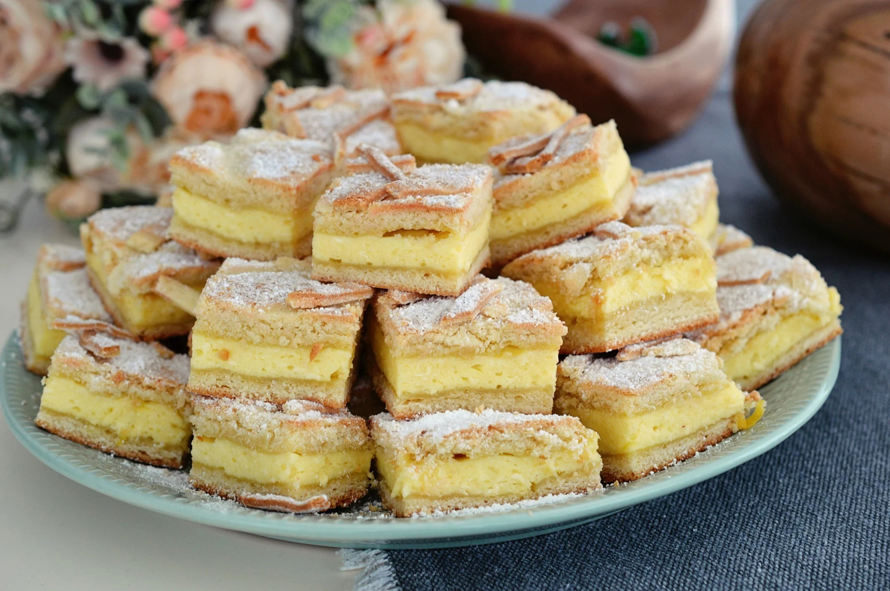

# Plăcintă cu brânză dulce

*The Moldovan sweet cheese pastry: a thin stretched dough wrapped around a filling of sweetened farmer's cheese with raisins, vanilla, and lemon zest, baked golden and dusted with icing sugar.*

**Serves:** 4 plăcinte

**Prep Time:** 45 minutes (plus 30 minutes resting)

**Cook Time:** 25 minutes

## Overview
This is the dessert sibling of the savoury plăcintă, built from the same stretched paper-thin dough and folded the same way, but wrapping a sweet filling of fresh farmer's cheese (brânză dulce de vaci) lifted with sugar, vanilla, egg yolk, raisins, and lemon zest. The brânză dulce is the lightly sour fresh cow's curd cheese sold in every Moldovan market, fresher than ricotta and tangier than fromage blanc. Baked until the pastry layers blister gold and the cheese inside is just set, the plăcintă is brushed with butter, dusted with icing sugar, and eaten warm in the hand. Sunday afternoon, kitchen table, glass of cold milk or tea.

## Ingredients

### For the dough
- 500 g plain flour
- 300 ml warm water (35°C)
- 1 tsp salt
- 1 tbsp caster sugar
- 50 ml sunflower oil
- Extra oil for stretching

### For the sweet cheese filling
- 500 g fresh farmer's cheese (brânză dulce de vaci, or substitute ricotta drained 2 hours)
- 2 egg yolks
- 80 g caster sugar
- 1 tsp vanilla extract
- Zest of 1 lemon
- 60 g raisins (soaked 10 minutes in hot water, drained)
- 2 tbsp semolina or fine breadcrumbs (to absorb moisture)

### To finish
- 30 g unsalted butter, melted
- 2 tbsp icing sugar
- 200 g sour cream (smântână) to serve

## Method

### Stage 1 - Mix and rest the dough
1. Whisk the flour, salt, and sugar in a wide bowl.
2. Pour in the warm water and sunflower oil.
3. Mix to a soft dough.
4. Turn onto an oiled surface; knead 8 minutes until smooth and elastic.
5. Divide into 4 balls; oil each.
6. Cover; rest 30 minutes.

### Stage 2 - Make the filling
1. Tip the cheese into a bowl; mash with a fork to break up.
2. Stir in the egg yolks, sugar, vanilla, lemon zest, and drained raisins.
3. Stir in the semolina to bind.
4. The filling should hold its shape on a spoon.

### Stage 3 - Stretch
1. Oil a wide table.
2. Take one ball; flatten with the palm.
3. Stretch into a thin circle 30 to 35 cm wide (you should see your hand through the dough).

### Stage 4 - Fill and fold
1. Spoon a quarter of the cheese filling into the centre.
2. Spread to a thick square in the middle, leaving a wide border.
3. Fold the left edge over; fold the right edge over.
4. Fold the top edge down; fold the bottom edge up to make a sealed parcel.
5. Press lightly to flatten.
6. Repeat with the remaining 3 balls.

### Stage 5 - Bake
1. Heat the oven to 200°C (fan 180°C).
2. Lay the plăcinte on a baking sheet lined with parchment, seam-side down.
3. Brush with a little oil.
4. Bake 22 to 25 minutes until the layers are blistered and deeply golden.

### Stage 6 - Finish and serve
1. Brush hot plăcinte with melted butter.
2. Dust generously with icing sugar.
3. Cut into quarters.
4. Serve warm with a great spoon of sour cream on the side.

## Notes
- **The cheese:** brânză dulce de vaci is the fresh slightly sour cow's curd; drained ricotta is close; quark is closer.
- **Semolina trick:** absorbs the moisture from the cheese so the pastry stays crisp.
- **Stretch thin:** the dough should be near-translucent; thin layers blister better.
- **Soak the raisins:** dry raisins go hard in the oven; soaking plumps them.
- **Eat warm:** cold plăcintă is dense; warm is the right temperature.

## Variations
- **Cu mac:** with 2 tbsp of soaked poppy seeds folded into the filling.
- **Cu coajă de portocală:** with orange zest in place of lemon, for a winter version.
- **Cu vanilie și smântână:** with 2 tbsp sour cream stirred into the filling, richer.
- **Cu mere:** apple chunks added to the cheese, the autumn version.
- **Plăcintă învârtită dulce:** the dough rolled into a spiral instead of folded square.

## Serving
- Warm from the oven, dusted with icing sugar, with a great spoon of cool sour cream alongside. A glass of cold milk, a cup of strong tea, or a small glass of sour cherry vișinata. Sunday afternoon, the family table, the kettle on the stove.

## Storage
- Eat the day they are baked; the dough toughens overnight.
- Refresh stale plăcinte in a 180°C oven for 5 minutes.
- Freeze cooked, wrapped tight: 1 month; reheat from frozen at 180°C for 15 minutes.

