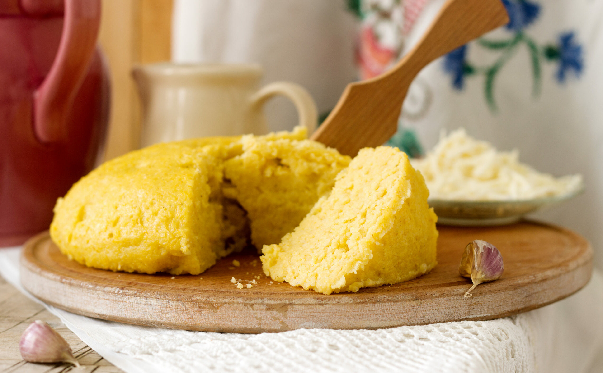

# Mămăligă Moldovan

*The Moldovan everyday carb: stiff yellow cornmeal cooked in salted water until it pulls from the cast-iron pot, turned out whole on a board, sliced with a thread, and eaten with brânză de oi and a spoon of smântână.*

**Serves:** 4

**Prep Time:** 5 minutes

**Cook Time:** 30 minutes

## Overview
Mămăligă is the daily bread of Moldova, the cornmeal porridge that has stood in for wheat bread in village kitchens since maize came up the Danube two and a half centuries ago. In the Moldovan house it is cooked stiffer than the Romanian version, often in a cast-iron ceaun over wood heat, until the polenta is dense enough to turn out whole on a wooden board and slice into wedges with a length of cotton thread. The accompaniments are the brânză de oi (a sharp salty sheep cheese from the Codru hills), a generous spoon of smântână (sour cream), and very often a fried egg on top. Eat hot, with the cheese melting into the steam and the sour cream cooling each forkful.

## Ingredients

- 1 L water
- 1.5 tsp salt
- 300 g coarse yellow cornmeal (mămăligă or polenta grade)
- 30 g butter
- 200 g brânză de oi (sheep cheese), crumbled (feta is the closest substitute)
- 200 g sour cream (smântână), full fat
- 4 eggs (optional, for soft-frying)

## Method

### Stage 1 - Cook the mămăligă
1. Bring the water and salt to a hard boil in a heavy-bottomed pot (cast iron is best).
2. Take a fistful of cornmeal and tap it into the centre in a steady stream, whisking with the other hand.
3. Continue with the rest of the cornmeal, whisking constantly, until all is in and the mixture is smooth.
4. Drop to a low heat; swap the whisk for a wooden spoon.
5. Stir for 25 to 30 minutes, scraping the base, until the polenta is very thick and pulls cleanly from the sides of the pot.
6. Stir in the butter; check the salt.

### Stage 2 - Turn out and slice
1. Run a wet wooden spoon around the edges of the pot.
2. Invert the pot onto a wooden board; tap the base to release the mămăligă in a single round dome.
3. Take a length of cotton thread; slip it under the dome and pull up through it to slice into wedges.

### Stage 3 - Serve
1. Lay a wedge on a warm plate.
2. Scatter generously with crumbled sheep cheese.
3. Spoon over a great pillow of sour cream.
4. If using, top with a soft-fried egg.
5. Eat at once while the cheese is melting into the steam.

## Notes
- **The cornmeal grade:** Coarse stone-ground cornmeal gives the right texture; instant polenta is loose and never sets stiff.
- **Stiff is the Moldovan way:** the porridge must be thick enough to turn out and hold its shape. If it pours, keep cooking.
- **The thread:** metal blades drag and tear; a length of thread under the dome cuts clean.
- **The cheese:** brânză de oi is sharp, salty, sheep's-milk; Greek feta is the closest substitute; Bulgarian sirene also works.
- **No lumps:** the steady rain of cornmeal into the boiling water (not the other way round) is the only way to keep it smooth.

## Variations
- **Mămăligă cu jumări:** with crisp pork cracklings folded through at the end.
- **Mămăligă în straturi:** layered with cheese and sour cream in a baked dish, oven-finished.
- **With smântână and honey:** sweet breakfast version.
- **With tochitură:** served as the bed for the pork stew.
- **Vegan Lent version (de post):** finished with sunflower oil and chopped dill in place of butter and cheese.

## Serving
- Hot from the pot, turned out on a board, sliced with thread, scattered with sheep cheese, crowned with sour cream and a soft-fried egg. Eat with a wooden spoon, scooping through the layers.

## Storage
- Best fresh; cools into a sliceable block within an hour.
- Refrigerate slices up to 3 days; pan-fry in butter to revive.
- Do not freeze; the texture turns grainy.

