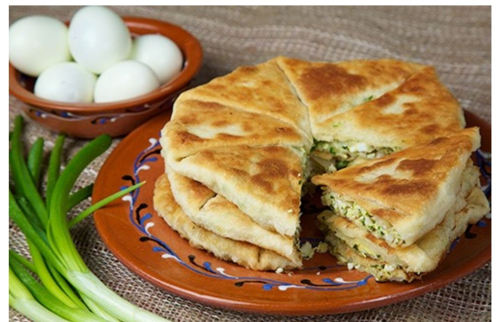

# Plăcintă Moldovan

*The Moldovan filled flatbread: a stretched paper-thin dough folded around brânză de oi, mashed potato, or pumpkin, baked or pan-fried until the layers blister gold and the filling steams through.*

**Serves:** 4 plăcinte

**Prep Time:** 40 minutes (plus 30 minutes resting)

**Cook Time:** 25 minutes

## Overview
Plăcintă is the everyday pastry of Moldova, a thin stretched dough wrapped around a savoury filling and folded flat into a square parcel. The classic three fillings are brânză cu mărar (sheep cheese with dill), cartofi (mashed potato with onion), and dovleac (sweet pumpkin with sugar and cinnamon, the autumn version). The dough is stretched on an oiled table to a near-translucent sheet, the filling is dropped in the centre, and the edges are folded over in a sealed square. The plăcintă goes onto a dry pan or into a hot oven and the layers puff up and burnish gold. Eat hot in the hand, the steam from the filling lifting off as you bite. Every village market has a stall selling them by the dozen.

## Ingredients

### For the dough
- 500 g plain flour
- 300 ml warm water (35°C)
- 1 tsp salt
- 50 ml sunflower oil
- Extra oil for stretching

### For the cheese filling (option 1)
- 300 g brânză de oi or feta, crumbled
- 2 tbsp chopped fresh dill
- 1 egg, beaten
- 1 tbsp sour cream
- Black pepper

### For the potato filling (option 2)
- 400 g floury potatoes, peeled and boiled
- 1 small onion, finely chopped
- 2 tbsp sunflower oil
- 1/2 tsp salt
- Black pepper

### For the pumpkin filling (option 3)
- 400 g pumpkin (or butternut squash), peeled and grated
- 2 tbsp caster sugar
- 1/2 tsp ground cinnamon
- A pinch of salt

### To finish
- 30 g butter, melted (for brushing after baking)

## Method

### Stage 1 - Mix and rest the dough
1. Whisk the flour and salt in a wide bowl.
2. Pour in the warm water and sunflower oil.
3. Mix to a soft sticky dough.
4. Turn onto an oiled surface; knead 8 minutes until smooth and elastic.
5. Divide into 4 equal balls; oil each lightly.
6. Cover; rest 30 minutes at room temperature.

### Stage 2 - Make the filling
1. **Cheese:** mash the crumbled cheese with the dill, egg, sour cream, and pepper to a rough paste.
2. **Potato:** mash the boiled potatoes with the oil; soften the onion in a dry pan 8 minutes; stir into the mash with salt and pepper.
3. **Pumpkin:** salt the grated pumpkin lightly; squeeze out the water through a tea towel; mix with the sugar and cinnamon.

### Stage 3 - Stretch the dough
1. Oil a wide table or a wooden board generously.
2. Take one ball; flatten with the palm.
3. Stretch with the hands (or roll thin with a pin) into a circle 30 to 35 cm wide, very thin (you should almost see through it).

### Stage 4 - Fill and fold
1. Place a quarter of the filling in the centre.
2. Fold the left edge over the filling; fold the right edge over to meet.
3. Fold the top edge down; fold the bottom edge up to make a sealed square parcel.
4. Press lightly to flatten.
5. Repeat with the remaining 3 balls.

### Stage 5 - Cook
1. **Pan method:** heat a dry heavy pan over medium heat. Lay one plăcintă seam-side down; cook 4 to 5 minutes per side until the layers blister gold.
2. **Oven method:** heat the oven to 200°C (fan 180°C). Lay the plăcinte on an oiled tray; brush with oil; bake 18 to 22 minutes until golden.

### Stage 6 - Finish
1. Brush hot plăcinte with melted butter.
2. Cut into quarters or eat whole, folded in half.
3. Eat hot.

## Notes
- **The stretch:** Moldovan grandmothers stretch the dough on an oiled cloth until they can read newsprint through it. Roll thin if you cannot stretch.
- **Pumpkin water:** ungrated pumpkin holds too much water and the plăcintă goes soggy; salt and squeeze.
- **Pan vs oven:** the pan gives the proper blistered crust; the oven is faster and cleaner.
- **One filling per round:** never mix fillings in the same plăcintă.
- **Eat hot:** cold plăcintă is leathery; revive in a dry pan.

## Variations
- **Plăcintă cu varză:** cabbage filling, slow-stewed with onion and dill.
- **Plăcintă cu carne:** minced lamb or beef with onion, the meat-eater's version.
- **Plăcintă învârtită:** rolled into a spiral instead of folded square (the Codru style).
- **Plăcintă cu mere:** apple filling with cinnamon, dessert version.
- **Mini plăcinte:** palm-sized, market-stall snack format.

## Serving
- Hot from the pan, brushed with butter, cut into quarters and eaten in the hand. The cheese ones with a glass of cold buttermilk; the pumpkin ones with strong black tea; the potato ones with a side of pickled gherkins.

## Storage
- Eat the day they are made; the dough toughens overnight.
- Refresh in a dry pan over medium heat for 2 minutes per side.
- Freeze cooked, wrapped tight: 1 month; reheat in the oven at 180°C.

