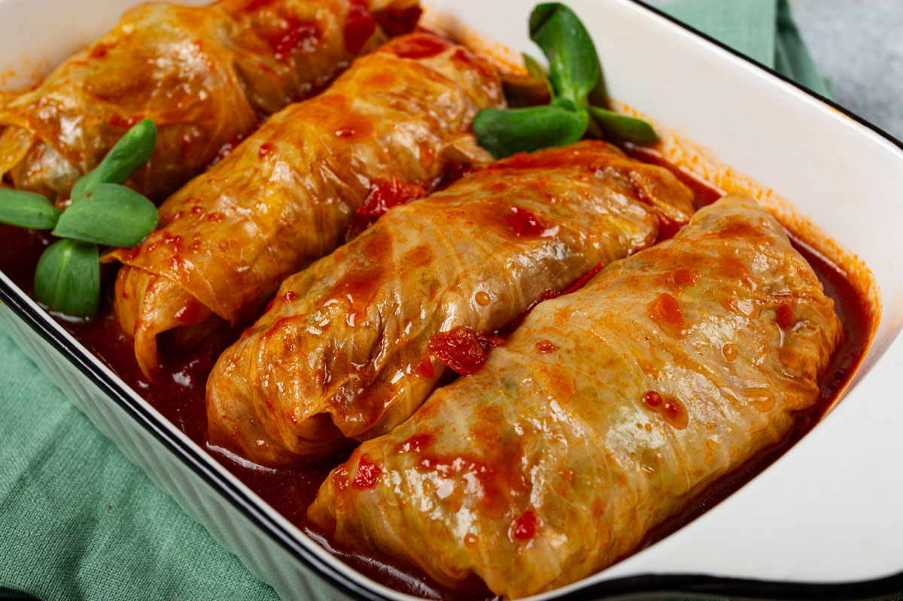

# Sarmale Moldovan

*The Moldovan cabbage roll: small finger-sized parcels of pickled cabbage wrapped around a pork-and-rice filling, packed tight in a clay pot, and slow-cooked for hours with smoked bacon, tomato, and bay.*

**Serves:** 6 to 8

**Prep Time:** 75 minutes

**Cook Time:** 3 hours

## Overview
Moldovan sarmale are the tight little cousins of the Romanian original, rolled finger-thin and finger-short so that twenty fit comfortably in a single bowl with a heap of mămăligă. The wrap is a soured cabbage leaf (varză murată), pickled in brine for two months in a barrel in the cellar, and the filling is pork mince stretched with rice, onion, and a heavy hand of dill and chopped smoked bacon. The packed pot goes onto the wood stove at first light for a long slow simmer until the leaves go translucent and the filling drinks up the smoke. The Moldovan signature is a pinch of dried summer savory (cimbru) in the filling and a few dried plums tucked between the rolls. Eat with mămăligă, smântână, and a small green chilli.

## Ingredients

### For the cabbage and pot
- 1 whole soured cabbage (about 1.5 kg drained weight), leaves separated
- 200 g shredded sauerkraut (from the inner cabbage)
- 150 g smoked streaky bacon, in thick slices
- 6 dried plums (prunes)
- 2 bay leaves
- 8 black peppercorns
- 500 ml tomato juice (passata thinned with water)
- 600 ml water (approx, to cover)

### For the filling
- 700 g coarsely minced pork (20% fat)
- 100 g smoked bacon, finely chopped
- 120 g long-grain rice (uncooked, rinsed)
- 2 medium onions, finely chopped
- 2 tbsp sunflower oil
- 1 tsp sweet paprika
- 1 tsp dried summer savory (cimbru)
- 3 tbsp chopped fresh dill
- 1 tsp salt
- 1 tsp ground black pepper

## Method

### Stage 1 - Prepare the filling
1. Soften the chopped onion in the sunflower oil over medium heat for 8 minutes until pale.
2. Stir in the paprika and savory; cook 30 seconds.
3. Tip into a large bowl and cool 10 minutes.
4. Add the pork, chopped bacon, rinsed rice, dill, salt, and pepper.
5. Mix with your hands until evenly combined.

### Stage 2 - Prepare the cabbage leaves
1. Rinse the soured cabbage leaves under cold water to remove excess salt.
2. Cut out the thick central rib from each leaf.
3. Halve the largest leaves so each finished wrap is roughly the size of your palm.
4. Pat the leaves dry on a tea towel.

### Stage 3 - Roll the sarmale
1. Place a leaf flat, rib-side down.
2. Place a heaped teaspoon of filling near the stem end (Moldovan rolls are smaller than Romanian).
3. Fold the stem end over, fold the sides in, roll up tight into a thin cigar about 5 cm long.
4. Repeat with all leaves and filling (you should get 35 to 40 rolls).

### Stage 4 - Layer the pot
1. Line the base of a large heavy pot (4 L capacity) with half the smoked bacon slices.
2. Scatter half the shredded sauerkraut over the bacon.
3. Pack the sarmale in tight concentric circles, seam-side down.
4. Tuck the dried plums between the rolls.
5. Add the remaining bacon and sauerkraut over the top.
6. Tuck in the bay leaves and peppercorns.
7. Pour over the tomato juice and enough water to just cover.
8. Set a heatproof plate on top to weigh them down.

### Stage 5 - Simmer
1. Bring to a gentle bubble over medium heat, then drop to the lowest simmer.
2. Cook covered for 2.5 to 3 hours; the leaves should be soft and the rice fully cooked.
3. Uncover for the last 30 minutes to reduce the sauce.

### Stage 6 - Rest
1. Take off the heat; rest 20 minutes before serving.
2. Sarmale are better the next day reheated.

## Notes
- **Soured cabbage:** the leaves must be brined, not fresh; sauerkraut leaves are usually too small for proper Moldovan finger rolls.
- **Pork fat:** lean mince gives dry sarmale; 20% fat is the minimum.
- **The summer savory:** cimbru is the Moldovan signature; without it the dish reads as Romanian.
- **The plum:** the dried plums tucked between the rolls give a sweet-sour note absent from the Romanian version.
- **Small is correct:** Moldovan sarmale are finger-sized, not Romanian-fist-sized.

## Variations
- **Sarmale în foi de viță:** rolled in brined vine leaves, the summer version.
- **Sarmale cu păsat:** rice replaced with coarse cracked wheat, the old country version.
- **Lent sarmale (de post):** mushrooms and rice in place of pork, no bacon.
- **With smoked sausage:** a few slices of cârnați afumați tucked between the rolls.
- **With sour cream baked on top:** smântână spooned over for the last 20 minutes for a baked-cheese crust.

## Serving
- Hot, with a great heap of mămăligă, a spoon of smântână, a small green chilli on the side, a glass of cold red Fetească Neagră, and a small țuică shot to start.

## Storage
- Refrigerate up to 5 days; flavour improves daily.
- Freezes well in the cooking liquid: 3 months.
- Reheat gently on the stove or in the oven at 150°C, not the microwave (the leaves toughen).

