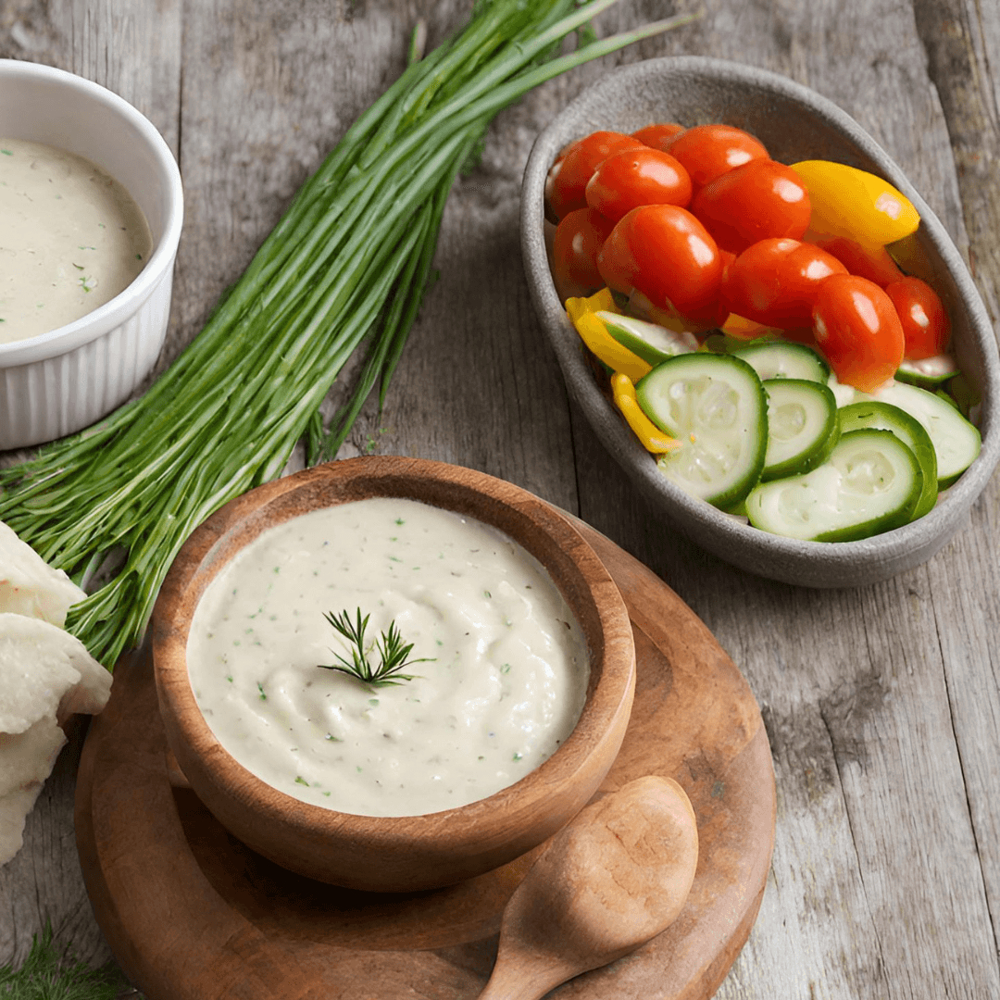

# Mujdei

*The Moldovan garlic sauce: a fierce emulsion of crushed raw garlic, white-wine vinegar, sunflower oil, salt, and chopped parsley, spooned over grilled chicken, mămăligă, or boiled potatoes. The hot sauce of the home kitchen.*

**Serves:** 6 to 8 (about 200 ml)

**Prep Time:** 10 minutes

**Cook Time:** None

## Overview
Mujdei is the loud raw-garlic sauce that sits in a small bowl beside every Moldovan grill plate, every roast chicken, every wedge of mămăligă. It is named for the word for garlic (must de ai, the juice of garlic) and the construction is as simple as the name: a head of garlic crushed to a paste with salt, beaten with sunflower oil and vinegar into a pale emulsion, and finished with chopped parsley. The heat of the sauce comes from the rawness of the garlic and the saltiness of the cure, not from chillies. A spoon on the plate cuts through fatty grilled pork (mititei or cârnați), brightens a bowl of boiled new potatoes, and turns plain mămăligă into a hot quick supper. Make it fresh; mujdei sleeps badly.

## Ingredients

- 1 whole head of garlic (8 to 12 cloves), peeled
- 1 tsp fine sea salt
- 4 tbsp sunflower oil
- 3 tbsp white-wine vinegar
- 2 tbsp cold water
- 2 tbsp finely chopped fresh parsley
- A grind of black pepper
- Optional: 1 small finely chopped fresh chilli (for a modern variant)

## Method

### Stage 1 - Crush the garlic
1. Peel all the cloves; trim away any green germs from the centre (they make the sauce bitter).
2. Tip the cloves into a mortar with the salt.
3. Pound for 2 to 3 minutes to a smooth pale paste; the salt acts as the abrasive.
4. (If using a small bowl and the side of a knife: drag the cloves with salt across the board into a fine paste in the same way.)

### Stage 2 - Beat in the oil
1. Scrape the garlic paste into a small wide bowl.
2. Add the oil in a slow steady stream, beating constantly with a wooden spoon or small whisk.
3. The mixture turns pale and thickens into a loose emulsion.

### Stage 3 - Loosen with vinegar and water
1. Add the vinegar in two pours, still beating.
2. Add the cold water a spoon at a time until the sauce drops easily from the spoon but holds together (the texture of double cream).
3. Stir in the chopped parsley and a grind of black pepper.
4. If using chilli, fold in now.

### Stage 4 - Rest briefly
1. Let the mujdei sit 5 minutes for the flavours to settle.
2. Taste; adjust salt and vinegar.
3. Pour into a small serving bowl.

## Notes
- **Raw garlic is the dish:** roasting or sautéing the garlic gives a different sauce entirely. Mujdei is raw.
- **Trim the germ:** the central green sprout makes the sauce bitter; remove it before pounding.
- **Make fresh:** the heat of raw garlic mellows fast; mujdei is best within 2 hours of making.
- **Sunflower oil:** the proper Moldovan choice; olive oil clashes with the white-wine vinegar.
- **No mortar:** the side of a heavy knife and a board work, but the pounded paste is finer.

## Variations
- **Cu smântână:** finished with 2 tbsp of sour cream beaten in, the softer cousin (good with roast chicken).
- **Cu apă caldă:** loosened with hot water instead of cold for a milder sauce.
- **Cu ardei iute:** with a finely chopped red chilli folded in for heat.
- **Mujdei de usturoi tânăr:** made with young green garlic in spring, milder and grassier.
- **Mujdei pentru pește:** with a squeeze of lemon in place of half the vinegar, for grilled river fish.

## Serving
In a small bowl next to grilled chicken, mititei, or cârnați. Spooned over boiled new potatoes with their skins. Drizzled over mămăligă with crumbled sheep cheese. Stirred into the cooking liquid of boiled river fish.

## Storage
- Best within 2 hours of making.
- Refrigerates 24 hours in a sealed jar; the raw garlic gets stronger and harsher.
- Do not freeze; the emulsion breaks.
