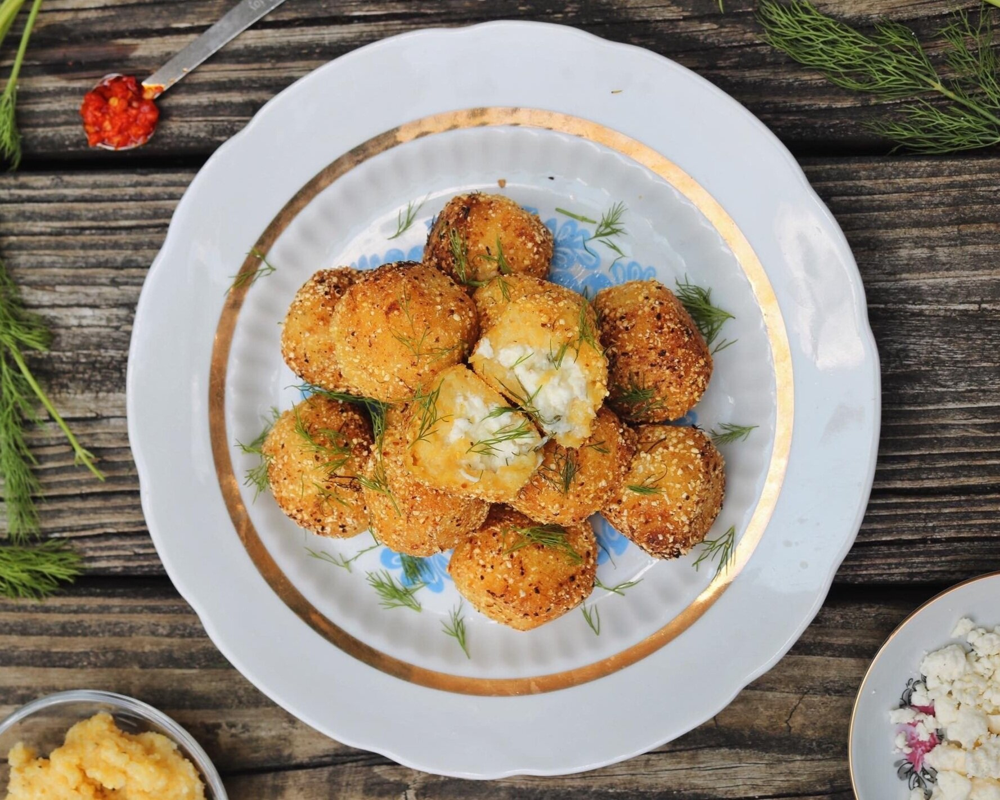

# Mămăligă Bites

*Fried polenta squares with sheep cheese and dill: thick slices of cold-set mămăligă pan-fried gold and crisp, topped with crumbled brânză and chopped dill. The party canapé built from the day-old polenta.*

**Serves:** 6 (about 24 squares)

**Prep Time:** 15 minutes (plus overnight setting)

**Cook Time:** 20 minutes

## Overview
This is what every Moldovan kitchen does with the half-pot of stiff mămăligă left over from Sunday lunch: chilled overnight in a tin to set into a sliceable block, cut into thick squares, and pan-fried in butter until each square is gold and crisp outside and steamy soft inside. A scatter of crumbled brânză de oi melts onto the hot surface and a heavy snowfall of chopped fresh dill on top finishes the bite. The squares are eaten with the fingers as a stand-up snack with a glass of cold beer, or with a fork as a quick supper alongside a fried egg and sour cream. The transformation of yesterday's porridge into today's party food.

## Ingredients

### For the polenta
- 1 L water
- 1.5 tsp salt
- 300 g coarse yellow cornmeal
- 30 g butter

### For frying
- 4 tbsp sunflower oil
- 30 g butter

### For finishing
- 200 g brânză de oi or feta, finely crumbled
- 3 tbsp chopped fresh dill
- 100 g sour cream (smântână), for dipping
- Black pepper

## Method

### Stage 1 - Cook the polenta
1. Bring the water and salt to a hard boil.
2. Rain in the cornmeal in a steady stream, whisking constantly.
3. Drop to a low heat; swap to a wooden spoon.
4. Cook 25 to 30 minutes, stirring, until very thick and pulling cleanly from the pot.
5. Stir in the butter.

### Stage 2 - Set
1. Line a 25 x 20 cm tray with parchment.
2. Spread the hot mămăligă evenly into the tray (about 3 cm deep).
3. Smooth the top with a wet spatula.
4. Cool 30 minutes at room temperature; cover; refrigerate at least 6 hours (ideally overnight).

### Stage 3 - Cut
1. Turn the set block out onto a board.
2. Trim the edges square.
3. Cut into 24 squares about 4 cm wide.
4. Pat dry on a tea towel.

### Stage 4 - Fry
1. Heat half the oil and butter in a wide non-stick pan over medium-high heat.
2. Lay half the squares in the pan; do not crowd.
3. Fry 3 to 4 minutes per side until deep gold and crisp.
4. Lift onto a rack to drain (paper towel makes them soggy).
5. Wipe the pan; repeat with the rest.

### Stage 5 - Finish
1. Arrange the hot squares on a warm serving plate.
2. Scatter generously with the crumbled cheese (the residual heat softens it).
3. Shower with chopped dill.
4. Grind on black pepper.
5. Serve sour cream in a small bowl alongside for dipping.

## Notes
- **Set overnight:** the polenta must be cold and fully set or the squares fall apart in the pan.
- **Hot pan:** medium-high heat is correct; lower and the squares go soft instead of crisp.
- **Drain on a rack:** paper towel traps steam under the squares and softens the crust.
- **Cheese on hot:** the heat of the freshly fried square is what melts the cheese; cold and the cheese sits dry.
- **Day-old polenta:** specifically built for leftover mămăligă; cook from scratch only if you do not have leftovers.

## Variations
- **Cu jumări:** with pork crackling crumbled on top instead of (or alongside) the cheese.
- **Cu ouă de prepeliță:** with a small quail's egg fried on each square, the brunch version.
- **Cu mujdei:** with a small dab of garlic sauce on each square.
- **Sweet version:** dust with icing sugar and serve with sour cream and jam.
- **Triple-cooked:** boil cubes, refrigerate, fry, then bake; pub-snack format.

## Serving
On a warm platter as a stand-up canapé with a glass of cold local Chișinău lager. As a quick supper alongside a fried egg and a green salad. With sour cream and pickled gherkins on the side.

## Storage
- Best fresh from the pan; the crust softens within 30 minutes.
- The cold polenta block keeps 3 days refrigerated; fry fresh on the day.
- Do not freeze cooked; the texture goes grainy.
