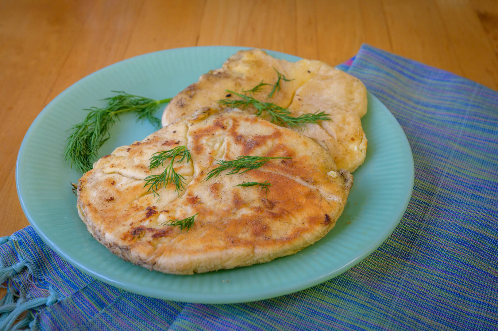

# Plăcintă Snack-Size

*Palm-sized Moldovan filled flatbreads: a thin stretched dough wrapped around a potato-and-cheese filling, fried in a dry pan until the layers blister gold. Market-stall snack, school lunchbox, road-trip food.*

**Serves:** 8 small plăcinte

**Prep Time:** 40 minutes (plus 30 minutes resting)

**Cook Time:** 25 minutes

## Overview
This is the snack-size cousin of the family plăcintă: smaller squares, palm-sized, made for eating in the hand walking from the market stall to the tram stop. The dough is the same stretched paper-thin oil-dough, the filling is the everyday Moldovan combination of mashed potato and crumbled sheep cheese with dill, and the cooking is in a dry heavy pan rather than the oven, faster and crisper. The snack plăcintă is sold from kiosks in Chișinău train stations and from grandmothers at country bus stops, wrapped in a paper napkin and eaten while still hot enough to burn the tongue. A glass of cold buttermilk or hot tea on the side.

## Ingredients

### For the dough
- 400 g plain flour
- 250 ml warm water (35°C)
- 1 tsp salt
- 40 ml sunflower oil
- Extra oil for stretching

### For the filling
- 400 g floury potatoes, peeled and boiled
- 1 small onion, finely chopped
- 2 tbsp sunflower oil
- 200 g brânză de oi or feta, crumbled
- 2 tbsp chopped fresh dill
- 1/2 tsp salt
- Black pepper

### For frying
- 2 tbsp sunflower oil (just to wipe the pan between batches)

## Method

### Stage 1 - Mix the dough
1. Whisk the flour and salt in a bowl.
2. Pour in the warm water and oil.
3. Mix to a soft sticky dough.
4. Knead on an oiled surface for 8 minutes until smooth.
5. Divide into 8 small balls (about 80 g each); oil each.
6. Cover; rest 30 minutes.

### Stage 2 - Make the filling
1. Mash the boiled potatoes coarsely with a fork.
2. Soften the chopped onion in the sunflower oil over medium heat for 8 minutes until pale.
3. Stir the onion into the mash.
4. Stir in the crumbled cheese, dill, salt, and black pepper.
5. Cool to room temperature.
6. Divide into 8 portions.

### Stage 3 - Stretch and fill
1. Oil the work surface generously.
2. Take one ball; flatten with the palm.
3. Stretch into a thin circle 20 cm wide.
4. Place a portion of filling in the centre.
5. Fold the left over, the right over, the top down, the bottom up to make a sealed square parcel about 10 cm across.
6. Press lightly to flatten.
7. Repeat with the rest.

### Stage 4 - Cook
1. Heat a dry heavy pan (cast iron is best) over medium heat.
2. Lay 2 or 3 plăcinte in the pan, seam-side down.
3. Cook 3 to 4 minutes until the layers blister and the underside is deep gold.
4. Flip; cook another 3 to 4 minutes until the second side is gold.
5. Wipe the pan with a little oil between batches.

### Stage 5 - Serve
1. Stack the hot plăcinte under a tea towel to keep warm.
2. Eat at once, in the hand.

## Notes
- **Smaller is correct:** snack plăcintă are palm-sized; full-meal plăcintă are twice this size.
- **Dry pan:** no oil in the pan; the dough has enough oil in it for crisping.
- **Filling temperature:** filling should be cool when wrapped, not hot, or it weakens the dough.
- **Stretch thin:** the layers blister only if the dough is near-translucent.
- **Stack under a towel:** keeps the crust soft for hand-eating; uncovered they go crisp.

## Variations
- **Cu varză:** with shredded cabbage stewed with onion and dill in place of potato.
- **Cu brânză și mărar:** cheese and dill only, no potato.
- **Cu cartofi și ciuperci:** with chopped sautéed mushrooms added to the potato.
- **Cu carne:** with seasoned minced lamb or beef, the meat snack version.
- **Mini-mini plăcinte:** even smaller (the size of a small bun), party-canapé.

## Serving
Hot from the pan in the hand. With cold buttermilk or hot tea. On a paper napkin from a market stall. As a packed-lunch with pickled gherkins.

## Storage
- Eat the day they are made; the dough toughens overnight.
- Refresh in a dry pan for 2 minutes per side.
- Freeze cooked, wrapped tight: 1 month; reheat from frozen in a dry pan over medium heat.
