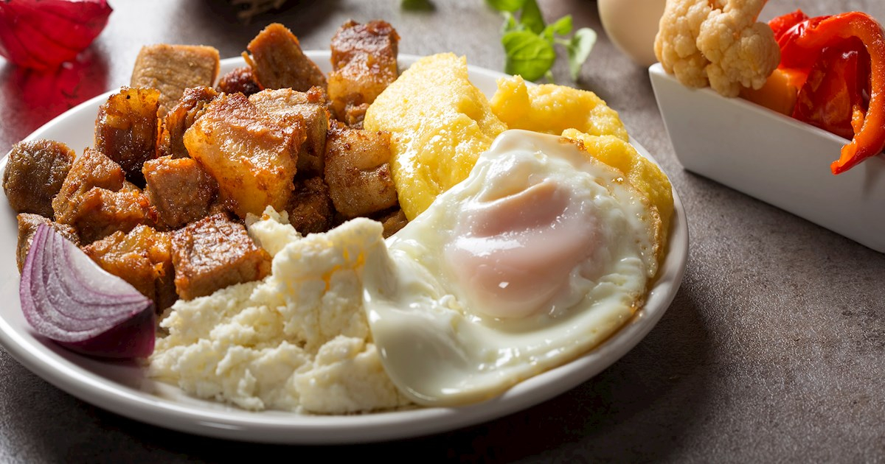

# Tochitură Moldovan

*The Moldovan pork stew: chunks of pork shoulder slowly browned in their own fat with smoked bacon, onion, and bay, deglazed with white wine, and served over a wedge of mămăligă with crumbled sheep cheese and a fried egg on top.*

**Serves:** 4

**Prep Time:** 20 minutes

**Cook Time:** 1 hour 45 minutes

## Overview
Tochitură is the heavy Sunday plate of Moldova, the pork-and-cornmeal partnership that fills the table after a long autumn afternoon at the cellar. The dish is built in stages: the pork shoulder is cut into thumb-sized chunks and browned slowly in its own fat (the verb a tochi means to render and slow-fry), the smoked bacon goes in to deepen the smoke, onions sweat into the fat, and a glass of dry white wine deglazes the pan and tightens to a glossy gravy. The classic Moldovan plate is served as a triptych: a wedge of mămăligă, a heap of the stew, a fried egg sitting on top, and a great scatter of crumbled sheep cheese (brânză de oi) crowning the lot. Eat with a glass of red Fetească Neagră and bread for the gravy.

## Ingredients

### For the stew
- 800 g pork shoulder, cut into 3 cm chunks
- 200 g smoked streaky bacon, in thick lardons
- 2 large onions, finely chopped
- 4 cloves garlic, finely chopped
- 2 tbsp lard or sunflower oil (only if needed)
- 250 ml dry white wine
- 200 ml hot water or pork stock
- 2 bay leaves
- 1 tsp dried summer savory (cimbru)
- 1 tsp sweet paprika
- 1 tsp salt
- 1/2 tsp black pepper
- 1 small dried chilli (optional)

### To serve
- 1 batch mămăligă (see Mămăligă Moldovan)
- 4 eggs (for soft-frying)
- 200 g brânză de oi or feta, crumbled
- A small handful chopped fresh parsley
- Black pepper

## Method

### Stage 1 - Render and brown
1. Heat a heavy wide pan (cast iron is best) over medium heat with no oil.
2. Add the bacon lardons; cook 8 minutes until the fat has rendered and the bacon is gold.
3. Lift the bacon out with a slotted spoon and set aside.
4. Pat the pork chunks dry on a tea towel.
5. Brown the pork in the rendered bacon fat over high heat, in 2 batches, 4 minutes per batch until deeply coloured (add a spoon of lard if the pan goes dry).
6. Lift each batch out with a slotted spoon.

### Stage 2 - Sweat the onion
1. Drop the heat to medium.
2. Add the chopped onions to the pan; cook 10 minutes until soft and pale gold, scraping up the browned bits.
3. Stir in the garlic, paprika, and savory; cook 1 minute.

### Stage 3 - Build the stew
1. Return the pork and bacon to the pan.
2. Add the bay leaves and the dried chilli if using.
3. Pour in the white wine; bring to a hard bubble and let it reduce by half (3 minutes).
4. Add the hot water or stock; salt and pepper.
5. Drop to a low simmer; cover with the lid slightly ajar.
6. Cook 1 hour 15 minutes until the pork is fork-tender and the sauce is glossy.
7. Uncover for the last 15 minutes to reduce the sauce to a thick gravy.

### Stage 4 - Make the mămăligă
1. While the stew finishes, cook a stiff mămăligă (see the separate recipe).
2. Hold warm over very low heat, covered.

### Stage 5 - Fry the eggs
1. Heat a knob of butter in a wide non-stick pan over medium heat.
2. Crack in the eggs; fry 2 to 3 minutes until the whites are set and the yolks are still runny.

### Stage 6 - Plate
1. On each warm plate, lay a wedge of mămăligă.
2. Spoon a heap of the tochitură stew alongside.
3. Set a fried egg on top of the egg or the mămăligă.
4. Scatter generously with crumbled sheep cheese.
5. A small grind of black pepper, a scatter of parsley, eat at once.

## Notes
- **The render:** the bacon fat is the cooking medium. Adding extra oil at the start is a shortcut that leaves the dish thin.
- **Pork shoulder, not leg:** shoulder has the fat for the long simmer; leg cooks dry.
- **White wine over red:** Moldovan tochitură uses dry white (Fetească Albă is correct); the red is for drinking with it.
- **Cimbru is the signature:** the summer savory rather than thyme is what places this in Moldova.
- **The egg yolk:** runny is correct; the yolk dressing the stew is part of the dish.

## Variations
- **Tochitură de Crăciun:** with chunks of smoked sausage (cârnați afumați) added in stage 3, the Christmas version.
- **Tochitură ardelenească:** Transylvanian cousin, tomato added in stage 3, no wine.
- **Tochitură de pui:** with chicken thigh in place of pork, the lighter version.
- **With pickled chilli paste (zacuscă cu ardei iuți):** a spoon stirred in at the end for heat.
- **With sour cream:** a generous spoon of smântână stirred through at the end, café version.

## Serving
- **The classic triptych:** mămăligă, stew, fried egg, sheep cheese. A glass of red Fetească Neagră. A small bowl of pickled chillies on the side. Country bread for the gravy.

## Storage
- Refrigerate the stew up to 4 days; the flavour deepens.
- Freezes well: 3 months.
- Reheat gently on the stove; cook mămăligă and eggs fresh on serving.

