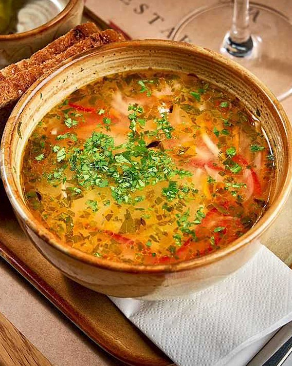

# Zeamă

*The Moldovan sour chicken soup: a clear broth of country chicken and hand-rolled noodles, soured with house-fermented borș and lemon, finished with parsley and lovage. The everyday Sunday soup.*

**Serves:** 6

**Prep Time:** 30 minutes

**Cook Time:** 1 hour 30 minutes

## Overview
Zeamă is the soup every Moldovan grandmother makes on a Sunday and the lunch every Moldovan grandchild remembers eating standing in the kitchen, blowing on the spoon. The broth is built on an old hen (the layer at the end of her career, simmered long enough to surrender all her flavour), and the noodles are pulled from the same enriched dough used for the village pasta, cut into wide ribbons (tăiței de casă). The soup is soured at the end with borș (a cloudy fermented wheat-bran liquid, the Moldovan-Romanian sour agent that pre-dates lemons by centuries) and finished with a great handful of chopped parsley and lovage (leuștean), the lovage being the deep grassy-celery flavour that says "this is zeamă and not Romanian ciorbă". Eat with a slice of country bread, a green chilli, and sour cream on the side.

## Ingredients

### For the broth
- 1 small chicken (about 1.5 kg), with bones (an old laying hen if possible)
- 3 L cold water
- 1 large onion, halved (skin on for colour)
- 1 large carrot, in chunks
- 1 small parsnip, in chunks
- 1 small celery root (about 100 g), peeled and chunked
- 1 small red bell pepper, halved and de-seeded
- 2 bay leaves
- 1 tsp black peppercorns
- 2 tsp salt

### For the noodles
- 200 g plain flour
- 2 eggs
- 1/2 tsp salt
- 1 tbsp water (if needed)

### For souring and finish
- 400 ml borș (fermented wheat-bran liquid; substitute with juice of 2 lemons plus 100 ml white-wine vinegar)
- 1 large bunch fresh lovage (leuștean), chopped (about 30 g)
- 1 small bunch parsley, chopped
- Salt and black pepper to taste

### To serve
- Sour cream (smântână)
- 1 small green chilli per bowl
- Country bread

## Method

### Stage 1 - Build the broth
1. Place the chicken in a large stockpot; cover with the cold water.
2. Bring slowly to a gentle simmer; skim the grey scum until the broth is clear (10 minutes).
3. Add the onion, carrot, parsnip, celery root, bell pepper, bay, and peppercorns.
4. Drop to the lowest simmer; cook uncovered for 1 hour 15 minutes.
5. Stir in 2 tsp salt at the halfway mark.

### Stage 2 - Make the noodles
1. Tip the flour onto a board; make a well.
2. Crack in the eggs and salt; mix into the flour with a fork.
3. Knead 5 minutes to a stiff smooth dough (add 1 tbsp water if dry).
4. Wrap; rest 20 minutes.
5. Roll out very thin on a floured surface (2 mm thick).
6. Dust with flour; roll up like a carpet; slice into 5 mm ribbons.
7. Shake out the ribbons and dust again with flour.

### Stage 3 - Strain and shred
1. Lift the chicken from the broth; cool 10 minutes.
2. Strain the broth through a fine sieve into a clean pot.
3. Discard the vegetables and aromatics (or keep the carrot for the bowl if liked).
4. Pull the chicken meat off the bones in finger-sized pieces; discard the bones and skin.

### Stage 4 - Sour and finish
1. Return the strained broth to the heat; bring to a gentle bubble.
2. Drop in the noodles; cook 4 to 5 minutes until tender.
3. Heat the borș separately to just below boiling in a small pan (do not let it boil hard or it goes bitter).
4. Pour the hot borș into the soup; stir well.
5. Return the shredded chicken to the pot.
6. Stir in most of the chopped lovage and parsley.
7. Taste; adjust salt and add black pepper.

### Stage 5 - Serve
1. Ladle hot into deep bowls.
2. Scatter the remaining lovage and parsley over each.
3. Pass sour cream, country bread, and a small green chilli at the table.

## Notes
- **Borș liquid:** the cloudy fermented wheat-bran sour, sold in plastic bottles in Moldovan and Romanian shops. If you cannot find it, lemon plus a touch of white-wine vinegar approximates the sharp note (the deep funk of real borș is harder to fake).
- **The lovage:** the herb that defines zeamă; without it the soup tastes Romanian, not Moldovan. Lovage seeds grow easily in the garden if you cannot buy the fresh leaf.
- **Old hen vs young chicken:** an old laying hen gives the deepest broth but needs 3 hours; a young supermarket bird is done in 1 hour 15.
- **Do not boil the borș:** it cooks into bitterness; warm it separately and add at the end.
- **Hand-cut noodles matter:** dried supermarket egg noodles work in a pinch but the texture is wrong.

## Variations
- **Zeamă de pasăre:** with whole chicken pieces (drumsticks and thighs) left in the bowl.
- **Zeamă de curcan:** with turkey in place of chicken, the festive version.
- **Zeamă de miel:** with lamb, the spring Easter version.
- **Zeamă cu păsat:** with coarse cracked wheat instead of noodles, the old country version.
- **With a beaten egg:** stir in a beaten egg at the end for a richer soup (less traditional but common in cafés).

## Serving
- Hot in a deep bowl, with a spoon of cool sour cream stirred in at the table, a fresh small green chilli to bite between spoonfuls, and a slab of country bread for dipping. A glass of cold Fetească Albă on the side.

## Storage
- Refrigerate up to 3 days; the noodles soften, so cook fresh noodles when reheating if possible.
- Freeze the broth (without noodles): 2 months. Add fresh noodles at the reheat.
- Reheat gently; do not boil hard or the chicken goes stringy and the borș goes bitter.

