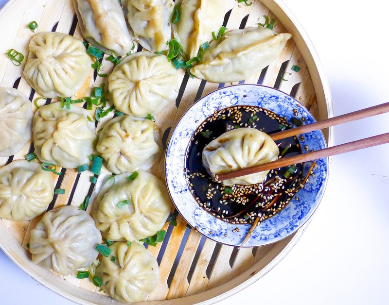

# Buuz

*Mongolia's signature dumplings: thick wheat wrappers gathered around juicy seasoned mutton, pleated into a small purse and steamed till the wrapper goes glossy.*

**Makes:** 30 buuz (serves 4-6)

**Prep Time:** 1 hour

**Cook Time:** 18 minutes

## Overview
Mongolia's signature dumpling and the centrepiece of Tsagaan Sar (Mongolian Lunar New Year): thick wheat wrappers gathered around juicy seasoned mutton, pleated into a small purse with a steam-vent at the top, steamed till the wrapper goes glossy and slightly translucent. Mongolian buuz prizes the meat's own flavour, so the seasoning stays minimal (onion, garlic, salt, pepper and traditional caraway), and the fat content matters more than spice. You knead flour, salt and warm water into a smooth dough, rest 30 minutes. Mix fatty mutton mince (20% fat; lean meat makes dry buuz, fat is structural) with very finely chopped onion, crushed garlic, salt, pepper, caraway and a splash of cold water, kneading by hand till the mix gets sticky and slightly springy. Divide the dough into 30 walnut-sized balls, roll each into a 9 to 10 cm circle that's slightly thinner in the centre than at the edges (the bottom needs the strength). Place a heaped tablespoon of filling in the middle, lift the edges, pleat them around the perimeter (12 to 15 small pleats is the showy count; six is fine for home cooks), pinch closed at the top leaving a tiny hole. Steam over high heat 15 to 18 minutes till the wrappers turn slightly translucent. Eat by hand: bite a small hole at the top, slurp the broth, then eat the rest with soured cream and a small bowl of soy-vinegar dip.

## Ingredients

### Dough
- 500 g plain flour
- 1 teaspoon salt
- 250-280 ml warm water

### Filling
- 600 g minced mutton (or lamb, 20% fat - fat is essential for juicy buuz; or 60/40 lamb-beef mix)
- 2 onions (medium, very finely chopped)
- 6 garlic cloves (crushed)
- 2 teaspoons salt
- 1 teaspoon black pepper
- 1 teaspoon ground caraway seed (optional, traditional)
- 4 tablespoons cold water (for juiciness)

### Soy-Vinegar Dipping sauce
- 4 tbsp light soy 
- 2 tbsp rice vinegar 
- 1 sliced spring onion

### To serve
- Soured cream (or natural yogurt mixed with a little salt)
- Pickled cabbage (suan cai or simple sauerkraut)
- A small bowl of soy-vinegar dipping sauce

## Method

### Stage 1 - Dough
1. Whisk the flour and salt in a wide bowl.
1. Add the warm water gradually, mixing with a fork, then bringing it together with hands.
1. Knead 8-10 minutes until smooth and elastic.
1. Cover and rest 30 minutes.

### Stage 2 - Filling
1. Combine the minced meat, onion, garlic, salt, pepper, caraway and cold water in a wide bowl.
1. Mix with one hand for 2-3 minutes - work it until the mixture is sticky and slightly springy. The water gets absorbed; the result is a juicier dumpling.
1. Refrigerate while you roll the wrappers.

### Stage 3 - Wrappers
1. Divide the dough into 30 walnut-sized balls.
1. On a lightly floured surface, roll each ball into a 9-10 cm circle - slightly thinner in the centre, thicker at the edge.

### Stage 4 - Shape
1. Place a heaped tablespoon of filling in the centre of each wrapper.
1. Lift the edges up around the filling.
1. Pleat the edges together: pinch a small fold, push it onto the next, repeat around the perimeter - making 12-15 small pleats.
1. Pinch the pleats closed at the top, leaving a tiny hole (the steam vent and "drink hole").
1. Place finished buuz on a lightly floured tray, not touching.

### Stage 5 - Steam
1. Set up a steamer with simmering water; line the steamer baskets with parchment (with holes punched) or oil them lightly.
1. Place buuz in the steamer with 1 cm gaps between (they don't expand much but should not stick).
1. Steam over high heat 15-18 minutes - the wrappers turn slightly translucent and the filling is cooked through.

### Stage 6 - Serve
1. Lift onto a platter; serve hot.
1. Bring soured cream, pickled cabbage and dipping sauce to the table.
1. Eat by hand: bite a small hole at the top, slurp the broth, then eat the rest. (A spoon catches escaping juice, but tradition is fingers.)

## Notes
- **Fat is essential:** Lean meat makes dry buuz. Mutton with 20% fat (or beef + lamb mix) gives the proper juicy interior.
- **Wrapper thickness:** Centre thinner than edge - the bottom of the buuz has more filling and needs a stronger wrapper. With practice, this becomes automatic.
- **Pleat count is showy:** Mongolian and Tibetan dumpling makers pride themselves on 12, 15, even 20+ pleats per buuz. Six is fine for a home cook.

## Storage
- Cooked buuz refrigerate 3 days; reheat by steaming again 5 minutes.
- Frozen raw buuz keep 2 months - steam from frozen, adding 4-5 minutes.
