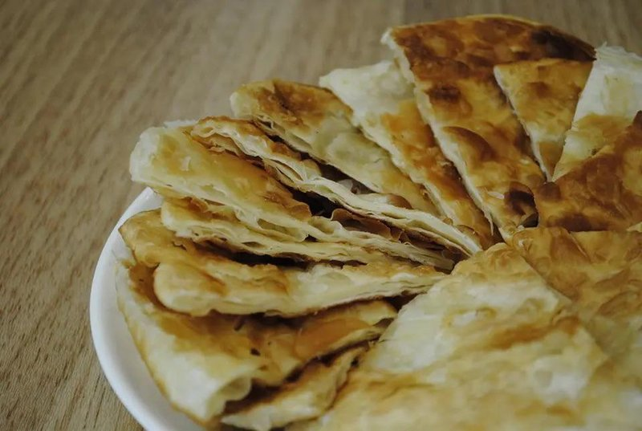

# Gambir

*Mongolia's layered sweet pastry: paper-thin dough rolled with butter and sugar, coiled tight and pan-fried till the layers crackle.*

**Serves:** Makes 6 gambir (serves 6)

**Prep Time:** 45 minutes (plus 30 minutes resting)

**Cook Time:** 30 minutes

## Overview
A simple dough - flour, warm water, salt - kneads to a smooth ball, rests for 30 minutes. Divides into 6 portions, each rolls paper-thin to 35 cm. The thin sheet brushes generously with melted butter, sprinkles with sugar, then rolls up like a Swiss roll, then coils tight like a snail shell. The coil flattens with the palm of the hand to a 12 cm disc - the layers compress but stay distinct. Pan-fries on a dry skillet 4 minutes per side, then bakes finish at 180°C for 8 minutes to dry out the centre.

## Ingredients

### Dough
- 400 g plain flour
- 220 ml warm water
- ½ teaspoon salt

### Layer filling
- 150 g unsalted butter (melted)
- 100 g caster sugar
- 1 teaspoon ground cardamom (optional)

### To finish
- 30 g unsalted butter (for the pan)
- Icing sugar (for dusting)

## Method

### Stage 1 - Dough
1. In a wide bowl, mix the flour and salt.
1. Pour in the warm water; mix to a shaggy mass.
1. Turn onto a lightly floured surface; knead 8 minutes to a smooth, firm dough.
1. Rest in a covered bowl 30 minutes.

### Stage 2 - Divide
1. Turn the rested dough onto the work surface.
1. Divide into 6 equal portions (~100 g each).
1. Cover all but one with a damp tea towel.

### Stage 3 - Roll and laminate
1. Roll the first portion on a lightly floured surface to a circle 35 cm across - paper-thin (1-2 mm).
1. Brush generously with melted butter, edge to edge.
1. Sprinkle 2 teaspoons of caster sugar evenly over the buttered surface.
1. Dust lightly with cardamom (if using).

### Stage 4 - Coil
1. Roll the dough up like a Swiss roll, tightly, to form a long rope.
1. Coil the rope tightly like a snail shell (start at one end, wind round and round).
1. Tuck the loose end under the base of the coil.
1. Press the coil flat with the palm of your hand, gently, to a 12 cm disc 1 cm thick (the layers should still be visible from above).
1. Roll lightly with a pin to even out the disc.

### Stage 5 - Pan-fry
1. Heat a heavy skillet over medium heat.
1. Add a small knob of butter; once foaming, lay 1-2 gambir in the pan.
1. Cook 3-4 minutes per side until deep gold and crackling slightly at the layers.
1. Transfer to a parchment-lined baking tray.
1. Repeat for the rest.

### Stage 6 - Finish in the oven
1. Heat the oven to 180°C (160°C fan).
1. Bake the pan-fried gambir 8 minutes (this dries the centre and crisps the layers fully).

### Stage 7 - Serve
1. Dust generously with icing sugar.
1. Serve warm with strong milk tea.

## Notes
- **Roll paper-thin:** the more layers you build into the coil, the more dramatic the cross-section. Thick rolls give doughy gambir.
- **Don't skimp on butter:** butter is what separates the layers and makes them flaky. Skimp and the layers fuse into a pancake.
- **Coil tight, then flatten gentle:** if you press too hard you fuse the layers together and lose the distinction.
- **Two-stage cooking:** pan-frying alone gives a golden exterior and a doughy centre. The oven finish dries the middle without over-browning the outside.

## Storage
- Best within an hour of cooking.
- Keep 2 days in an airtight tin; re-warm in a 150°C oven 5 minutes to revive the layers.
- Don't refrigerate - the butter solidifies and the layers go heavy.
