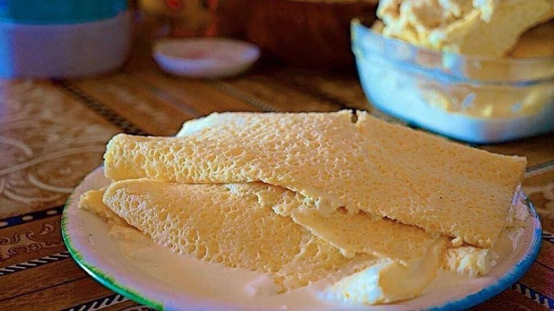

# Urum (Mongolian Clotted Cream and Sugar)

*The Mongolian clotted cream: whole milk simmered for hours, the cream skin lifted off and stacked in layers with sugar to set into a soft slab.*

**Serves:** 4

**Prep Time:** 10 minutes

**Cook Time:** 3 hours (mostly hands-off) plus overnight chilling

## Overview
The Mongolian clotted cream: whole milk simmered slowly for hours, the cream skin lifted off as it forms and stacked in layers with sugar between each, then chilled overnight to set into a soft slab that gets sliced like a small cake. Patient work but mostly hands-off; an afternoon project that gives you a celebration dessert and a second prize of reduced sweet milk for tea. You need full-fat whole milk (≥3.5%; semi-skimmed barely forms a skin) and a wide shallow heavy pan (more surface area means more skin forms). Bring the milk to just below a simmer with a pinch of salt over the lowest possible heat; you want steam and tiny bubbles at the edge but never a rolling boil (boiling tears the skin and the milk solids fall to the bottom instead of the cream rising to the top). Hold here 30 to 40 minutes till the first wrinkled cream skin forms. Lift it gently with a slotted spoon, letting the milk drip back, lay in a deep dish and sprinkle a thin layer of caster sugar over (about a teaspoon). Return to the heat and repeat every 20 to 30 minutes for two or three hours, building up four to six sugar-separated layers. Don't discard the reduced sweet milk left in the pan; it goes into tea or chills as a sweet drink. Cover the layered dish, chill overnight till the layers fuse into a soft slab. Lift out, cut into slices like cake, serve with strong black tea or smeared on warm bread.

## Ingredients
- 2 litres whole milk (full-fat, organic if possible - fat content makes urum)
- 50 g caster sugar (or to taste)
- 1 pinch salt
- ½ teaspoon vanilla extract (optional, not traditional but pleasant)

## Method

### Stage 1 - The slow simmer
1. Pour the milk into a wide shallow heavy pan (a sauté pan is ideal - more surface area means more cream skin forms).
1. Add a pinch of salt.
1. Place over the lowest possible heat.
1. Bring the milk slowly to just-below-a-simmer - you'll see steam and tiny bubbles at the edge, but the surface should never break into a rolling boil.
1. Hold here for 30-40 minutes; a wrinkled cream skin will form on the surface.

### Stage 2 - Lift and stack
1. When the first skin is thick and wrinkled (it should look like the skin on cooled custard), lift it gently with a slotted spoon, letting the milk drip back into the pan.
1. Lay the skin in a small deep dish (a 15 cm round dish works well).
1. Sprinkle a thin even layer of caster sugar over the skin (about a teaspoon).
1. Return to the heat.
1. Repeat every 20-30 minutes for 2-3 hours, building up 4-6 layers of skin in the dish, each separated by sugar.

### Stage 3 - Use the reduced milk
1. By the end you'll have about 500 ml of reduced sweet milk in the pan.
1. This goes into tea (the Mongolian way) or chills as a sweet milk drink.
1. Don't discard it - it's the second half of urum's value.

### Stage 4 - Set
1. Cover the layered cream dish; chill overnight (the layers fuse into a soft slab).

### Stage 5 - Serve
1. Lift the slab out of the dish; cut into slices like a small cake.
1. Serve at the table with hot strong black tea (su tei tsai if you have it) or smeared on warm bread.

## Notes
- **Whole milk is the minimum:** semi-skimmed barely forms a skin and tastes thin. Look for milk labelled ≥3 ½% fat.
- **Low heat, no boiling:** rolling boils tear the skin and you end up with milk solids at the bottom of the pan instead of cream on top.
- **Wide pan, lots of surface:** the skin forms on top, so surface area beats depth. A 30 cm sauté pan beats a 20 cm saucepan even if both hold 2 L.
- **Don't stir:** any agitation prevents the skin from forming. Lift skins gently; don't disturb the milk underneath.

## Storage
- Keeps 4 days refrigerated in a covered dish.
- Doesn't freeze (the cream layers separate and weep on thaw).
- The reduced sweet milk keeps 3 days; use within for tea or porridge.
