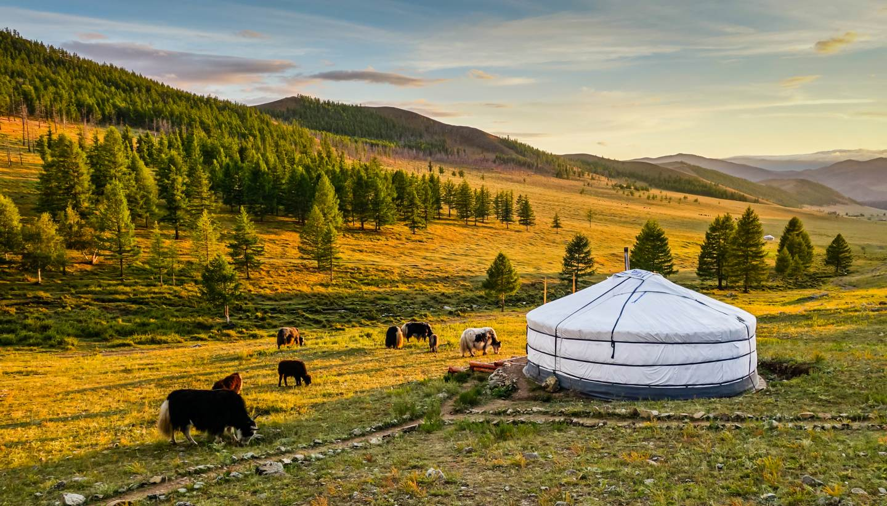

# Mongolian Cuisine

Steppe cuisine, meat-heavy, dairy-rich, fresh-vegetable-light, shaped by nomadic herding. Buuz (steamed mutton dumplings), khuushuur (fried meat pies), tsuivan (hand-cut noodles with mutton) and bansh (small boiled dumplings) anchor the table. Suutei tsai (salty milk tea) is breakfast, lunch and supper. Tsagaan Sar (Lunar New Year) brings stacked towers of boortsog (fried biscuits) and aaruul (dried curd) to communal tables. Influences run from China to the south and Russia to the north.
