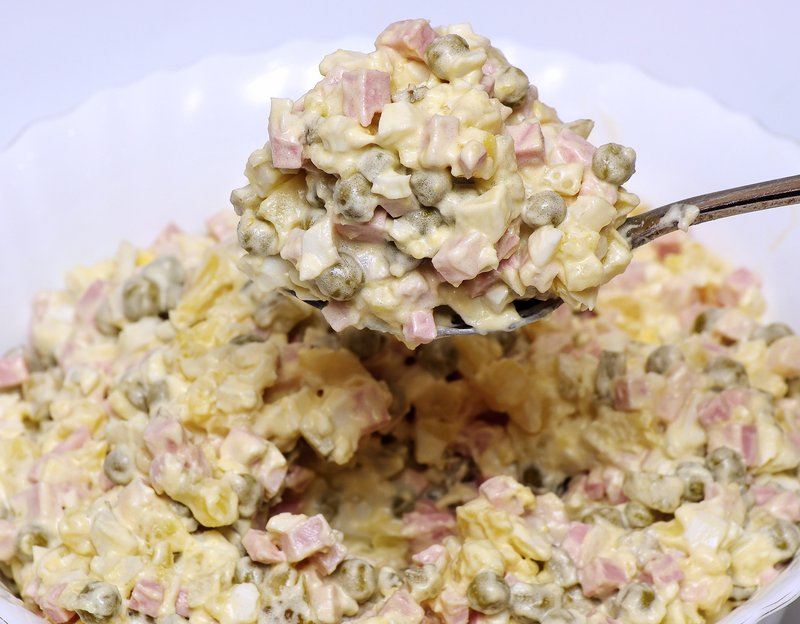

# Niislel Salat

*Mongolia's 'capital city salad': diced boiled potato, carrot, egg, pickles and sausage bound with mayo. Served chilled at any large meal.*

**Serves:** 6 as a side

**Prep Time:** 25 minutes

**Cook Time:** 25 minutes (plus 1 hour chilling)

## Overview
Potatoes, carrots and eggs boil separately to keep their texture distinct. Cooked smoked sausage (or boiled beef) and dill pickles dice to match. Frozen peas thaw under hot water. Everything mixes with mayo, mustard, salt and pepper. Chills at least an hour so the dressing thickens and the flavours marry. Eaten cold from the fridge.

## Ingredients

- 4 potatoes (medium, around 600 g; waxy or all-rounders)
- 3 carrots (medium)
- 4 eggs (large)
- 200 g cooked smoked sausage (frankfurter or doctor's sausage; or boiled beef brisket)
- 4 dill pickles (large, about 200 g)
- 200 g frozen peas (thawed; or tinned, drained)
- 6 tablespoons mayonnaise
- 1 tablespoon Dijon mustard
- 1 teaspoon salt (or to taste)
- ½ teaspoon black pepper
- 4 spring onions (sliced; optional)
- A small bunch of dill (chopped)

## Method

### Stage 1 - Boil
1. Boil the potatoes in their skins in salted water 18-22 minutes until tender; drain; cool.
1. Boil the carrots in salted water 12-15 minutes until tender; drain; cool.
1. Hard-boil the eggs: place in cold water, bring to a boil, simmer exactly 10 minutes; drain; cool under cold running water; peel.

### Stage 2 - Dice
1. Peel and dice the cooled potatoes, carrots and eggs into 5 mm cubes.
1. Dice the sausage and pickles to match.
1. Have the thawed peas drained in a colander.

### Stage 3 - Combine
1. Tip everything into a wide bowl.
1. Mix the mayo, mustard, salt and pepper together; pour over.
1. Toss gently with two large spoons - try to keep the cubes intact rather than mashing.
1. Stir in the dill (and spring onions if using); reserve a little for the top.

### Stage 4 - Chill
1. Cover and refrigerate at least 1 hour (3-4 hours is better) so the flavours marry and the dressing thickens.

### Stage 5 - Serve
1. Spoon onto a platter or into a wide bowl.
1. Top with the reserved dill.
1. Serve cold from the fridge alongside buuz, khuushuur, or grilled meat.

## Notes
- **5 mm dice across the board:** Inconsistency makes the salad look messy and dressed unevenly. Take the time to dice properly.
- **Sausage or beef:** Mongolian niislel salat traditionally uses boiled beef (sometimes including the brisket from making bone broth). Smoked sausage is the everyday city version. Both work.
- **Make ahead:** Better the next day - the potatoes absorb dressing and the salad becomes silkier.

## Storage
- Keeps 3 days refrigerated. Don't freeze (the texture suffers).
