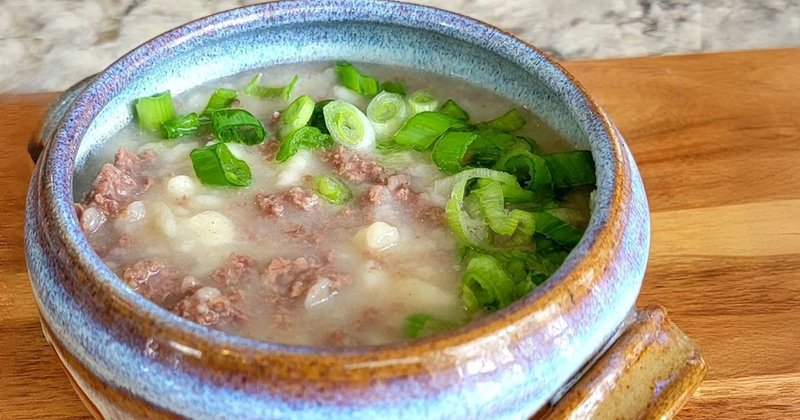

# Bantan

*Mongolia's flour-and-mutton broth: simmering mutton stock with pinches of raw flour rubbed into pea-sized pearls. The cure for a hungover adult.*

**Serves:** 4

**Prep Time:** 10 minutes

**Cook Time:** 30 minutes

## Overview
Mongolia's flour-and-mutton broth, the steppe's morning-after restorative for hangovers and cold mornings: simmering mutton stock with rubbed-flour pearls cooked through it, salty and warming and plain on purpose. Don't add chilli, garlic or fancy herbs; that's not the dish. The flour-and-water "pearls" are the technical move: a couple of tablespoons of cold water rubbed into plain flour between the palms aggregates the flour into pea-sized crumbs, sieved free of loose flour, then scattered into the gently simmering broth a handful at a time. Ladled into bowls hot, with sliced spring onion or fresh dill on top.

## Ingredients

- 1 tablespoon vegetable oil (or mutton fat)
- 150 g minced mutton (or beef)
- 1 onion (small, finely diced)
- 1 ½ litres mutton stock (or water with 1 stock cube)
- 1 teaspoon salt
- ½ teaspoon black pepper
- 150 g plain flour
- 2-3 tablespoons cold water (to form the flour pearls)
- 1 spring onion (finely sliced) or 1 tablespoon fresh dill

## Method

### Stage 1 - Fry
1. Heat the oil in a medium pot over medium heat.
1. Add the mince and onion; fry 5 minutes, breaking up the meat, until the onion is soft and the meat is just cooked.

### Stage 2 - Broth
1. Pour in the stock; bring to a simmer.
1. Add salt and pepper.
1. Simmer 8 minutes to develop the flavour.

### Stage 3 - Flour pearls
1. Place the flour in a wide shallow bowl.
1. Drizzle 2 tablespoons of cold water across the flour.
1. Rub the flour and water together between your palms - the flour clumps into pea-sized crumbs.
1. Sieve the crumbs gently to remove any loose flour (the loose flour is fine but the crumbs are the point).

### Stage 4 - Cook the pearls
1. Drop the flour-pearls into the gently simmering broth a handful at a time, stirring as you go to keep them separate.
1. Simmer 5 minutes until the pearls are cooked through and slightly swollen.

### Stage 5 - Serve
1. Taste; adjust salt.
1. Ladle into bowls; scatter spring onion or dill.

## Notes
- **Rub, don't measure:** The flour pearls form by friction - the water moistens, the rubbing aggregates. Too much water and you get dough; too little and you get loose flour. The right consistency is "couscous-like crumbs".
- **Stir as you drop:** If you add the pearls in a lump they'll fuse. Sprinkle as you stir.
- **Mild and salty:** Bantan is plain on purpose. Don't add chilli, garlic or fancy herbs - that's not the dish.

## Storage
- Best fresh. Refrigerate 2 days; reheat gently with extra stock (the pearls absorb liquid as they sit).
