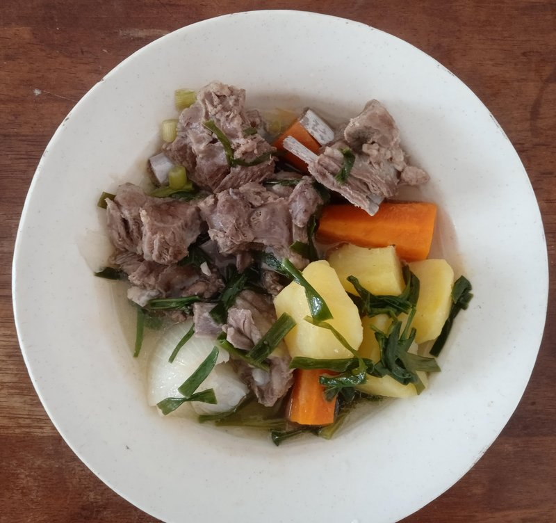

# Chanasan Makh

*Mongolia's plainest dish: mutton on the bone boiled in salted water with nothing else. The honour-meat of the steppe, eaten by hand with a knife.*

**Serves:** 4

**Prep Time:** 5 minutes

**Cook Time:** 1 hour 45 minutes

## Overview
Mutton on the bone, shoulder, breast, leg in big pieces, is placed in a deep pot. Cold water covers. Salt is added (heroically, about 1 tablespoon per litre). The pot comes to a boil; the surface is skimmed thoroughly; then it simmers, partially covered, until the meat is so tender it falls in big juicy pieces from the bone. The dish is piled onto a platter; the broth is reserved and drunk in cups alongside.

## Ingredients

- 1 ½ kg mutton on the bone (shoulder, leg, breast, ribs - mixed cuts are traditional)
- 3 litres cold water
- 3 tablespoons salt (yes, 3)
- 1 onion (small, halved - optional; traditionalists use nothing)
- 1 bay leaf (optional)

### To serve
- Salt flakes
- Mustard (Mongolian-style - sharp yellow mustard with a splash of water and salt)

## Method

### Stage 1 - Pot
1. Place mutton pieces in a deep heavy pot.
1. Cover with the cold water (the meat should be fully submerged with 5 cm of water above).
1. Bring slowly to a boil over medium heat - slow heating makes a clearer broth.

### Stage 2 - Skim
1. As the water approaches a boil, foam will rise.
1. Skim it off thoroughly for 3-4 minutes until it stops forming.
1. Add the salt (and onion / bay if using).

### Stage 3 - Simmer
1. Reduce to the lowest simmer.
1. Partially cover.
1. Cook 1 hour 30 minutes until the meat is fall-from-bone tender.
1. Don't boil hard - a gentle simmer is the rule. Boiling toughens the meat and clouds the broth.

### Stage 4 - Rest
1. Off heat; let the meat sit in the broth 15 minutes.

### Stage 5 - Serve
1. Lift the mutton pieces onto a wide warmed platter.
1. Strain the broth into a jug or cups.
1. Eat the meat by hand or with a knife. Sprinkle salt flakes onto the meat as you eat.
1. Drink the salty broth from cups alongside.
1. Mustard is offered on the side for dipping.

## Notes
- **Heavy salting:** Mongolian boiled mutton is well-salted - the salt is what cures the bland and brings out the meat. Don't undersalt out of timidity.
- **Slow simmer, no aromatics:** This is the dish - meat, water, salt. Vegetables and herbs are anti-traditional. The flavour is pure mutton.
- **Eat with your hands:** Forks are wrong. Bones are sucked clean; cartilage is chewed.

## Storage
- Refrigerate the meat in the broth 4 days; reheat together in the broth.
- The broth makes superb soup base; freeze 3 months.
