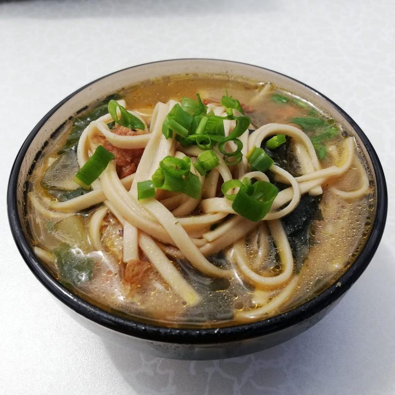

# Guriltai Shul

*Mongolia's mutton noodle soup: a clear broth of slow-simmered mutton on the bone with hand-cut wheat noodles, carrot and onion. The cold-day restorative.*

**Serves:** 4

**Prep Time:** 30 minutes (mostly noodle making)

**Cook Time:** 1 hour 30 minutes

## Overview
Mutton on the bone simmers for 1 hour 15 minutes with onion, bay and a few peppercorns. Bones lift out; meat is shredded. Hand-cut noodles drop into the simmering broth with diced carrot and onion. 6 minutes later the noodles are tender and the dish is done. Salted to taste, garnished with chopped spring onion or dill.

## Ingredients

### Broth
- 800 g mutton on the bone (shoulder, neck or breast pieces)
- 1 onion (medium, halved)
- 2 bay leaves
- 1 teaspoon black peppercorns
- 1 carrot (rough chunks)
- 2 ½ litres water
- 1 ½ teaspoons salt (to taste at the end)

### Noodles
- 200 g plain flour
- 100 ml warm water
- ¼ teaspoon salt

### Add to soup
- 1 carrot (medium, diced small)
- 1 onion (medium, diced)
- 1 potato (medium, diced 1 cm, optional, common in winter)

### Garnish
- 2 spring onions (sliced) or 2 tablespoons fresh dill (chopped)

## Method

### Stage 1 - Broth
1. Place mutton, halved onion, bay, peppercorns and carrot chunks in a large pot.
1. Cover with the water; bring to a boil.
1. Skim the foam thoroughly.
1. Reduce to a gentle simmer; cover loosely; cook 1 hour 15 minutes until the meat falls off the bone.
1. Lift out the bones; pull off the meat and shred it. Discard the bones, bay, peppercorns and aromatic vegetables.
1. Strain the broth back into a clean pot.

### Stage 2 - Noodles
1. While the broth simmers, mix flour, salt and warm water into a stiff dough.
1. Knead 6 minutes until smooth; rest 20 minutes covered.
1. Roll out to 2 mm thick on a floured surface.
1. Fold into thirds and cut into 5 mm-wide strips.
1. Shake out the strips; dust with flour.

### Stage 3 - Soup
1. Bring the strained broth back to a simmer.
1. Add the diced carrot, onion and potato (if using); cook 8 minutes until just tender.
1. Add the noodles; cook 4-5 minutes until tender (they're thin and cook fast).
1. Return the shredded mutton to the pot; warm through 1 minute.
1. Taste; add salt to season.

### Stage 4 - Serve
1. Ladle into deep bowls.
1. Scatter spring onion or dill.

## Notes
- **Mutton on the bone:** Bones give the broth its body. Boneless mutton makes a thin watery soup. Lamb necks work very well too.
- **Skim early:** The skim is essential for a clear broth. After the first big boil-up, skim every minute for 3-4 minutes until the foam stops rising.
- **Fresh noodles, no compromise:** Shop noodles work in a pinch but the hand-cut noodles' faintly chewy bite is the dish.

## Storage
- Refrigerate 3 days; reheat gently.
- The noodles soften on day two - for best texture, make the broth ahead but the noodles fresh.
