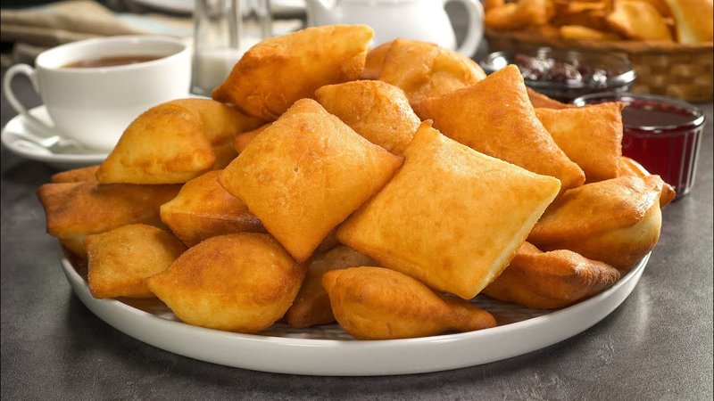

# Boortsog

*Mongolia's everyday fried dough: slightly sweet biscuits deep-fried golden. Dipped in milk tea or piled high for Tsagaan Sar.*

**Makes:** about 30 boortsog

**Prep Time:** 25 minutes (plus 30 min resting)

**Cook Time:** 25 minutes

## Overview
Mongolia's everyday fried dough: slightly sweet biscuits that turn up dipped in milk tea every afternoon and piled high in tiered stacks (sometimes called ul boov) at Tsagaan Sar to symbolise prosperity. A simple flour, butter, egg and milk dough, lightly sweetened, cut into rectangles, twists or score-topped discs and deep-fried golden. Don't overwork the dough; boortsog should be tender, not chewy. Eat warm or at room temperature, dusted with caster sugar or drizzled with honey, with hot sweetened milk tea on the side (or salted milk tea for the proper Mongolian way).

## Ingredients

- 500 g plain flour
- 80 g caster sugar
- 1 teaspoon salt
- ½ teaspoon baking powder
- 100 g unsalted butter (softened)
- 1 egg (large)
- 200 ml whole milk (warm; plus 50 ml extra if needed)

### Frying
- Vegetable oil for deep-frying (about 1 litre)

### To finish (optional)
- Caster sugar for dusting (modern variation)
- Or: drizzle of honey
- Or: butter and jam to serve

## Method

### Stage 1 - Dough
1. Whisk the flour, sugar, salt and baking powder in a wide bowl.
1. Rub in the softened butter until breadcrumb texture.
1. Whisk the egg and warm milk together; pour into the flour.
1. Mix to a soft, slightly sticky dough; knead briefly (3-4 minutes) until smooth.
1. Cover and rest 30 minutes.

### Stage 2 - Roll and shape
1. On a lightly floured surface, roll the dough to a 6-7 mm thick rectangle.
1. Cut into pieces. Several traditional shapes:
   - **Rectangles** (3 x 6 cm) - easiest.
   - **Twists**: cut a long strip; make a slit lengthwise in the middle; pull one end through the slit to form a twist.
   - **Discs**: roll into balls, flatten, score the top with a fork.
1. Lay finished pieces on a tray; rest 10 minutes (gives a slightly puffier result).

### Stage 3 - Heat the oil
1. Heat the oil to 165-170°C (a piece of dough should bubble vigorously and float without browning instantly).

### Stage 4 - Fry
1. Add 6-8 boortsog at a time; don't crowd.
1. Fry 2-3 minutes per side until uniformly deep gold and slightly puffed.
1. Lift onto kitchen paper.

### Stage 5 - Finish
1. Eat warm or at room temperature.
1. Optional: dust with caster sugar while still warm; or drizzle with honey; or split and spread with butter and jam.

### Stage 6 - Serve
1. Serve with hot sweetened milk tea (or any black tea with milk and a pinch of salt for the proper Mongolian way).
1. Pile high on a plate for tea time.

## Notes
- **Don't overwork the dough:** Boortsog should be tender, not chewy. Knead just until smooth, then leave it alone.
- **Frying temperature:** Hotter than 175°C burns the outside before the inside cooks; cooler than 160°C means oily, dense biscuits. Use a thermometer if you have one.
- **Festival stacking:** For Tsagaan Sar, boortsog stack like a tiered cake - sometimes called "ul boov" - symbolising prosperity. Domestic versions are eaten more casually, dipped into milk tea.

## Storage
- Keeps 2 weeks in an airtight tin at room temperature; eats well stale (dunked in tea).
- Freezes 2 months.
