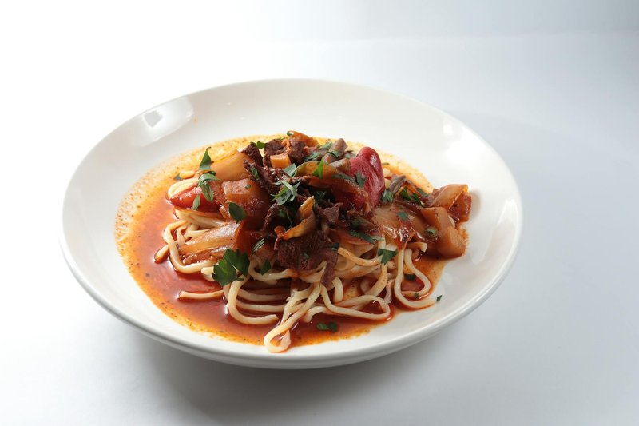

# Tsuivan

*Mongolia's one-pot noodle dish: hand-cut wheat noodles steamed atop a mutton-and-cabbage stew, the noodles drinking up the meat fat from below.*

**Serves:** 4

**Prep Time:** 40 minutes (mostly noodle making)

**Cook Time:** 35 minutes

## Overview
Mongolia's one-pot noodle dish, the kind of weeknight dinner that fills a deep pot and feeds a family: hand-cut wheat noodles steamed atop a mutton-and-cabbage stew, the noodles drinking up the meat fat from below till every strand is glossy with juice. Fresh hand-cut noodles are non-negotiable; shop-bought dried noodles are pre-set and won't absorb the meat fat the same way. Spread the raw noodles in a loose pile on top of the stewing vegetables (don't push them down into the liquid; they steam, they don't boil), lid down tight for fifteen minutes without peeking. Tossed at the end so the noodles fall into the meat and vegetables and absorb the juices. Piled into wide bowls, scattered with spring onion.

## Ingredients

### Noodles
- 300 g plain flour
- 150 ml warm water
- ½ teaspoon salt

### Stew base
- 500 g mutton shoulder (or fatty beef, cut into 2 cm cubes)
- 2 tablespoons vegetable oil
- 2 onions (medium, sliced)
- 4 garlic cloves (crushed)
- ½ small cabbage (shredded, about 300 g)
- 2 carrots (medium, julienned)
- 1 teaspoon salt
- ½ teaspoon black pepper
- 200 ml water (or mutton stock)

### To finish
- 2 tablespoons soy sauce (modern addition, common today)
- 1 spring onion (sliced)

## Method

### Stage 1 - Noodles
1. Mix flour, salt and warm water to a stiff dough.
1. Knead 8 minutes until smooth.
1. Wrap and rest 30 minutes.
1. Roll out to a thin sheet 2 mm thick.
1. Lightly flour the surface; fold the sheet into thirds.
1. Slice across the folds into 3 mm-wide strips.
1. Shake out the strips; dust with flour to prevent sticking.

### Stage 2 - Brown the meat
1. Heat oil in a deep heavy lidded pot over high heat.
1. Add mutton; brown 5 minutes, stirring, until coloured all over.

### Stage 3 - Aromatics and vegetables
1. Reduce heat to medium.
1. Add onion; cook 5 minutes until softened.
1. Add garlic, carrot, cabbage, salt and pepper; stir 2 minutes.

### Stage 4 - Steam the noodles
1. Pour in the water; bring to a simmer.
1. Spread the raw noodles on top of the stew in a loose pile (don't push them down into the liquid, they need to steam, not boil).
1. Cover tightly; reduce heat to low.
1. Cook 15 minutes (no peeking, the steam is what cooks the noodles).

### Stage 5 - Toss
1. Lift the lid; sprinkle over the soy sauce.
1. With two big forks or wooden spoons, toss everything together, the noodles fall into the meat and vegetables and absorb the juices.
1. Cook 2 more minutes uncovered if the bottom is wet.

### Stage 6 - Serve
1. Pile into wide bowls; scatter spring onion.

## Notes
- **Steam, don't boil:** The water in the pot is for steam only, there should be no broth at the end, just glossy noodles coated in meat juice. If it looks soupy, lift the lid for the last few minutes to evaporate.
- **Hand-cut, not shop-bought:** Shop-bought noodles are pre-dried and won't absorb the meat fat the same way. The fresh noodles are non-negotiable for the right texture.
- **Mutton fat is the flavour:** Lean cuts give a thinner dish. Mutton shoulder or breast (or fatty beef) is what you want.

## Storage
- Refrigerate 3 days; reheats well in a covered pan with a splash of water.
- Doesn't freeze well, the noodles turn mushy on thaw.
