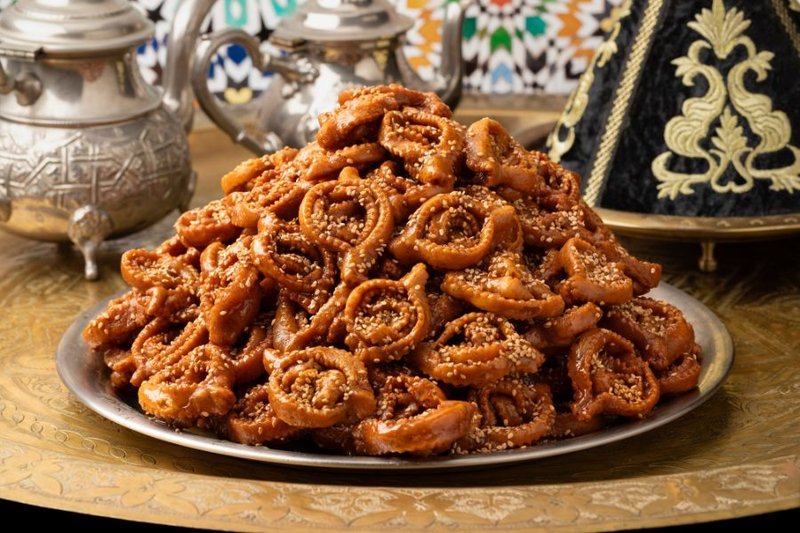

# Chebakia (Sesame Honey Rosettes)

*Morocco's Ramadan rosette: a sesame-and-almond dough cut and twisted into ornate flowers, deep-fried, plunged into warm honey, dusted with more sesame.*

**Serves:** Makes about 30 chebakia

**Prep Time:** 1 hour (plus 1 hour resting)

**Cook Time:** 30 minutes

## Overview
Morocco's Ramadan rosette, the ornate honey-soaked pastry that piles high in glass cake stands on every iftar table: a sesame-and-almond dough cut into rectangles, slit lengthways and twisted into rosette flowers, deep-fried golden, then plunged into warm honey perfumed with orange-flower water. Rosette shaping takes practice; your first chebakia will look terrible, but by the tenth they're recognisable and by the twentieth beautiful. You toast sesame seeds in a dry pan till fragrant, grind lightly, mix with ground almonds, plain flour, aniseed, cinnamon, salt, yeast and a saffron infusion. Bind with melted butter, eggs, vinegar and orange-flower water, knead eight minutes to a smooth slightly sticky dough, rest an hour. Roll out to 3 mm thick, cut into 8 × 5 cm rectangles, slit each four times lengthways without cutting through to the ends. Thread one corner through the centre slit and pull out the other side to form the rosette, pinch the corners to set the shape. Warm honey gently with orange-flower water till just liquid (not boiling; boiling honey turns bitter). Fry the rosettes at 170°C for three or four minutes till deep amber, lift straight into the warm honey, submerge for two minutes with a slotted spoon, lift onto a wire rack to drain. Sprinkle with toasted sesame seeds while sticky, cool fully. Best on day two when the honey has fully penetrated.

## Ingredients

### Dough
- 500 g plain flour
- 200 g toasted sesame seeds (lightly ground)
- 100 g almonds (toasted, finely ground)
- 1 tablespoon ground aniseed
- 1 tablespoon ground cinnamon
- 1 teaspoon salt
- 1 pinch saffron threads (ground, steeped in 2 tablespoons hot water)
- 1 sachet (7 g) instant yeast
- 100 g unsalted butter (melted, cooled slightly)
- 2 eggs (large)
- 3 tablespoons white vinegar
- 4 tablespoons orange-flower water
- 100 ml warm water (or as needed)

### Frying
- 1 litre neutral oil

### Honey glaze
- 700 g clear honey
- 3 tablespoons orange-flower water

### Finishing
- 100 g toasted sesame seeds (for sprinkling)

## Method

### Stage 1 - Dough
1. In a wide bowl, combine flour, ground sesame, ground almond, aniseed, cinnamon, salt and yeast.
1. Add the melted butter, eggs, vinegar, orange-flower water and saffron infusion.
1. Mix to a shaggy dough; add warm water as needed to bring together.
1. Knead 8 minutes to a smooth, slightly sticky dough.
1. Rest 1 hour covered.

### Stage 2 - Roll and cut
1. Roll the rested dough on a lightly floured surface to 3 mm thick.
1. Cut into rectangles 8 × 5 cm.
1. With a sharp knife, slit each rectangle lengthways 4 times - slits should not reach the ends (the dough must stay in one piece).

### Stage 3 - Shape rosettes
1. Take one rectangle; hold by the two short ends.
1. Thread one corner through the centre slit, pulling out the other side.
1. Pinch the corners to set the shape.
1. Practice on a few - the goal is an open flower / rosette form.
1. Set on a tray.

### Stage 4 - Warm the honey
1. In a wide pan, warm the honey with the orange-flower water until just liquid (not boiling).
1. Keep warm.

### Stage 5 - Fry
1. Heat the oil to 170°C.
1. Lower 4-5 chebakia at a time; fry 3-4 minutes, turning, until deep amber.
1. Lift directly into the warm honey.

### Stage 6 - Soak
1. Submerge in honey 2 minutes (use a slotted spoon to push them under).
1. Lift onto a wire rack; let excess drip.
1. Sprinkle with toasted sesame seeds while still sticky.
1. Cool fully.

## Notes
- **Rosette shaping takes practice:** your first chebakia will look terrible. By the 10th they're recognisable; by the 20th they're beautiful. Watch a YouTube video of a Moroccan grandmother folding chebakia - it's mesmerising.
- **Toasted sesame in the dough, not raw:** raw sesame tastes bland. Toast 200 g in a dry pan 4 minutes till fragrant, then grind lightly.
- **Honey HOT enough to penetrate, NOT boiling:** boiling honey turns bitter. Body-temperature warm is perfect.
- **Soak fully:** chebakia depends on the deep honey absorption. Skimping on soaking gives dry chebakia.

## Storage
- Keeps 3 weeks at room temperature in a sealed tin.
- Don't refrigerate.
- Best on day 2 when the honey has distributed fully.
