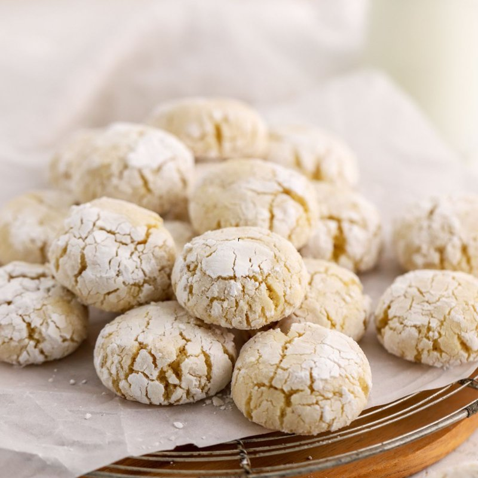

# Ghriba (Moroccan Almond Shortbread)

*Morocco's almond shortbread: ground almonds, sugar, eggs and orange-flower water rolled in icing sugar and baked till cracked on top.*

**Serves:** Makes 24 cookies

**Prep Time:** 20 minutes (plus 30 minutes resting)

**Cook Time:** 15 minutes

## Overview
Ghriba is Morocco's almond shortbread, the cracked-snowy-topped biscuit that lands on every tea tray and Eid table. Ground almonds, sugar, eggs and orange-flower water bind into a soft dough, rolled in a thick coat of icing sugar and baked at gentle heat till the surface fissures like a snowball. Naturally gluten-free; the almonds and the egg do all the structural work. The icing-sugar coat has to be heavy, not a dusting; the iconic cracked top depends on a really thick layer of sugar pressing in around the cookie as it spreads in the oven. A pause in the fridge before rolling firms the dough enough to shape, and a whole almond pressed into the centre of each ball is an optional but pretty finish. Baked at 170 °C for twelve to fifteen minutes; pale ivory-cream is the goal, never browned. Cooled on the tray five minutes before transferring since they're fragile straight from the oven.

## Ingredients
- 500 g ground almonds
- 200 g icing sugar
- ½ teaspoon salt
- ¾ teaspoon baking powder
- 1 teaspoon ground cinnamon (optional)
- 1 lemon (zest)
- 3 eggs (large)
- 2 tablespoons orange-flower water
- 30 g unsalted butter (melted)

### Coating
- 150 g icing sugar (for rolling)
- 50 g whole almonds (optional, pressed onto each ball as a topper)

## Method

### Stage 1 - Mix
1. In a wide bowl, whisk the ground almonds, 200 g icing sugar, salt, baking powder, optional cinnamon and lemon zest.
1. In a separate bowl, beat the eggs with the orange-flower water and melted butter.
1. Pour the wet into the dry; mix with a wooden spoon until just bound.
1. The dough should be soft but holdable; if too wet, add more ground almonds a tablespoon at a time.

### Stage 2 - Rest
1. Cover; refrigerate 30 minutes.

### Stage 3 - Shape
1. Heat the oven to 170°C (150°C fan).
1. Line two baking trays with parchment.
1. Spread the 150 g icing sugar on a wide plate.
1. Pinch off walnut-sized portions (about 30 g each); roll between palms into smooth balls.
1. Drop each ball into the icing sugar; roll to coat HEAVILY (not a dusting, a thick all-over snow).
1. Place on the trays, 4 cm apart.
1. Optional: press a whole almond into the centre of each ball.

### Stage 4 - Bake
1. Bake 12-15 minutes.
1. The cookies will spread slightly; the icing sugar coat will crack as the cookies expand; the surface should look like a fissured snowball.
1. DON'T let them brown, pale is the goal.

### Stage 5 - Cool
1. Cool on the tray 5 minutes (they're fragile straight from the oven).
1. Transfer to a wire rack to cool fully.

## Notes
- **Heavy sugar coat or fail:** the iconic cracked-snowy top depends on a really thick layer of icing sugar. A light dusting won't give the same look.
- **Pale, not browned:** ghriba should look ivory-cream. If they brown, your oven is too hot or you've cooked them too long.
- **Pure almonds, no flour:** ghriba is naturally gluten-free. The almonds and the egg give all the structure.
- **Orange-flower water is iconic:** rose-water is a regional substitute; vanilla works but loses the Moroccan accent.

## Storage
- Keeps 2 weeks in a sealed tin at room temperature.
- The texture softens slightly over the first 24 hours, actually improves.
- Doesn't refrigerate well, the sugar coat goes damp.
- Freezes baked 2 months; re-dust with icing sugar after thawing.
