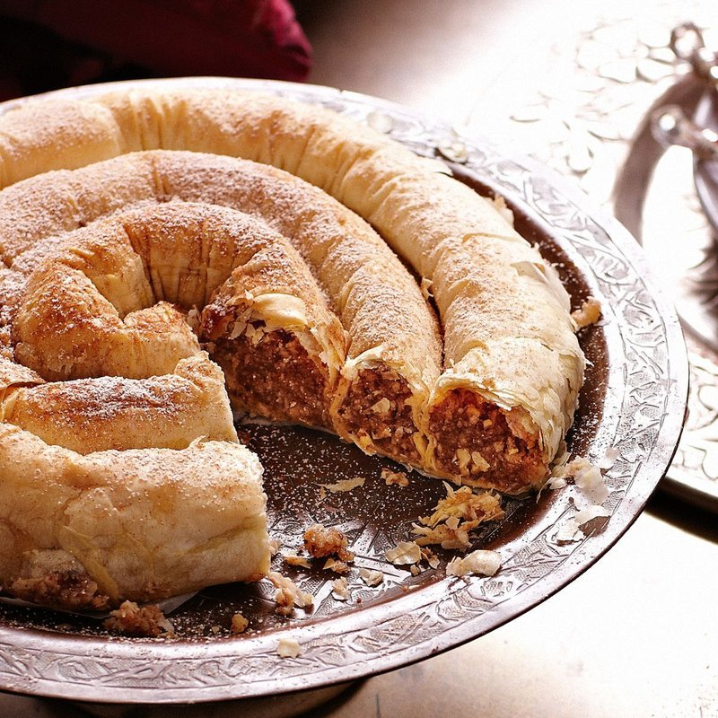

# m'Hencha (Almond Snake Coil)

*Morocco's snake-coil dessert: warka pastry filled with cinnamon almond paste, rolled into a long cylinder and coiled tight into a spiral. Baked golden.*

**Serves:** 8-10

**Prep Time:** 45 minutes

**Cook Time:** 35 minutes

## Overview
Morocco's snake-coil dessert and the showpiece pastry at any Eid or wedding spread: warka pastry filled with cinnamon-and-orange-flower almond paste, rolled into a long cylinder, then coiled tight into a snail-shell spiral, baked golden and dusted in a crisscross of icing sugar and cinnamon lines. The coil tight, the joins clean and the cinnamon lattice are the visual signatures. You mix ground almonds, icing sugar, salt, cinnamon, melted butter, orange-flower water, honey and an egg yolk into a soft pliable paste, divide into six portions and roll each into a rope 35 cm long. Lay a warka or filo sheet flat, brush the upper third with melted butter, place an almond rope along the bottom edge, fold up and roll tightly to form a long thin cylinder enclosed by two or three turns of pastry. Brush a 25 cm round tin with butter, starting at the centre coil the first cylinder into a tight spiral, brush the end with water, join the start of the second cylinder, continue till the tin is filled (a small gap at the very edge is fine; the pastry expands). Whisk an egg yolk with water, brush generously across the whole spiral. Bake at 180°C for 30 to 35 minutes till deep gold and crisp, covering loosely with foil for the last 10 if the surface browns too fast. Cool 20 minutes, carefully unmould onto a serving plate, dust generously with icing sugar then dust ground cinnamon in lattice lines across the top with a paper template.

## Ingredients

### Almond filling
- 400 g ground almonds
- 200 g icing sugar
- 80 g unsalted butter (melted)
- 1 tablespoon ground cinnamon
- 3 tablespoons orange-flower water
- 1 egg yolk (large)
- 1 tablespoon honey
- A pinch of salt

### Pastry
- 12 sheets warka (or filo pastry, large rounds preferred; rectangles work - cut to ~30 × 25 cm)
- 80 g unsalted butter (melted, for brushing)

### Eggwash
- 1 egg yolk
- 1 tablespoon water

### Garnish
- 2 tablespoons icing sugar
- 1 teaspoon ground cinnamon

## Method

### Stage 1 - Almond paste
1. In a wide bowl, combine ground almonds, icing sugar, salt, cinnamon, melted butter, orange-flower water, honey and egg yolk.
1. Mix until the mixture comes together as a soft pliable paste.
1. Divide into 6 equal portions; roll each into a rope 35 cm long, 1 ½ cm thick.

### Stage 2 - Cylinder assembly
1. Lay a warka or filo sheet flat (use 2 stacked thin filo sheets if substituting; warka is naturally a bit thicker).
1. Brush the upper third with melted butter.
1. Place an almond rope along the bottom edge of the sheet.
1. Fold the bottom edge of the sheet up over the rope; brush with butter; continue rolling tightly upward to form a long thin cylinder.
1. The cylinder should be about 35 cm long; the almond paste enclosed by 2-3 turns of pastry.

### Stage 3 - Coil in the tin
1. Brush a 25 cm round springform or shallow round baking tin with melted butter.
1. Starting at the centre of the tin, coil the first cylinder into a tight spiral.
1. Brush the end of the first cylinder with water; join the start of the second cylinder; continue coiling outward.
1. Continue until all cylinders are joined and the spiral fills the tin (a small gap at the very edge is fine - the pastry expands).

### Stage 4 - Glaze
1. Whisk the egg yolk with 1 tablespoon water.
1. Brush generously over the whole spiral surface.

### Stage 5 - Bake
1. Bake at 180°C (160°C fan) for 30-35 minutes until deep gold and crisp.
1. If the surface browns too fast, cover loosely with foil for the last 10 minutes.

### Stage 6 - Cool and dust
1. Cool 20 minutes in the tin.
1. Carefully unmould onto a serving plate.
1. Dust generously with icing sugar.
1. Using a paper template or carefully with a small sieve, dust lines of ground cinnamon across the top in a lattice / crisscross pattern.

### Stage 7 - Serve
1. Cut into wedges with a sharp knife.
1. Serve at room temperature with mint tea.

## Notes
- **Coil tight, don't leave gaps:** as the m'hencha bakes the cylinders expand slightly. Loose coils give an uneven spiral with bare patches. Tight is the goal.
- **Join cylinders cleanly:** a quick brush of water at the join is enough; press to seal. Sloppy joins separate during baking.
- **Don't slice while hot:** cuts beautifully cool; cuts to a mess hot. Patience.
- **The cinnamon lattice is the visual signature:** use a stencil or a paper-strip template for clean lines.

## Storage
- Keeps 5 days at room temperature in a sealed container.
- The pastry softens slightly over time; rebake briefly (5 min at 160°C) to re-crisp if desired.
- Freezes 2 months pre-dusted; thaw at room temperature; re-dust with icing sugar before serving.
