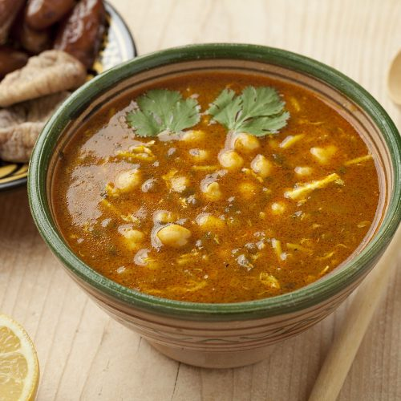

# Harira

*Moroccan tomato-and-lentil soup with chickpeas, lamb (often) and a swarm of spices and herbs. Traditionally served at iftar to break the Ramadan fast; equally good year-round on a cold evening.*

**Serves:** 6-8

**Prep Time:** 20 minutes

**Cook Time:** 1 ½ hours

## Overview
The Moroccan tomato-and-lentil soup that breaks the Ramadan fast at every iftar table: lamb shoulder, chickpeas, lentils, tomatoes, vermicelli noodles and a heavy spice mix of ginger, cinnamon, turmeric and cumin simmered together into a thick fragrant broth, finished with coriander, parsley and lemon juice. Equally good year-round on a cold evening. You brown lamb shoulder cubes in batches in a heavy pot for the colour, set aside. Soften onion and chopped celery in the same oil for 10 minutes, add garlic, ginger and the spice mix (cinnamon, cumin, paprika, turmeric, pepper, saffron) for a minute, stir in tomato puree for another. Return the lamb, add tinned tomatoes, drained chickpeas, rinsed lentils and stock, simmer covered for an hour till the lamb is tender and the lentils are soft. Add vermicelli noodles in the last 10 minutes (earlier and they dissolve into starch). Off the heat, stir in chopped coriander, parsley and a generous squeeze of lemon (the lemon brightens the spice and restores balance after the long simmer). Taste for salt. Ladle into deep bowls, serve with lemon wedges and crusty bread.

## Ingredients

- 400 g lamb shoulder (cut into 1 cm cubes)
- 3 tablespoons olive oil
- 2 onions (chopped)
- 4 celery sticks (chopped)
- 4 garlic cloves (crushed)
- 1 tablespoon grated ginger
- 1 teaspoon ground cinnamon
- 2 teaspoons ground cumin
- 1 teaspoon sweet paprika
- 1 teaspoon ground turmeric
- ½ teaspoon black pepper
- A pinch of saffron threads
- 2 tablespoons tomato purée
- 800 g tinned chopped tomatoes (2 tins)
- 200 g tinned chickpeas (or dried chickpeas, cooked if dried)
- 100 g brown lentils (rinsed)
- 1 ½ litres chicken (or lamb stock)
- 100 g vermicelli noodles (broken into short pieces)
- A small bunch of fresh coriander (chopped)
- A small bunch of fresh parsley (chopped)
- 1 lemon (juice)
- Salt
- Lemon wedges, to serve

## Method

### Stage 1 - Brown the lamb
1. Heat the oil in a large heavy pot.
1. Brown the lamb cubes in batches; set aside.

### Stage 2 - Soffritto and spices
1. Cook the onion and celery in the same pot for 10 minutes.
1. Add the garlic, ginger and all the dry spices; cook 1 minute.
1. Stir in the tomato purée; cook 1 minute.

### Stage 3 - Simmer
1. Return the lamb. Add the chopped tomatoes, chickpeas, lentils and stock.
1. Bring to a simmer; cover loosely and cook 1 hour until the lamb is tender and the lentils are soft.

### Stage 4 - Vermicelli and finish
1. Add the vermicelli noodles; cook 8-10 minutes until soft.
1. Stir in the coriander, parsley and lemon juice. Taste; salt as needed.

### Stage 5 - Serve
1. Ladle into deep bowls.
1. Serve with lemon wedges and crusty bread.

## Notes
- **Lamb is traditional but optional:** Vegetarian harira is common; double the chickpeas and lentils, swap stock for vegetable.
- **Vermicelli late:** Earlier and the noodles dissolve into starch.
- **Generous lemon at the end:** Brightens the spice; restores balance after the long simmer.

## Storage
- Improves overnight. Keeps 4 days refrigerated.
- Freezes 3 months. Add fresh noodles when reheating to keep them al dente.
