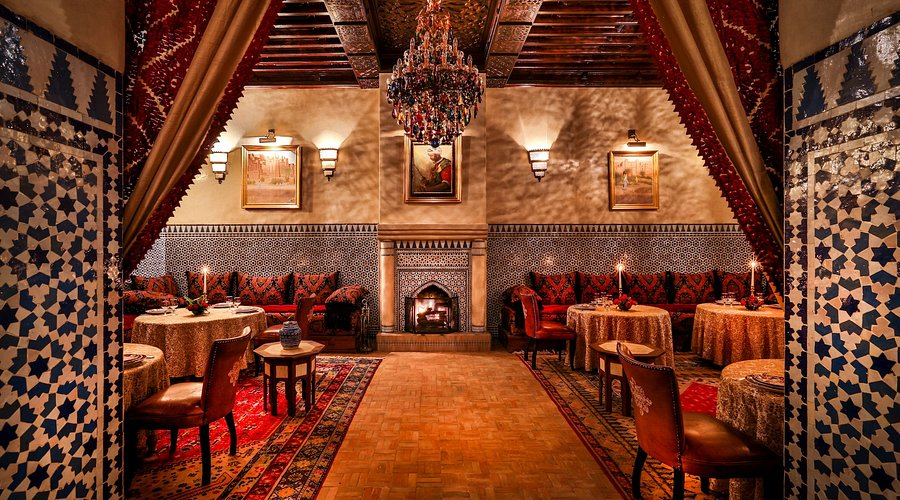

# Moroccan Cuisine

Spiced, slow-cooked plates from across the Maghreb. Ras el hanout, saffron, preserved lemon, olives and the fragrance of cumin, cinnamon and ginger drive the flavour. Tagines (slow-cooked clay-pot stews), couscous (steamed two or three times for the right texture), b'stilla pies of layered phyllo and the complex spice work of harira soups define the tradition.
