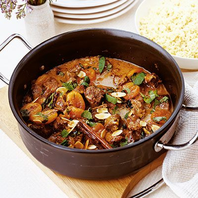

# Lamb Tagine with Apricots and Almonds

*The other classic Moroccan tagine: lamb shoulder braised slow with onion, ginger, cinnamon, honey and dried apricots. Sweet and savoury balance; comes out glossy and tender enough to spoon. Toasted almonds on top.*

**Serves:** 4-6

**Prep Time:** 20 minutes

**Cook Time:** 2 ¼ hours

## Overview
The other classic Moroccan tagine, a sweet-and-savoury celebration of lamb that turns up at Friday lunches and family feasts: lamb shoulder braised slow with onion, ginger and a heady spice blend, sweetened with honey and dried apricots, glossy and tender enough to spoon. The apricots and honey carry the sweet end; the warm spices (ras el hanout, cinnamon, cumin, saffron) carry the savoury, and the balance between the two is the dish. Brown the lamb deeply in batches: pale lamb gives a flat braise, so push for real colour before the liquid goes in. The apricots join only for the last thirty minutes uncovered, so they soften without dissolving (earlier and they become slop; later and they stay chewy). Scattered with toasted flaked almonds and fresh coriander, served over couscous or with flatbread torn straight from the basket.

## Ingredients

- 1 kg lamb shoulder (cut into 4 cm cubes)
- 3 tablespoons olive oil
- 2 onions (sliced)
- 4 garlic cloves (crushed)
- 1 thumb fresh ginger (grated)
- 2 teaspoons ras el hanout
- 1 teaspoon ground cinnamon
- 1 teaspoon ground cumin
- 1 teaspoon sweet paprika
- ½ teaspoon ground turmeric
- A pinch of saffron threads
- 700 ml chicken stock (or lamb stock)
- 2 tablespoons honey
- 200 g dried apricots
- 50 g toasted flaked almonds
- A small bunch of coriander (chopped)
- salt
- pepper
- Couscous (or flatbread), to serve

## Method

### Stage 1 - Brown the lamb
1. Heat 2 tablespoons of oil in a heavy casserole over medium-high heat.
1. Season the lamb with salt and pepper.
1. Brown in batches deeply on all sides; set aside.

### Stage 2 - Build the base
1. Add the remaining oil to the pan; cook the onions over medium heat for 10 minutes until soft and golden.
1. Add the garlic, ginger, ras el hanout, cinnamon, cumin, paprika, turmeric and saffron.
1. Cook 1 minute until fragrant.

### Stage 3 - Braise
1. Return the lamb; pour in the stock and stir in the honey.
1. Bring to a simmer; cover and braise on low heat for 1 ½ hours, or in a 160°C oven.

### Stage 4 - Add apricots
1. Stir in the dried apricots.
1. Cook another 30 minutes uncovered to thicken the sauce.
1. The lamb should be falling-tender; the sauce should be reduced and glossy.

### Stage 5 - Serve
1. Taste; adjust salt.
1. Scatter toasted almonds and coriander.
1. Serve over couscous or with flatbread.

## Notes
- **Ras el hanout:** Moroccan spice blend; up to 30 spices in some versions. Find at Middle Eastern grocers; substitute with a mix of cumin, coriander, cinnamon, allspice and a pinch of cardamom in equal parts.
- **Brown the lamb hard:** Pale lamb gives flat braise. Get colour everywhere.
- **Apricots in the second half:** Earlier and they dissolve to slop; later and they're chewy. 30 minutes in the sauce is the sweet spot.

## Storage
- Improves overnight. Keeps 4 days refrigerated.
- Freezes 3 months.
