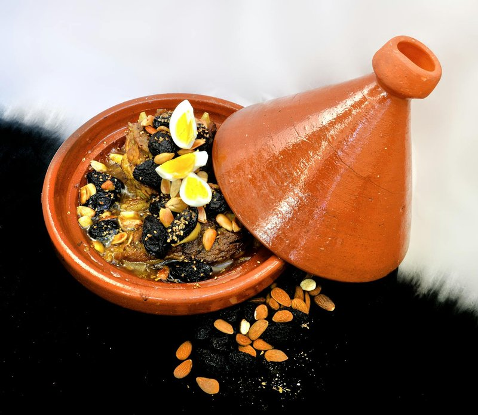

# Lamb Tagine with Prunes

*Morocco's Friday lamb: shoulder slow-cooked in a tagine with saffron, ginger and cinnamon, finished with soft brandy-soaked prunes and toasted almonds.*

**Serves:** 4

**Prep Time:** 20 minutes

**Cook Time:** 2 hours 15 minutes

## Overview
Morocco's Friday lamb tagine: the slow Sunday-lunch dish that wraps the kitchen in saffron and cinnamon. Lamb shoulder slow-cooked till the meat slips off, finished with soft brandy-soaked prunes and a spoon of honey, topped with toasted almonds and sesame. Shoulder, not leg: shoulder has the fat and connective tissue that melt over two hours into a silky sauce; leg goes dry. Soft Agen-style prunes are essential; hard dried prunes never quite catch up in the soak. The honey goes in at the end, not the start (added early it scorches). Brandy-soaked prunes with their liquid join for the last fifteen to twenty minutes uncovered, till the sauce reduces and the prunes plump. Toasted whole almonds, sesame seeds and chopped coriander scatter across the top. Eat with bread or fluffy couscous.

## Ingredients

### Lamb
- 1 kg lamb shoulder (cut into 5 cm chunks)

### Spice paste
- 4 garlic cloves (crushed)
- 3 cm fresh ginger (grated)
- 1 large pinch saffron threads (soaked in 2 tablespoons hot water)
- 1 teaspoon sweet paprika
- 1 teaspoon ground ginger
- 1 teaspoon ground cumin
- 1 teaspoon ground cinnamon
- 1 ½ teaspoons salt
- ½ teaspoon black pepper
- 3 tablespoons olive oil

### Tagine
- 3 tablespoons olive oil (additional)
- 2 onions (large, sliced thin)
- 1 cinnamon stick
- 500 ml water (or light lamb stock)

### Prunes
- 300 g soft pitted prunes (the moist Agen-style, NOT dried)
- 3 tablespoons brandy (or warm water, to plump)
- 1 tablespoon clear honey
- ½ teaspoon ground cinnamon

### Garnish
- 60 g whole blanched almonds (toasted in a dry pan 4 minutes until gold)
- 2 tablespoons toasted sesame seeds
- 2 tablespoons fresh coriander (chopped)

### To serve
- Khobz (or couscous)

## Method

### Stage 1 - Spice paste
1. Whisk all spice-paste ingredients in a wide bowl to a thick paste.
1. Add the lamb chunks; rub all over.
1. Rest 30 minutes.

### Stage 2 - Soak the prunes
1. Place the prunes in a small bowl with the brandy (or warm water); leave to plump for 30 minutes.

### Stage 3 - Onion base
1. Heat the 3 tablespoons olive oil in a tagine or wide heavy casserole over medium-low.
1. Add onion; cook 12 minutes until soft and gold.

### Stage 4 - Brown the lamb
1. Push onion to one side; turn heat to medium-high.
1. Add the lamb pieces fat-side down; brown 4 minutes (don't worry about all sides, Moroccan tagines don't sear hard).
1. Stir together with the onion.

### Stage 5 - Simmer
1. Drop in the cinnamon stick.
1. Pour in the water (or stock).
1. Bring to a gentle simmer; cover with the tagine lid (or casserole lid).
1. Cook 1 hour 30 minutes on the lowest simmer. The lamb should be very tender.

### Stage 6 - Prunes and honey
1. Add the soaked prunes (and their soaking liquid) to the tagine.
1. Stir in the honey and additional cinnamon.
1. Cook uncovered 15-20 minutes, the sauce reduces; the prunes plump further and soften into the sauce.

### Stage 7 - Garnish and serve
1. Taste; adjust salt or add a small extra drizzle of honey if the dish needs balance.
1. Scatter the toasted almonds, sesame seeds and fresh coriander.
1. Serve with bread or fluffy couscous.

## Notes
- **Lamb shoulder, not leg:** Shoulder has fat and connective tissue that melt over 2 hours into a silky sauce. Leg goes dry. Don't substitute.
- **Honey at the end, not the start:** Honey added early scorches. Add at the prune stage when the sauce is wet enough to dilute it.
- **Soft prunes, not dried:** Agen-style soft prunes still in the bag, moist, plump, dark. Hard dried prunes need a much longer soak and never quite catch up.

## Storage
- Refrigerate 4 days; even better on day 2 when the fruit has fully integrated.
- Freezes 3 months.
