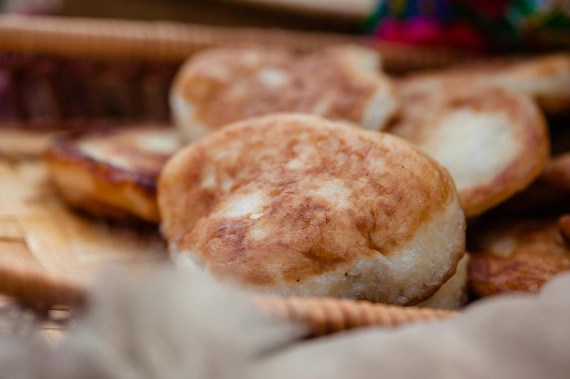

# Harcha

*A semolina pan-bread, dense and slightly crumbly, with a soft inside and a golden crust from being fried on a hot griddle. Eats split open like an English muffin, slathered with butter, honey, jam, or amlou (almond-argan paste). The Moroccan teatime staple - afternoon mint tea always comes with a plate of harcha. Different from msemen (layered laminated bread) - harcha is a single thick disc, no layers.*

**Serves:** Makes 6 harcha

**Prep Time:** 15 minutes

**Cook Time:** 25 minutes

## Overview
Fine semolina mixes with a little plain flour, sugar, baking powder, salt. Melted butter rubs in until the mixture resembles damp sand. Warm milk pours in to bind; the dough should be soft, slightly tacky, not sticky. Divides into 6 portions; each shapes into a disc 8 cm across and 1.5 cm thick. Dredges in extra semolina (the iconic crunchy coating). Pan-fries on a dry hot skillet 4-5 minutes per side, turning carefully (they're delicate).

## Ingredients
- 400 g fine semolina (durum)
- 50 g plain flour
- 2 tablespoons caster sugar
- 1 ½ teaspoons baking powder
- 1 teaspoon salt
- 100 g unsalted butter (melted)
- 250 ml warm milk
- 50 g extra semolina (for coating)

### To serve
- Butter
- Honey, jam, amlou or soft cheese

## Method

### Stage 1 - Mix
1. In a wide bowl, whisk the semolina, plain flour, sugar, baking powder and salt.
1. Pour in the melted butter; rub through with your fingertips for 2-3 minutes until the mixture feels like damp sand.

### Stage 2 - Hydrate
1. Pour in 200 ml of warm milk gradually, stirring with a wooden spoon.
1. The mixture should come together into a soft, slightly tacky dough; add more milk a tablespoon at a time if needed.
1. Don't overwork - just bring it together.

### Stage 3 - Shape
1. Spread the extra semolina on a plate.
1. Divide the dough into 6 portions (~120 g each).
1. Shape each into a flat disc 8 cm across and 1.5 cm thick (use damp hands if it sticks).
1. Press each disc into the extra semolina to coat both sides.

### Stage 4 - Pan-fry
1. Heat a heavy dry skillet over medium-low heat (low and slow - harcha needs to cook through, not just sear the outside).
1. Lay 2-3 discs in the pan.
1. Cook 4-5 minutes per side, turning carefully with a wide spatula, until deep golden and slightly cracked.
1. Reduce heat if the bottoms colour too fast.
1. Lift onto a board; let cool 2 minutes before serving (the inside is steamy hot).

### Stage 5 - Serve
1. Split each harcha horizontally with a serrated knife.
1. Smear with butter; top with honey, jam, amlou or soft cheese.
1. Eat warm with mint tea.

## Notes
- **Medium-LOW heat:** harcha cooks slowly. Too-hot pan burns the outside before the inside is done. The total cook time is 8-10 minutes per harcha.
- **Don't skip the semolina coat:** the extra coating creates the iconic golden crunchy crust. Without it harcha is bland and pale.
- **Don't knead:** the dough is brought together with gentle stirring. Knead and it goes tough.

## Storage
- Best within an hour of cooking.
- Keep 2 days at room temperature in a sealed bag.
- Reheats well in a hot dry pan 1 minute per side; or in a 160°C oven 5 minutes.
- Freezes 2 months; thaw at room temp, then reheat.
