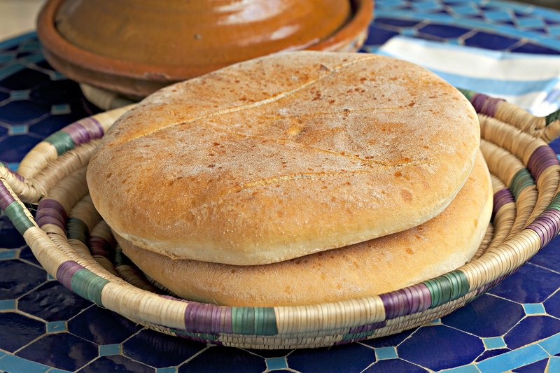

# Khobz (Moroccan Round Flatbread)

*Morocco's everyday round bread: a slightly enriched semolina-and-flour dough baked into a flat disc. Torn at the table to scoop up tagines.*

**Serves:** Makes 4 loaves

**Prep Time:** 30 minutes (plus 1 ½ hours rising)

**Cook Time:** 25 minutes

## Overview
Plain flour and fine semolina (durum flour) combine with yeast, salt, sugar, warm water and a glug of olive oil. Knead 8 minutes. First rise for 1 hour till doubled. Divide into 4 balls; shape each into a flat round disc 18 cm across and 2 cm thick; rest for 30 minutes covered. Score the tops in a cross pattern; sprinkle with sesame or nigella seeds. Bake for 22-25 minutes at 220°C.

## Ingredients
- 400 g strong white bread flour
- 100 g fine semolina (durum flour)
- 7 g instant yeast
- 1 ½ teaspoons salt
- 1 teaspoon sugar
- 300 ml warm water
- 2 tablespoons olive oil (plus more for greasing)
- 1 tablespoon sesame seeds (for tops)
- 1 teaspoon nigella seeds (optional)

## Method

### Stage 1 - Dough
1. In a wide bowl, whisk the flour, semolina, yeast, salt and sugar.
1. Pour in the warm water and olive oil.
1. Stir to a shaggy mass; knead 8 minutes on a lightly floured surface until smooth and supple.
1. Rest in a lightly oiled bowl, covered, 1 hour until doubled.

### Stage 2 - Shape
1. Knock the dough back; divide into 4 portions.
1. Shape each into a smooth ball.
1. Flatten each ball with the heel of your hand to a disc about 18 cm across and 2 cm thick.
1. Place on parchment-lined baking trays.
1. Cover loosely with a tea towel; rise 30 minutes.

### Stage 3 - Bake
1. Heat the oven to 220°C (200°C fan).
1. With the tip of a sharp knife, score a shallow cross (or a series of parallel lines) on the top of each loaf.
1. Brush the tops with a little water; sprinkle with sesame and nigella seeds.
1. Bake 22-25 minutes until deep gold and the loaves sound hollow when tapped on the base.

### Stage 4 - Cool
1. Cool on a wire rack at least 20 minutes before slicing.

## Notes
- **Semolina is essential:** plain flour gives a generic round loaf; durum semolina gives khobz the wheaty depth and tender bite Moroccan bread needs.
- **Flat and wide, not tall:** khobz is 2 cm thick, not 5 cm. It's a loaf shaped for tearing and dipping, not slicing for sandwiches.
- **Bake hot and fast:** the bread shouldn't dry out. 25 minutes max at 220°C.

## Storage
- Best the day of baking.
- Keeps 2 days in a paper bag at room temperature; stale bread is excellent in harira soup.
- Freezes 2 months wrapped in foil; thaw at room temp, warm briefly in a 150°C oven.
