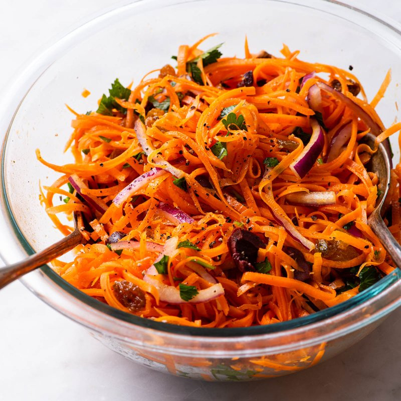

# Moroccan Carrot Salad

*Morocco's bright orange side: carrots just-tender, dressed warm in cumin, paprika, garlic, lemon and olive oil with a pinch of cinnamon.*

**Serves:** 4

**Prep Time:** 10 minutes

**Cook Time:** 12 minutes

## Overview
Morocco's bright orange side, the small bowl that turns up alongside a tagine or as part of a mezze spread: carrots boiled just tender then tossed warm in a cumin-paprika-garlic-lemon dressing with a tiny pinch of cinnamon. The warmth is the technical move; the carrots soak up the dressing's flavour while still warm, while cold carrots tossed in dressing just sit there with vinaigrette around them. Boil till just tender with a slight bite; soft carrots fall apart in the dressing and the texture suffers. Cooled to room temperature so the flavours settle, served with chopped coriander and parsley scattered across and a final drizzle of olive oil. Improves on day two or three; make ahead if you can.

## Ingredients

- 500 g carrots (peeled, sliced into 5 mm rounds, or 5 cm batons)
- 1 teaspoon salt (for boiling)

### Dressing
- 3 tablespoons extra-virgin olive oil
- 2 tablespoons lemon juice (about 1 lemon)
- 3 garlic cloves (crushed to a paste with ½ teaspoon salt)
- 1 ½ teaspoons ground cumin
- 1 teaspoon sweet paprika
- ¼ teaspoon ground cinnamon
- ¼ teaspoon cayenne pepper (optional, for a little heat)
- 1 teaspoon caster sugar (balances the lemon)
- ½ teaspoon salt (to taste)

### To finish
- 2 tablespoons fresh coriander (chopped)
- 1 tablespoon fresh flat-leaf parsley (chopped)
- 1 tablespoon extra-virgin olive oil (drizzle)

## Method

### Stage 1 - Cook the carrots
1. Bring a pot of salted water to a boil.
1. Add the carrots; boil 8-10 minutes until just tender, a knife should slip in with slight resistance.
1. Drain; do NOT rinse with cold water.

### Stage 2 - Dressing
1. While the carrots cook, whisk olive oil, lemon juice, garlic-salt paste, cumin, paprika, cinnamon, cayenne (if using), sugar and ½ teaspoon salt in a wide bowl.

### Stage 3 - Combine warm
1. Tip the drained warm carrots into the bowl with the dressing.
1. Toss gently, the warm carrots will soak up the dressing.
1. Taste; adjust salt or lemon.

### Stage 4 - Rest
1. Let cool to room temperature, 30 minutes (or refrigerate longer, flavours improve).

### Stage 5 - Serve
1. Scatter coriander and parsley.
1. Drizzle a final spoon of olive oil.
1. Eat at room temperature or slightly chilled.

## Notes
- **Just tender, not soft:** Boil until a knife slips in with a small resistance. Soft carrots fall apart in the dressing and the texture suffers.
- **Dressing on warm carrots:** The warmth is what makes the carrots take on the dressing's flavour. Cold carrots tossed in dressing just sit there with vinaigrette around them.
- **Improves on day 2:** Make a day ahead if you can; the carrots deepen in flavour overnight.

## Storage
- Refrigerate 4 days.
- The salad is at its best on day 2-3. Bring to room temperature before serving.
