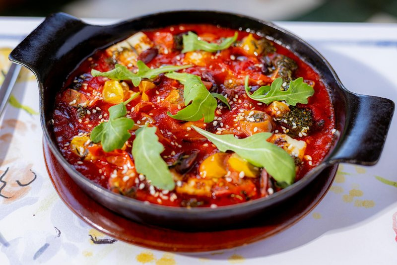

# Taktouka

*Morocco's smoky vegetable side: roasted red peppers and tomatoes cooked down with garlic, cumin and paprika to a glossy spoonable relish. Eaten with bread.*

**Serves:** 4-6

**Prep Time:** 15 minutes

**Cook Time:** 35 minutes

## Overview
Morocco's smoky vegetable side, the small plate that lands on every Moroccan table from breakfast to dinner: roasted red peppers and tomatoes cooked down with garlic, cumin and paprika to a jammy, glossy spoonable relish, eaten warm or at room temperature with bread for scooping or alongside a tagine. The char on the peppers is the soul; under-charred peppers give a bland version, so char fully till the skins are blackened all over. You char the peppers under a hot grill or directly over a flame for eight to 10 minutes, seal in a covered bowl 10 minutes to steam, peel off the blackened skin, deseed and slice. Score a cross in the base of each tomato, blanch briefly in boiling water, peel and dice. Heat olive oil in a wide pan, soften garlic without colouring for 30 seconds, bloom sweet paprika, cumin and ground coriander for another. Add the diced tomatoes and cook eight to 10 minutes till broken down, add the sliced peppers and salt, cook 15 to 18 minutes stirring till the mixture is glossy, jammy and almost dry (watery taktouka is uncooked taktouka; keep going till the moisture has reduced and oil pools at the edges). Off the heat, stir in lemon juice and chopped coriander. Eat warm or room temperature, with bread or alongside a tagine; tastes better an hour after cooking and even better overnight.

## Ingredients
- 4 red peppers (large, about 700 g)
- 4 ripe tomatoes (about 500 g)
- 4 garlic cloves (minced)
- 5 tablespoons olive oil
- 1 ½ teaspoons sweet paprika
- 1 teaspoon ground cumin
- ½ teaspoon ground coriander
- 1 teaspoon salt
- ½ teaspoon ground black pepper
- 20 g fresh coriander (chopped)
- 1 tablespoon lemon juice

## Method

### Stage 1 - Char peppers
1. Heat the grill to maximum (or use a gas burner flame).
1. Char the peppers, turning, 8-10 minutes until blackened all over.
1. Seal in a covered bowl 10 minutes to steam.
1. Peel off the blackened skin; deseed; slice into 1 cm strips.

### Stage 2 - Tomatoes
1. Score a cross in the base of each tomato; plunge into boiling water 30 seconds; lift into cold water.
1. Peel; deseed; dice 1 cm.

### Stage 3 - Cook
1. Heat the olive oil in a wide pan over medium heat.
1. Soften the garlic 30 seconds; don't let it colour.
1. Add the paprika, cumin and ground coriander; stir 30 seconds.
1. Add the diced tomatoes; cook 8-10 minutes till broken down.
1. Add the sliced peppers and salt; cook 15-18 minutes, stirring, until the mixture is glossy, jammy and almost dry.

### Stage 4 - Finish
1. Off heat; stir in the lemon juice and chopped coriander.
1. Taste; adjust salt.
1. Serve warm or at room temperature, with bread or alongside a tagine.

## Notes
- **Char fully:** the smoke flavour from blackened pepper skin is the soul of taktouka. Under-charred peppers give a bland version.
- **Cook till glossy and dry:** watery taktouka is uncooked taktouka. Keep going until the moisture has reduced and the oil pools at the edges.
- **Room temperature ages well:** taktouka tastes better an hour after cooking; overnight is better still.

## Storage
- Keeps 5 days refrigerated under a film of olive oil.
- Freezes 3 months; thaw overnight; bring to room temp before serving.
