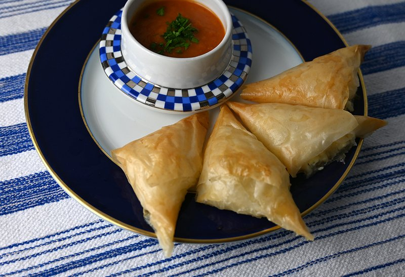

# Briouat bil Jben (Cheese Briouats)

*Morocco's cheese briouats: triangular filo pastries filled with soft fresh cheese, beaten egg, herbs and a hint of cumin. Deep-fried golden and crisp.*

**Serves:** Makes 18 triangles

**Prep Time:** 30 minutes

**Cook Time:** 15 minutes (in batches)

## Overview
Filling: fresh cheese (ricotta, paneer, or feta + cream cheese) mashes with a beaten egg, chopped parsley, mint, ground cumin and a pinch of black pepper. Warka pastry (or filo) strips lay flat. A teaspoon of filling sits at one end; the strip folds flag-style up the strip, forming a triangle. Edges seal with egg-wash or water. Deep-fries for 2-3 minutes till deep gold. Drains on a rack. Eats warm.

## Ingredients

### Filling
- 250 g fresh soft cheese (Moroccan jben or substitute: 150 g ricotta + 100 g crumbled feta + 1 tablespoon cream cheese)
- 1 large egg
- 20 g fresh flat-leaf parsley (chopped)
- 15 g fresh mint (chopped)
- 1 teaspoon ground cumin
- ½ teaspoon ground black pepper
- ¼ teaspoon salt (taste - feta may be salty enough)

### Pastry
- 18 sheets warka or filo pastry (about 25 × 25 cm - cut filo to size if larger)
- 2 tablespoons olive oil (for brushing the strips lightly)
- 1 large egg (beaten, for sealing)

### Frying
- 600 ml neutral oil

### To serve
- Lemon wedges
- A drizzle of honey (optional - sounds odd, works beautifully)

## Method

### Stage 1 - Filling
1. In a wide bowl, mash the cheese with a fork until uniform.
1. Beat in the egg, parsley, mint, cumin, black pepper and salt to taste.
1. The filling should be thick enough to scoop in a teaspoon; if too wet, drain on a sieve briefly.

### Stage 2 - Cut strips
1. Stack the warka or filo sheets; cut into strips 8 cm wide.
1. Cover the strips with a damp tea towel as you work (filo dries to brittle shards in minutes).

### Stage 3 - Shape
1. Take one strip; brush lightly with olive oil (helps it stay flexible).
1. Place 1 teaspoon of filling at the bottom-left corner.
1. Fold the bottom-right corner diagonally over the filling to make a triangle.
1. Fold the triangle straight up.
1. Fold diagonally across again.
1. Continue this flag-fold up the strip until you reach the end.
1. Seal the final flap with egg-wash; press to stick.
1. Place on a tray; cover; repeat for the rest.

### Stage 4 - Fry
1. Heat the oil to 170°C.
1. Lower 4-5 briouats at a time into the oil.
1. Fry 2-3 minutes, turning, until deep gold and crisp.
1. Lift onto a wire rack to drain.

### Stage 5 - Serve
1. Pile on a warm platter.
1. Drizzle with honey (optional but traditional in some regions).
1. Serve with lemon wedges and mint tea.

## Notes
- **Warka pastry vs filo:** warka is the Moroccan thin pancake-pastry, very similar to filo but slightly more pliable. Filo is the easiest substitute. Spring-roll wrappers also work (give a different crispier finish).
- **Drain the cheese if wet:** ricotta and fresh cheese can be very wet. Drain on a sieve 30 minutes before using to avoid leakage during frying.
- **Flag-fold direction:** the triangle pattern walks UP the strip; each fold is a 45° flip. Practice on a spare strip first.
- **Honey is the surprise:** the sweet drizzle on hot savoury briouats is a classic Moroccan touch. Try it.

## Storage
- Best within an hour of frying.
- Refrigerate cooked briouats 2 days; reheat in a 180°C oven 6 minutes (microwaving turns the pastry soggy).
- Freeze unfried, on a tray then bagged, 2 months; fry from frozen, adding 1 minute.
