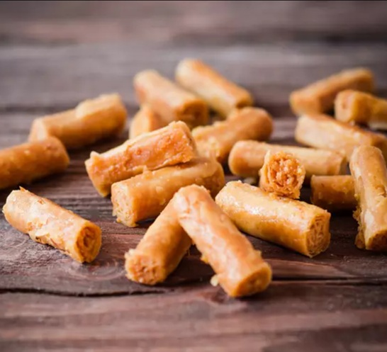

# Cigares au Miel (Honey Almond Cigars)

*Morocco's honey-almond cigars: long thin warka cylinders filled with cinnamon-orange-flower almond paste, deep-fried, then soaked in warm honey.*

**Serves:** Makes 20-24 cigars

**Prep Time:** 45 minutes

**Cook Time:** 15 minutes

## Overview
Almond paste: ground almonds, icing sugar, melted butter, cinnamon, orange-flower water, pulses or kneads to a soft pliable paste. Divides into walnut-sized portions; each rolls into a thin cylinder 10 cm long. Warka strips wrap around the cylinder; seal with egg-wash. Fries in moderately hot oil till deep gold. Submerges briefly in warm honey with orange-flower water; lifts; drains; cools.

## Ingredients

### Filling
- 300 g ground almonds
- 150 g icing sugar
- 60 g unsalted butter (melted)
- 1 teaspoon ground cinnamon
- 2 tablespoons orange-flower water
- 1 tablespoon water (only if needed to bind)

### Pastry
- 24 sheets warka (or filo pastry, cut to 12 × 10 cm strips)
- 1 egg (large, beaten, for sealing)

### Frying
- 600 ml neutral oil

### Honey glaze
- 300 g clear honey
- 2 tablespoons water
- 1 tablespoon orange-flower water
- ½ teaspoon ground cinnamon (optional)

### To finish
- 2 tablespoons toasted sesame seeds

## Method

### Stage 1 - Almond paste
1. In a wide bowl (or food processor), combine the ground almonds, icing sugar, cinnamon, melted butter and orange-flower water.
1. Mix or pulse until the mixture comes together as a pliable paste.
1. Add 1 tablespoon water if too dry (it shouldn't be sticky-wet; just clumpable).
1. Cover; rest 10 minutes.

### Stage 2 - Shape
1. Divide the paste into 24 walnut-sized portions (~22 g each).
1. Roll each between palms into a thin cylinder about 10 cm long and 1 ½ cm thick.

### Stage 3 - Wrap
1. Take a warka strip; lay flat.
1. Place a paste cylinder along the long edge.
1. Roll up tightly into a long thin cigar.
1. Brush the seam with egg-wash; press to seal.
1. Place seam-down on a tray; repeat for the rest.

### Stage 4 - Honey glaze
1. While the cigars rest, gently warm the honey, water, orange-flower water and cinnamon in a wide shallow pan until just liquid (not boiling).
1. Keep warm but not hot.

### Stage 5 - Fry
1. Heat the oil to 170°C.
1. Lower 6 cigars at a time; fry 2 minutes, turning, until deep gold.
1. Lift directly into the warm honey glaze.

### Stage 6 - Glaze
1. Roll the hot cigars in the honey for 20-30 seconds to coat.
1. Lift onto a wire rack with tongs; let excess drip.
1. Sprinkle with toasted sesame seeds while sticky.
1. Cool completely.

## Notes
- **Don't over-knead the almond paste:** it should be plastic but not greasy. Over-mixing in a processor warms the almonds and the oil separates.
- **Roll cylinders thin:** 1 ½ cm is the sweet spot - too thick and the filling stays cold in the centre; too thin and the cigars bend during frying.
- **Honey warm, not boiling:** boiled honey crystallises on cooling. Keep at body-temperature warm.
- **Sesame on the sticky cigars:** the seeds adhere only while honey is wet. Sprinkle within 30 seconds of removing from the glaze.

## Storage
- Keeps 2 weeks at room temperature in a sealed tin (cigares stay crisp if the honey isn't drowning them).
- Don't refrigerate - the honey crystallises.
- The cinnamon flavour deepens over the first day.
