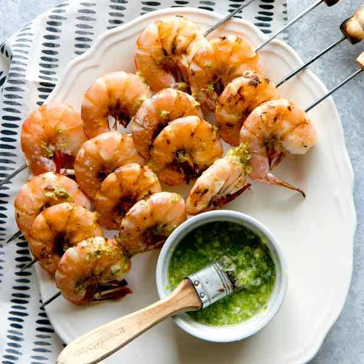

# Camarão Grelhado à Moçambicana

*Mozambique's chargrilled prawns: large fresh prawns butterflied open, marinated in a paste of garlic, chilli, paprika, olive oil and lime, grilled over open flame till the shells char and the flesh stays sweet and just-cooked. The Maputo seafront classic, served with rice, salad and a small bowl of piri-piri sauce.*

**Serves:** 4

**Prep Time:** 30 minutes (plus 30 minutes marination)

**Cook Time:** 10 minutes

## Overview
Camarão grelhado is one of Mozambique's most iconic dishes and a Maputo seafront specialty: large fresh prawns (often the magnificent local LM prawns, named after Lourenço Marques, the colonial name for Maputo) butterflied open down the back, marinated briefly in garlic, fresh chilli, smoked paprika, lemon and olive oil, then grilled over hot charcoal till the shells char and the flesh stays sweet and just-cooked. Served on a wooden platter with arroz blanco, salada moçambicana, fries and a small bowl of warm piri-piri. The LM prawns are eaten with the hands, shells discarded into a side bowl, heads optionally sucked for their juices. The canonical Maputo Sunday seafront meal, eaten slowly over hours with cold beer or vinho verde, watching the Indian Ocean. Use the freshest large prawns you can find. Charcoal gives the proper smoky character; a grill pan works in a pinch but isn't the same.

## Ingredients

### Prawns
- 16 large fresh prawns (about 100 g each; head-on if possible; about 1.5 kg total)

### Marinade
- 8 garlic cloves (crushed)
- 4 fresh red chillies (deseeded for milder; or use 2 piri-piri chillies if you can find them)
- 4 tablespoons olive oil
- 2 tablespoons fresh lemon juice
- Zest of 2 lemons
- 2 tablespoons smoked paprika (sweet)
- 1 tablespoon paprika (hot)
- 2 teaspoons fine sea salt
- 1 teaspoon ground black pepper
- 1 teaspoon dried oregano
- 1 tablespoon Worcestershire sauce
- 4 tablespoons piri-piri sauce (or substitute with hot chilli sauce)

### Piri-piri butter sauce (for serving)
- 100 g unsalted butter
- 4 garlic cloves (crushed)
- 2 tablespoons piri-piri sauce
- 1 tablespoon fresh lemon juice
- 1 tablespoon fresh parsley (chopped)

### To serve
- Arroz blanco (white rice) or arroz de coco
- Salada Mozambicana (lettuce, tomato, cucumber, onion, vinaigrette)
- Crispy chips/fries
- Lemon wedges
- Fresh coriander
- Extra piri-piri sauce

## Method

### Stage 1 - Prepare the prawns
1. Rinse the prawns under cold running water; pat dry with kitchen paper.
2. Place each prawn on a cutting board, belly-side down.
3. With a sharp knife, slice down the back of the prawn from head to tail, cutting through the shell and into the flesh about halfway (not all the way through).
4. Open the prawn out like a book (butterfly).
5. Remove the dark intestinal vein from each prawn.
6. Place the prepared prawns in a wide bowl.

### Stage 2 - Make the marinade
1. Combine the crushed garlic, chopped chillies, olive oil, lemon juice, lemon zest, both paprikas, salt, pepper, oregano, Worcestershire sauce and piri-piri sauce in a bowl.
2. Whisk to a smooth paste.

### Stage 3 - Marinate
1. Pour the marinade over the butterflied prawns; rub the marinade into the cuts and over the shells.
2. Cover and refrigerate 30 minutes (don't go beyond 1 hour; the citrus can start to cook the flesh).

### Stage 4 - Prepare the grill or pan
1. Light a charcoal grill; let burn down to glowing embers (about 30 minutes).
2. Or heat a heavy ridged grill pan over high heat till smoking.
3. The grill should be properly hot; the prawns should sizzle aggressively when they hit.

### Stage 5 - Make the piri-piri butter sauce
1. While the grill heats, melt the butter in a small saucepan over low heat.
2. Add the crushed garlic; cook 30 seconds till fragrant.
3. Stir in the piri-piri sauce, lemon juice and chopped parsley.
4. Keep warm.

### Stage 6 - Grill the prawns
1. Lift the prawns out of the marinade; let any excess drip off (reserve any extra marinade).
2. Place the prawns on the hot grill, shell-side down first (this is critical: shell side down protects the flesh from over-charring).
3. Grill for 3-4 minutes till the shells char to deep mahogany.
4. Flip the prawns flesh-side down; brush with the warm piri-piri butter.
5. Grill 2-3 more minutes till the flesh is just-cooked (white and opaque) and lightly charred at the edges.
6. The total cooking time is 5-7 minutes; longer gives dry overcooked prawns.

### Stage 7 - Serve immediately
1. Pile the grilled prawns on a wooden platter.
2. Drizzle generously with the warm piri-piri butter sauce.
3. Scatter fresh chopped parsley and coriander over.
4. Place lemon wedges around the platter.
5. Serve immediately with arroz blanco, salada, chips and extra piri-piri sauce on the side.
6. Eat with hands; pull the prawns from their shells, dip in the piri-piri butter sauce, drink the beer slowly.

## Notes
- **Large prawns are essential:** the proper Mozambican experience uses LM tiger prawns or large king prawns (16-20 per kg, head-on if possible). Smaller prawns dry out too fast on the grill.
- **Butterfly properly:** opening the prawn out lets the marinade penetrate and the prawn cooks evenly. Cut through the shell and into the flesh, but not all the way through.
- **Shell-side down first:** the shell protects the flesh from over-charring. Always start with the shell side down; flip only when the shell is properly charred.
- **Don't overcook:** prawns go from sweet and tender to rubbery in seconds. 5-7 minutes total is the maximum; less is better.
- **The piri-piri butter is essential:** the warm spiced butter is what makes Mozambican grilled prawns distinctive. Don't skip; pour generously.

## Variations
**Lobster Mozambicana (lagosta grelhada):** swap the prawns for split lobster tails or a whole split lobster; cook the same way, increase grilling time to 8-10 minutes (for tails) or 12-15 minutes (for whole lobster). Maputo specialty.
**Crab Mozambicana:** swap the prawns for large blue crabs or mud crabs (split open); grill the same way. Common Mozambican beachside variant.
**Spicier prawns:** double the piri-piri chillies and sauce; serve with extra-hot piri-piri sauce on the side. Properly Mozambican.
**Lighter (lemon-only) version:** skip the piri-piri sauce; marinate in just garlic, olive oil, lemon and herbs; brush with garlic-lemon butter instead. For non-spice-tolerant diners.

## Serving
On a wooden platter at the centre of the table, the prawns scattered with herbs and the butter pooled around. Cold beer (Laurentina or 2M; Mozambique's local beers) or chilled vinho verde. As a Sunday lunch at the seafront, a special-occasion dinner, or a weekend cookout. Allow 2-3 hours of eating slowly.

## Storage
- Best eaten fresh and hot off the grill; the texture suffers as the prawns cool.
- Keep refrigerated 2 days; reheat briefly in a hot pan with a little butter for 1-2 minutes per side (don't overcook).
- The piri-piri butter keeps refrigerated 1 week; reheat gently before serving.
- The marinade keeps refrigerated 3 days but is best used fresh.
- Don't freeze cooked prawns; the texture suffers.
