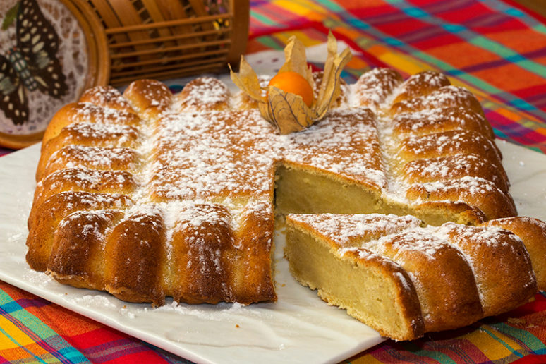

# Bolo Polana

*Mozambique's signature cake: a dense, deeply Mozambican cake made from ground cashew nuts and mashed sweet potato, enriched with butter, eggs and sugar, lifted with a touch of citrus zest and baked till the top goes deep golden and the inside stays moist and rich. Named for the Polana neighbourhood of Maputo, the most iconic dessert of Mozambican cooking.*

**Serves:** 10-12

**Prep Time:** 35 minutes

**Cook Time:** 1 hour

## Overview
Bolo Polana is Mozambique's most iconic and beloved cake, named after the Polana neighbourhood of Maputo (where the famous Polana Hotel sits, a historic art-deco landmark). A dense, deeply rich cake made from ground roasted cashew nuts (castanha de caju, the country's famous export) and mashed sweet potato, enriched with plenty of butter, sugar and egg yolks; whipped egg whites fold in separately to give lift. Orange zest and vanilla brighten. Baked in a high-sided cake tin till the top goes deep golden and the interior stays moist and rich. The cake sits between a flourless almond cake, a sweet potato pie and a Portuguese-style dense butter cake; the combination of cashews and sweet potato gives it a unique flavour profile that's both nutty and faintly tropical. The traditional Mozambican Sunday dessert, on every christening, wedding and hotel-high-tea table in Maputo. The cake has no flour; the lift comes entirely from properly whipped egg whites folded into the rich nut-butter-yolk batter. Under-whipping the whites gives a dense brick rather than a light dessert.

## Ingredients

- 400 g sweet potato (peeled, cubed; or substitute with pumpkin or butternut squash; should be the orange-fleshed variety)
- 300 g roasted unsalted cashews
- 200 g unsalted butter (softened)
- 250 g caster sugar
- 6 large eggs (separated)
- Zest of 1 orange
- 2 teaspoons vanilla extract
- 1 teaspoon ground cinnamon
- ½ teaspoon ground nutmeg
- ¼ teaspoon ground cardamom
- ½ teaspoon fine sea salt
- 3 tablespoons fresh orange juice
- 50 g plain flour (a small amount, to help bind; traditional recipes are sometimes flourless but this gives better texture)
- 1 teaspoon baking powder

### To finish
- 2 tablespoons icing sugar (for dusting)
- 30 g toasted whole cashews (for garnish)
- 1 tablespoon orange marmalade (warmed and brushed over the top, optional)

## Method

### Stage 1 - Cook the sweet potato
1. Place the cubed sweet potato in a saucepan with cold water and a pinch of salt.
2. Bring to a boil; cook 15-18 minutes till properly tender (a knife slides through easily).
3. Drain thoroughly; tip back into the warm pan.
4. Let dry over very low heat for 1-2 minutes (removes excess moisture).
5. Mash with a potato masher till smooth.
6. Let cool to room temperature.

### Stage 2 - Grind the cashews
1. Place the roasted cashews in a food processor.
2. Pulse till you have a fine meal (like ground almonds); don't go to a paste.
3. If you don't have a food processor, use a spice grinder in batches.

### Stage 3 - Prepare the cake tin
1. Preheat the oven to 170°C (340°F).
2. Grease a 24 cm springform cake tin with butter.
3. Line the bottom with parchment paper.

### Stage 4 - Make the egg yolk batter
1. In a large bowl, cream the softened butter and sugar with an electric mixer for 4-5 minutes till pale and fluffy.
2. Add the egg yolks one at a time, beating well after each.
3. Add the orange zest, vanilla, cinnamon, nutmeg, cardamom and salt; beat to combine.

### Stage 5 - Add cashew meal and sweet potato
1. Add the ground cashews to the butter-sugar-yolk mixture; mix till combined.
2. Add the cooled mashed sweet potato; mix till smooth.
3. Add the orange juice, flour and baking powder; fold gently till combined.
4. The mixture should be thick and dense.

### Stage 6 - Whip the egg whites
1. In a clean dry bowl, whip the egg whites with an electric mixer to stiff glossy peaks.
2. Don't over-whip (don't go to dry-crumbly stage); stop at glossy stiff peaks that hold their shape.

### Stage 7 - Fold the whites into the batter
1. Add a third of the whipped egg whites to the cake batter; fold gently to loosen the batter (use a large metal spoon or spatula).
2. Add the remaining whites in two more batches, folding gently each time; preserve as much air as possible.

### Stage 8 - Bake
1. Pour the batter into the prepared tin; smooth the top.
2. Bake at 170°C for 55-65 minutes till the top is deep golden and a skewer inserted into the centre comes out clean (or with just a few crumbs clinging).
3. If the top is browning too fast, cover loosely with foil at the 40-minute mark.

### Stage 9 - Cool
1. Let the cake cool in the tin for 20 minutes.
2. Release the springform; transfer to a wire rack to cool completely.

### Stage 10 - Finish and serve
1. Dust the cooled cake with icing sugar.
2. Scatter toasted whole cashews on top.
3. If desired, brush with warm orange marmalade for a glossy finish.
4. Slice and serve with strong coffee, hot chocolate, or a small glass of port wine.

## Notes
- **Cashews are essential:** the proper bolo Polana is built on cashew flavour. Mozambican cashews are exceptional; good-quality roasted unsalted cashews from anywhere work. Don't substitute with almonds (the flavour is too different) or peanuts (texture and flavour are wrong).
- **Grind to a meal, not a paste:** fine cashew meal (like ground almonds) gives the proper texture. Going to a paste makes a dense cake.
- **Sweet potato or pumpkin:** both work; sweet potato is more traditional. The proper cake uses the orange-fleshed variety for the colour.
- **Whip the egg whites properly:** the cake's lift depends on properly whipped egg whites folded gently into the batter. Under-whipped whites give a dense brick.
- **Don't overbake:** the cake should be moist inside; over-baking gives a dry cake. Check at 55 minutes with a skewer.

## Variations
- **Pumpkin bolo Polana:** swap the sweet potato for pumpkin (butternut squash); the cake is slightly lighter. Common variation.
- **Coconut bolo Polana:** add 50 g of desiccated coconut to the batter; gives a more tropical version.
- **Bolo Polana with brandy:** add 2 tablespoons of brandy (or Portuguese aguardente) to the batter; common festive variation at weddings and special occasions.
- **Mini bolo Polana:** bake in a muffin tin for 25-30 minutes; gives small individual cakes for parties.

## Serving
- At the centre of the table for family dessert. Sliced into 10-12 wedges, dusted with icing sugar and toasted cashews. With strong sweet Mozambican coffee, hot chocolate, or a small glass of port wine. After Sunday lunch, at weddings, christenings, or any Mozambican family celebration.

## Storage
- Keeps in a sealed container at room temperature 4 days; the cake gets even more moist as it sits.
- Refrigerated 1 week; bring to room temperature 30 minutes before serving.
- Freezes 3 months wrapped tightly; defrost at room temperature 4 hours.
- Don't microwave whole; slice and microwave individual pieces briefly if you must (15-20 seconds).
- Day-old bolo Polana is excellent for breakfast with strong coffee.
