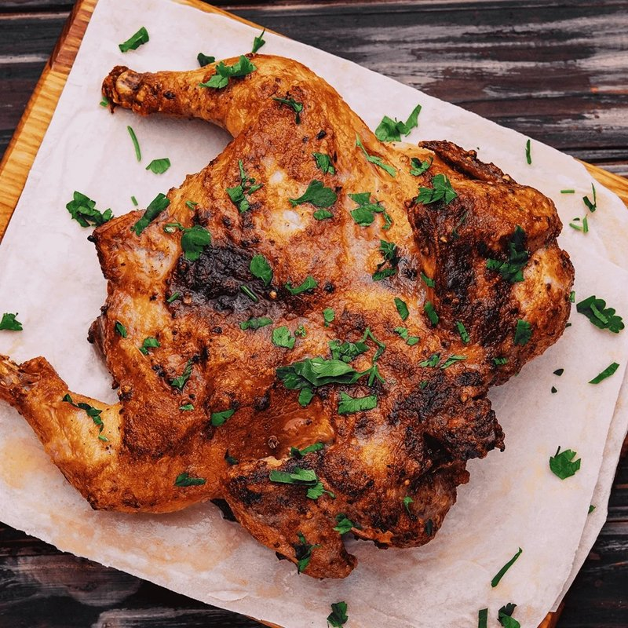

# Frango Piri-Piri

*Mozambique's national grilled chicken: spatchcocked bird marinated in fiery garlic-lemon-piri-piri, grilled hard over charcoal and basted as it cooks.*

**Serves:** 4

**Prep Time:** 15 minutes (plus 4 hours marinating)

**Cook Time:** 35 minutes

## Overview
Mozambique's national grilled chicken and the dish that defines coastal Lusophone cooking from Maputo to Beira: spatchcocked bird marinated in a fiery garlic-lemon-piri-piri paste, grilled hard over charcoal till the edges blacken in spots and the marinade caramelises into a glaze. The char is the point; don't fear a dark exterior. The piri-piri paste blends bird's-eye chillies with garlic, smoked paprika, oregano, lemon zest and juice, red wine vinegar and olive oil into a thick red paste; deseed for less heat, or substitute scotch bonnet for hotter and fruitier. Reserve a third of the marinade for basting and serving. Refrigerate at least four hours, ideally overnight. Served with the remaining piri-piri sauce, lemon wedges and chips or coconut rice.

## Ingredients

### Piri-piri marinade
- 10-15 bird's-eye chillies (or 6 red Thai chillies for a milder result)
- 6 garlic cloves
- 2 teaspoons paprika (smoked)
- 1 teaspoon dried oregano
- 1 teaspoon salt
- 1 teaspoon ground black pepper
- 1 lemon (juice and zest)
- 4 tablespoons red wine vinegar
- 100 ml olive oil

### Chicken
- 1 whole chicken (1.6-1.8 kg) (spatchcocked, ask the butcher or cut the backbone out with kitchen shears)
- 1 tablespoon olive oil (extra, for basting)
- 1 lemon (for serving)

## Method

### Stage 1 - Marinade
1. Strip the chilli stems. Roughly chop the chillies (leave the seeds for full heat; deseed for less).
1. Blend the chillies, garlic, paprika, oregano, salt, pepper, lemon zest and juice, vinegar and oil to a smooth red paste.
1. Reserve a third of the marinade in a small bowl, this is the basting / serving sauce.

### Stage 2 - Marinate
1. Place the spatchcocked chicken skin-up on a board. Score the thickest parts of the thighs and breasts 1 cm deep.
1. Rub the larger portion of marinade all over, working it into the cuts and under the skin where you can.
1. Cover; refrigerate at least 4 hours, preferably overnight.

### Stage 3 - Grill or roast
1. **Grill:** Heat charcoal until ashed over. Place the chicken skin-down on the grill 8 cm above the coals. Cook 15 minutes, basting with the reserved marinade; flip; cook 12-15 minutes more, basting again. The juices should run clear.
1. **Oven:** Heat to 220°C (200°C fan). Place the chicken skin-up on a wire rack over a tray. Roast 35-40 minutes, basting at 15 and 25 minutes. Internal temperature 75°C in the thigh.

### Stage 4 - Rest and serve
1. Rest the chicken 5 minutes, skin-up.
1. Cut into pieces. Serve with the remaining piri-piri sauce, lemon wedges and chips or coconut rice.

## Notes
- **Heat is adjustable:** Bird's-eye is the traditional chilli. Substitute red Thai (similar heat), red Fresno (milder), or habanero/scotch bonnet (hotter, fruitier). Deseed for less heat.
- **Marinade time matters:** Less than 4 hours is barely seasoned. Overnight gives the deepest flavour and the most tender meat.
- **Char is the point:** Don't fear a dark exterior. The skin should be blackened in spots, and the marinade caramelises into a glaze.

## Storage
- Refrigerate 3 days. Reheat in a 180°C oven until heated through.
- The piri-piri sauce keeps 2 weeks refrigerated.
